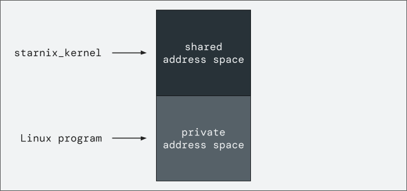
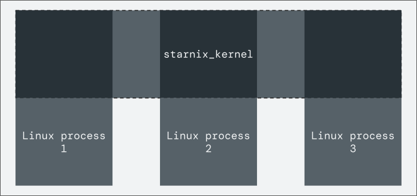
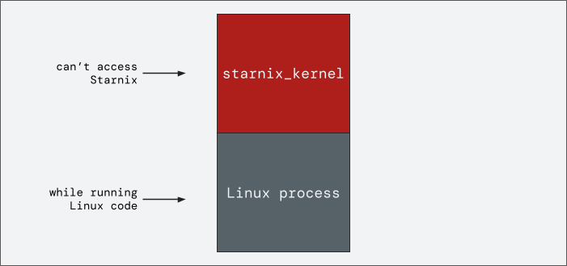
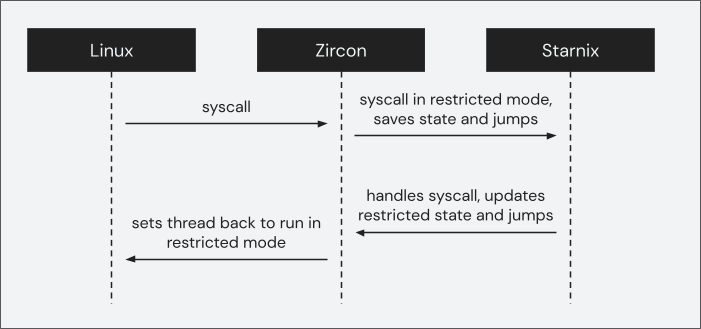

# Making Linux syscalls in Fuchsia

This page describes how [Starnix][starnix-runner] handles Linux system calls
(syscalls) in Fuchsia.

## Address space of a Linux program in a Zircon process {:#address-space-of-a-linux-program-in-a-zircon-process}

Before a Linux program can make any syscalls, it must be loaded into a Zircon
process. [`starnix_kernel`][starnix-readme] is the component responsible for both
loading and executing Linux programs in Fuchsia.

`starnix_kernel` first creates a Zircon process with an address space that is
divided into halves. The top half is a shared address space and the bottom half is
a private address space. `starnix_kernel` then sets up the address space of the
Zircon process in the following way:

- The Linux program is loaded into the process's private address space (bottom half).
- `starnix_kernel` itself is loaded into the process's shared address space (top half).

The Linux portion of the address space is constructed differently, compared to
that of a normal Fuchsia process, to match the layout expected of a Linux
program.



**Figure 1**. The address space of a Zircon process loaded with a Linux program
and `starnix_kernel`.

## Shared Starnix instance {:#shared-starnix-instance}

Each Linux program is loaded into a separate Zircon process and each Linux
thread runs in a dedicated Zircon thread. However, all the Zircon processes in a
[Starnix container][starnix-container] share the same `starnix_kernel` instance.
This shared `starnix_kernel` instance manages all the state of the Linux programs
in the container, such as file descriptor tables, a global virtual filesystem,
and a table of running threads.

For more information on the state shared between the Zircon processes
that run the `starnix_kernel`, see the restricted mode [RFC][rfc] and
[`ShareableProcessState`][shareable-state] struct.



**Figure 2**. The `starnix_kernel` instance is shared across all Linux processes
in the same container.

When in normal execution mode, any thread in these processes can access the
shared address space. However, in restricted execution mode, the thread can only
access the private address space of its own process. In other words, when the
Linux program is running in a process, Zircon restricts its thread's access to
only the Linux (private) portion of the address space in the process.



**Figure 3**. Restricted mode prevents Linux threads from accessing the
`starnix_kernel` portion of the address space.

## Running a Linux program in restricted mode {:#running-a-linux-program-in-restricted-mode}

Once the Linux program is loaded to a process, `starnix_kernel` directs Zircon
to start the process. The process starts executing in the `starnix_kernel`
portion of the address space where it enters the syscall dispatch loop.

`starnix_kernel` inspects the task state to determine where to enter the Linux
program. The `restricted_enter()` method shown below is used to enter a specific
location in the Linux program (for more information, see the
[`zx_restricted_enter`][restricted-enter] syscall in Zircon).

```C++ {:.devsite-disable-click-to-copy}
// Enter the restricted portion of the address space at the location pointed to by `rip`.
restricted_enter(task.registers.rip);
```

However, the complete call is more complicated than what's shown above. The
method takes the full register state of restricted mode as input through a separate
VMO called a "sidecar." (For more information on this VMO "sidecar" which stores the
`zx_restricted_state` object containing the architectural state used by restricted
mode, see the [`zx_restricted_bind_state`][restricted-bind-state] syscall in Zircon.)

After the `restricted_enter()` method is called, Zircon will note that the thread
is entering restricted mode and set the thread to access only the private
address space before jumping to the Linux code.

## The flow of a Linux syscall {:#the-flow-of-a-linux-syscall}

The process continues to run until the Linux program makes a syscall. The
assembly instruction that executes a syscall varies by architecture, but they
all result in the transfer of control to Zircon. When Zircon inspects the thread
and sees that the thread is in restricted mode, instead of handling the syscall
itself, Zircon immediately jumps back to Starnix.

To discover which syscall the Linux program made, Starnix reads the restricted
mode register state that Zircon saved. Then Starnix invokes the handler for this
particular syscall. The result of this syscall is saved to the restricted mode
register state as well.

Once the syscall is returned, Starnix again instructs Zircon to put the thread
into restricted mode. This loop continues until the thread exits.



**Figure 4**. The flow of a Linux syscall in a Zircon process.

Below is the pseudocode representation of the flow in Figure 4:

```C++ {:.devsite-disable-click-to-copy}
loop {
  // Enter restricted mode at the instruction pointer address.
  restricted_enter(task.registers.rip);

  // Update the register state of the task to match what Zircon saved before exiting
  // restricted mode.
  task.registers = thread_state_general_regs_t::from(&restricted_state);

  // Figure out which syscall was made based on the appropriate register value.
  let syscall = Syscall::from_number(task.registers.rax);

  // Execute the syscall for the current task.
  execute_syscall(task, syscall);

  // After handling the syscall, check for signals, exit status, etc. before
  // continuing the loop.
  if let Some(exit_status) = process_completed_syscall(task)? {
      return Ok(exit_status);
  }
}
```

<!-- Reference links -->

[rfc]: https://fuchsia-review.googlesource.com/c/fuchsia/+/688090
[shareable-state]: https://cs.opensource.google/fuchsia/fuchsia/+/main:zircon/kernel/object/include/object/shareable_process_state.h
[starnix-runner]: /docs/concepts/components/v2/starnix.md
[starnix-readme]: https://cs.opensource.google/fuchsia/fuchsia/+/main:src/starnix/kernel/README.md
[restricted-enter]: /docs/reference/syscalls/restricted_enter.md
[restricted-bind-state]: /docs/reference/syscalls/restricted_bind_state.md
[starnix-container]: /docs/concepts/starnix/starnix-container.md
