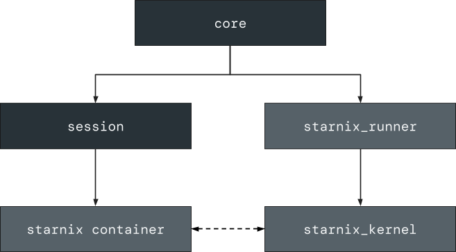
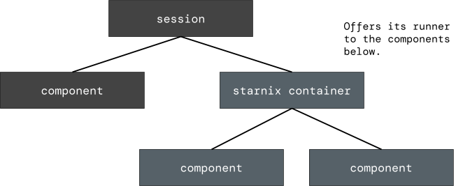

# Starnix container

Starnix containers enable running Linux binaries in different Linux
environments.

## Overview of a Starnix container {:#overview-starnix}

A Starnix container (conceptually analogous to a
[Linux container][linux-container]{:.external} or a virtual machine) is the
combination of a Starnix kernel instance and disk images used to run a collection
of Linux processes. For instance, the [`debian_container`][debian-container]
component is a Starnix container that has a small Debian-based Linux system.
Notice that this component specifies `starnix` as its runner (see
[`debian_container.cml`][debian-container-cml]). It means that this Starnix
container component doesn't represent a single process but a whole Linux
environment that is run and managed by Starnix on Fuchsia.

### Starnix container, Starnix kernel, and Starnix runner {:#starnix-container-starnix-kernel-and-starnix-runner}

The following definitions are helpful for understanding the concepts in this
page:

- **Starnix container**: A Fuchsia component that contains configuration values
  for a Starnix kernel instance.
- **Starnix kernel** ([`starnix_kernel`][starnix-kernel]): A Fuchsia component
  responsible for executing Linux programs. This component runs a Starnix
  container and creates and executes Linux processes in the Starnix container.
  This component can also run other Fuchsia components (that are set to run
  Linux binaries) in the Starnix container.
- **Starnix runner** ([`starnix_runner`][starnix-runner]): A Fuchsia component
  responsible for creating Starnix kernel instances.

### Running a Starnix container as a Fuchsia component {:#running-a-starnix-container-as-a-fuchsia-component}

To start a Starnix container, Fuchsia asks the Starnix runner to initiate the
launch of the Starnix container component. The Starnix runner creates a new
Starnix kernel instance to be the kernel for this container. The Starnix kernel
then reads the `program` block from the Starnix container component, which
provides the following information:

- Which disk images to mount at which paths in its Linux environment.
- Which binary to run as `init` (which is the initial process that kicks off the
  Linux boot process).

While the Starnix kernel runs the Starnix container component, the Starnix
container is not part of the component hierarchy of the Starnix kernel (see
Figure 1), just like the ELF runner is not the parent of the components it runs.

**Figure 1**. A simplified component hierarchy of a Fuchsia system running
Starnix components.

### Linux environment in a Starnix container {:#linux-environment-in-a-starnix-container}

In the Linux environment inside a Starnix container, just as a typical Linux
system, most Linux processes are forked from other Linux processes, starting
with the `init` process (which, however, is created by the Starnix kernel in the
Starnix container). For instance, `init` might fork and create an `sshd`
process, which then listens on a port. When `sshd` receives a network connection
on that port, it might spawn an `sh` process to be the command-line shell for
that connection.

## Running Linux binaries in a Starnix container {:#running-linux-binaries-in-a-starnix-container}

Linux binaries as Fuchsia components can run inside an existing Starnix
container. A Starnix container itself is a component runner that can run Fuchsia
components within the container.

The following Linux binaries can run as Fuchsia components inside a Starnix
container:

- Linux binaries included in a Fuchsia package
- Linux binaries that exist in a running Starnix container

To put it differently, if developers want to run a Linux program inside of a
Starnix container, they can define a Fuchsia component in one of the following
ways:

- A component to include a Linux binary (which is set to run in a Starnix
  container) in its Fuchsia package.
- A component to reference a Linux binary in an already running Starnix
  container.

The Starnix kernel then spawns a new Linux process as a child of `init` for the
component.

### Starnix container as a component runner {:#starnix-container-as-a-component-runner}

A Starnix container can have a `collection` of child components in the Fuchsia
component framework (see [`container.shard.cml`][container-shard-cml]). In
that case, the Starnix container offers its runner to the collection. If a new
component starts in the collection (or anywhere in the component topology where
the runner of the Starnix container has been routed), that component can use
the Starnix container as its runner (for example, see the
[`hello_starnix`][hello-starnix] component).

**Figure 2**. A component topology showing a collection of child components
under a Starnix container.

When the Starnix container is asked to run a component using its runner
(according to the `program` block of the component), the Starnix container
spawns a Linux process as a child of the `init` process inside its Linux
environment.

### Including Linux binaries in a Fuchsia package {:#including-linux-binaries-in-a-fuchsia-package}

In the [`hello_starnix`][hello-starnix-cml] component, the `program` block
specifies that the Starnix container runs the `bin/hello_starnix` binary from
the same package that the `hello_starnix` component is located in. The
`hello_starnix` component can run the `bin/hello_starnix` binary from its own
package because the runner of the Starnix container mounts the namespace for
the `hello_starnix` component as a directory of the root file system inside
the Starnix container's Linux environment. (However, the `program` block
can also specify that the Starnix container runs a binary from the Linux
environment's own file system using an absolute path, such as `/bin/fortune`.)

This machinery of running Linux binaries from a Fuchsia package is most often
used for tests. Tests often come with test fixtures and other data that need
to be present inside the container along with the tests. It's common to
package this data together with the test binary (which is a Linux binary) as a
Fuchsia component and ask a test-specific Starnix container to run the test.
This mechanism lets the test access its fixtures and other data while running
inside the Starnix container.

However, Linux binaries are expected to run in an environment that contains all
their runtime dependencies. These runtime dependencies are different from binary
to binary and not always compatible. For example, some binaries require `glibc`
while others may expect [`musl`][musl]{:.external}. Therefore, Linux binaries
in a Fuchsia package need to be compatible with the Linux environment provided by
the Starnix container. For instance, if Linux binaries are linked to `glibc`,
then they must be run in a Starnix container that has `glibc` available, such as
Debian Linux distros. Similarly, many Linux binaries make assumptions about the
file system layout. Such Linux binaries need to be run in a Starnix container
that has the file system layout that matches their expectation.

<!-- Reference links -->

[linux-container]: https://en.wikipedia.org/wiki/LXC
[debian-container]: https://fuchsia.googlesource.com/fuchsia/+/main/src/starnix/containers/debian
[debian-container-cml]: https://fuchsia.googlesource.com/fuchsia/+/main/src/starnix/containers/debian/meta/debian_container.cml
[container-shard-cml]: https://fuchsia.googlesource.com/fuchsia/+/main/src/starnix/containers/container.shard.cml
[starnix-kernel]: /docs/concepts/starnix/making-linux-syscalls-in-fuchsia.md
[starnix-runner]: /docs/concepts/components/v2/starnix.md
[hello-starnix]: https://fuchsia.googlesource.com/fuchsia/+/main/src/starnix/examples/hello_starnix
[hello-starnix-cml]: https://fuchsia.googlesource.com/fuchsia/+/main/src/starnix/examples/hello_starnix/meta/hello_starnix.cml
[musl]: https://www.musl-libc.org/
