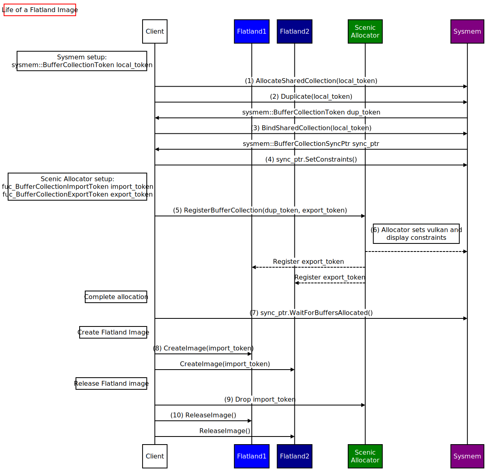

# Life of a Flatland image

This document describes the life of a Flatland Image. Image is a bitmap of pixels and the most
common type of Flatland Content. The graphical applications are often interested in drawing their UI
onto a buffer and sending it to the system compositor to be displayed, which happens through Image.
Flatland relies on Sysmem and Allocator APIs for the allocation of these graphical buffers.

The sequence diagram below shows the steps a client follows to allocate, use and destroy these
graphical buffers. The reasoning and details are explained for each step that is described in this
diagram.

1. Client initiates the buffer allocation by creating a Sysmem token. This uses the common steps in
the allocation process of Sysmem. Sysmem allows allocating shared memory for use by multiple
applications and hardware blocks. This functionality of Sysmem is exactly what is needed for
graphical buffers: a buffer for writing, that the GPU can access and which the display can read. It
is also important to avoid any copies because graphical buffers are big and copying operations can
be costly.

2. Client duplicates Sysmem tokens which will be sent to the other participants. In this sequence,
the focus is on the Flatland Image, so one of these duplicate tokens is needed for Scenic. However,
the client is free to duplicate more and send around as needed. i.e. a video player application may
want to share it with the decoder. Note that all of the Sysmem tokens have to be used for the
allocation to complete.

3. Client uses one of the tokens itself to bind into a ``BufferCollection``. `BufferCollection`
protocol allows for the client to interact with Sysmem.

4. Client sets constraints on `BufferCollection`. Remember that each Sysmem token needs to be used
and there are no exceptions. Client may choose to set no constraints here.

5. Client sends one of the Sysmem token duplicates to Flatland Allocator. This is the stage where
Flatland becomes a participant in this buffer collection negotiation. Client does this by creating a `fuchsia::ui::composition::BufferCollectionImportToken` and
`fuchsia::ui::composition::`BufferCollectionExportToken` pair. Client connects to
fuchsia::ui::composition::Allocator service and sends `BufferCollectionExportToken` and the
duplicated Sysmem token.

6. Flatland sets buffer constraints behind the scenes. Flatland collects the necessary constraints
from Vulkan and Display hardware. This ensures that Flatland can directly use the buffers. At this
stage, `BufferCollectionExportToken` is registered for this allocation and any Flatland instance may
access
it by using the corresponding `BufferCollectionImportToken`. This registration is not limited to a
single Flatland instance in case the instances are torn down or the client has multiple Flatland
instances, to avoid reallocation or copy of buffers which is costly.

7. Client waits for the buffer allocation completion through `BufferCollection` protocol. This can
only succeed if all of the duplicated Sysmem tokens are used and an overlap is found that satisfies
each participant’s constraints. This call may hang if any of the tokens are unused. Since this may
be blocking or unsuccessful, this is expected to be processed on the client side. Once this returns
with a success signal, the shared memory is actually allocated.

8. Client creates a Flatland Image by using `BufferCollectionImportToken`. Client may choose to
allocate multiple Images by duplicating and using this `BufferCollectionImportToken`. All of them
will be pointing to the same memory allocation.

9. Clients drops all of its `BufferCollectionImportTokens` when it is done creating Flatland Images.
This sends a signal to Flatland Allocator that there will be no new Flatland Images created after
this point. This is a token ownership model instead of an explicit release method on FIDL protocol
to make it less likely to misuse and leak. This doesn’t free the buffers yet, because they stay
around as long as the Flatland Images are references. The next step is required before freeing the
buffers.

10. Client releases Flatland Image. Once all the Images referring to the `BufferCollection` are
released, the memory will be freed.
