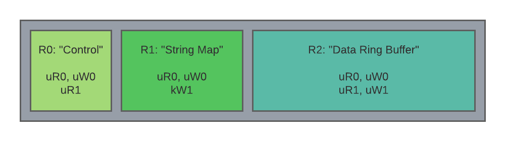

<!-- mdformat off(templates not supported) -->


# {{ rfc.name }}: {{ rfc.title }}
<!-- SET the `rfcid` VAR ABOVE. DO NOT EDIT ANYTHING ELSE ABOVE THIS LINE. -->

<!-- mdformat on -->

<!-- This should begin with an H2 element (for example, ## Summary).-->

## Summary

A new IOBuffer kernel primitive is proposed to improve the safety, convenience,
and performance of communication and distributed IO use cases using shared
memory and optional kernel-mediated operations.

## Motivation

The majority of the Fuchsia operating system is implemented in userspace,
distributed among multiple communicating processes and components. This
intentional design choice typically entails more processes and threads than the
equivalent implementations in a monolithic system, particularly when the
equivalent functionality is implemented directly in a monolithic kernel. While
this distributed approach has significant advantages for security, development,
and update-ability, an important implication is that many operations require an
IPC in Fuchsia, when only a syscall and state read/write is required in a
monolithic kernel. Furthermore, IPCs using existing Fuchsia channel and socket
primitives involve multiple syscalls, mode switches, thread hops, and data
copies to complete an end-to-end operation. The impact of this overhead can be
significant to communication and IO workloads, especially those involving large
data volumes, high frequency, and/or low latency operations.

In principle, shared memory may be employed to avoid some or all of this
overhead, while preserving the advantages of the Fuchsia userspace isolation
model. However, raw shared memory has limitations that make safe, efficient,
and reliable communication challenging in many situations, especially those
involving multiple clients, differing degrees of trust or reliability, or
shared resources.

Some challenges include:

- Security and Correctness: Direct-access shared memory communication patterns
  are difficult to make resilient to misuse or abuse without either significant
  overhead or significant complexity. Importantly, syscalls are simpler to
  validate than arbitrary memory accesses.
- Synchronization: Direct memory access affords limited synchronization
  mechanisms beyond the architectural memory model.
- Lifetime and Session: The scope of memory access can be difficult to reason
  about and enforce with existing primitives.

This proposal is a pragmatic approach to addressing these and other challenges,
leveraging the Zircon peered object model for better session management and
utilizing the kernel as a trusted intermediary to enforce obligations.

## Stakeholders

_Facilitator:_

- cpu@google.com

_Reviewers:_

- adanis@google.com
- rashaeqbal@google.com
- fmeawad@google.com
- gmtr@google.com
- maniscalco@google.com
- johngro@google.com
- abarth@google.com
- cpu@google.com

_Consulted:_

- miguelfrde@google.com
- puneetha@google.com
- mseaborn@google.com
- mcgrathr@google.com
- quiche@google.com
- mvanotti@google.com
- brunodalbo@google.com

_Socialization:_

The RFC went through a design review and iteration with Fuchsia Performance,
Diagnostics, and Zircon Performance Tools WG.

## Design

The IOBuffer (IOB) design introduces a new type of memory object for efficient
communication and distributed IO. The new object encapsulates multiple memory
regions, with different properties and roles, into a single coherent entity with
useful lifetime management, access controls, and kernel-mediated operations.

An IOB is a peered object pair with two endpoints. The endpoints provide
similar lifetime management and signaling as other peered objects, such as
channels, sockets, fifos, and event pairs. In addition to the access controls
provided by the usual endpoint handle rights, access to each memory region may
be configured independently per-endpoint to support granular security
properties.

Even stronger security properties are supported by configurable kernel-mediated
operations, where memory accesses are performed on behalf of the user through
kernel syscalls, with the kernel acting as a trusted mediator that always
follows the requested access rules. Mediated operations trade some overhead for
robustness and safety, while maintaining lower end-to-end overhead than other
communication primitives.

This flexible combination of lifetime management, memory region encapsulation,
configurable access controls, and kernel-mediated operations supports a wide
variety of shared memory communication and IO patterns, with improved safety
and convenience, compared to similar structures composed from other discrete
objects.

### Objectives

This proposal has the following high-level objectives:

* Close performance gaps with monolithic systems by reducing memory allocation,
  syscall, and scheduling overhead for communication and IO.
* Simplify shared memory lifetime management and synchronization.
* Enforce strong security invariants when required.
* Provide a foundation for future kernel and userspace interfaces.

### Endpoints

Each IOB has two endpoints, Ep0 and Ep1. IOB endpoint handles may be duplicated
and shared by multiple processes. The underlying memory objects are retained by
the IOB as long as at least one endpoint handle exists, providing similar
lifetime semantics to other peered objects.

### Memory Regions

An IOB encapsulates a collection of one or more memory regions that have
independent properties and access controls to support each region's intended
role in a communication protocol. For example, different regions may be used for
purposes including key/value stores, client coordination, state management, and
data payload transfer.

### Access Control

Memory access is configured per endpoint and region combination during IOB
creation. Each endpoint may be granted different access rights to each region.
Region access controls are combined with the handle rights of an endpoint when
validating an operation. The effective rights for an operation may be stricter
than the handle rights, but cannot be greater than the handle rights permit.

Memory access may also be [mediated through the kernel](#mediated-access)
without mapping.

The following table lists the three types of access controls that pertain to a
region. The mapping (user) and mediated (kernel) access controls may be set
independently for each region, while the endpoint rights come from the handle
initiating the operation.

Type              | Ep0      | Ep1
----------------- | -------- | --------
Mapping (user)    | uR0, uW0 | uR1, uW1
Mediated (kernel) | kR0, kW0 | kR1, kW1
Endpoint (handle) | hR0, hW0 | hR1, hW1

The effective access rights, eRn and eWn, for a mapping or mediated operation
by endpoint Epn are computed as follows:

Operation    | Read Rights (eRn) | Write Rights (eWn)
------------ | ----------------- | ------------------
Map          | uRn & hRn         | uWn & hWn
Mediated Op  | kRn & hRn         | kWn & hWn

#### Mediated Access Control and Directionality

A subtle distinction between user and kernel access control is that the former
control read or write access in the absolute sense, while the latter operate in
the logical or directional sense. For example, a kernel-mediated read operation
might involve updating bookkeeping data structures in a region to indicate how
much data was read from a buffer. Read-only access in this sense does not
prevent the kernel from updating the bookkeeping, but rather indicates that only
logical read operations, and the associated bookkeeping updates, are permitted.

### Example

The following schematic diagram depicts an IOB having three memory regions with
logical functions. The endpoints Ep0 and Ep1 are logically assigned to server
and client roles, respectively.

1. Region 0 "Control":
   - Ep0: RW mapping access.
   - Ep1: RO mapping access.
   - Usage: The server writes atomic variables in this region to publish state
     to, and coordinate the activity of, the client(s).
1. Region 1 "String Map":
   - Ep0: RO mapping access.
   - Ep1: Mediated WO access.
   - Usage: The client uses kernel-mediated operations to internalize strings,
     which are interpreted lock-free by the server using a mapping. Because
     client access is mediated-only, the client may not tamper with the string
     map, other than to add new entries, eliminating potential time of check,
     time of use hazards for the server.
1. Region 2 "Data Ring Buffer":
   - Ep0: RW mapping access.
   - Ep1: RW mapping access.
   - Usage: Both client and server access this region directly through mappings
     using an agreed upon protocol and accept potential integrity issues.



### Creation

An IOB is created by calling `zx_iob_create` with a set of options.

```C++
zx_status_t zx_iob_create(uint64_t options,
                          const zx_iob_region_t* regions,
                          uint32_t region_count,
                          zx_handle_t* ep0_out,
                          zx_handle_t* ep1_out);
```

#### Parameters

- *options* is reserved for future extensions.

- *regions* is a pointer to an array of `zx_iob_region_t` region descriptions.

- *region_count* specifies the number of elements in the regions array.

- *ep0_out*, *ep1_out* are out parameters for the initial handles to the
  endpoints of the IOB.

#### Region Descriptions {#region-descriptions}

The geometry and configuration of a region are specified by a `zx_iob_region_t`
region description structure. The base structure includes fields that are common
to all region types.

```C++
struct zx_iob_region_t {
  uint32_t type;
  uint32_t access;
  uint64_t size;
  zx_iob_discipline_t discipline;
  union {
    zx_iob_region_private_t private_region;
    uint8_t max_extension[4 * 8];
  };
};
```

- *type* specifies the type of the region and memory object backing it.
  - Type 0: [Private region](#private-region-type).
  - Type 1+: Reserved for future use.

- *access* specifies the access control modifiers for each endpoint. The memory
  access discipline MAY specify which combinations of access bits are valid to
  support security or correctness properties.
  - Bit 0: uR0 mapping for Ep0.
  - Bit 1: uW0 mapping for Ep0. May imply uR0 on some systems.
  - Bit 2: kR0 mediated access for Ep0.
  - Bit 3: kW0 mediated access for Ep0.
  - Bit 4: uR1 mapping for Ep1.
  - Bit 5: uW1 mapping for Ep1. May imply uR1 on some systems.
  - Bit 6: kR1 mediated access for Ep1.
  - Bit 7: kW1 mediated access for Ep1.
  - \[8..31\]: Reserved for future use.

- *size* is the requested size of the region in bytes. The size will be rounded
  up to the system page size boundary. Use `zx_object_get_info` with topic
  `ZX_INFO_IOB_REGIONS` to determine the actual size of the region.

- *discipline* specifies the memory access discipline to employ for
  [kernel-mediated operations](#mediated-access).

##### Region Type 0: Private {#private-region-type}

Specifies a region backed by a private memory object uniquely owned by the IOB.
This memory object is only accessible through operations on, and mappings of,
the owning IOB.

```
struct zx_iob_region_private_t {
  uint64_t options;
};
```

- *options* reserved for future use.

##### Region Type 1+: Reserved for Future Use

Future extensions may include a shared region type, where the same memory object
is shared by multiple IOBs, to support efficient multi-agent coordination.

### Mapping

Memory regions of an IOB are mapped by calling `zx_vmar_map_iob`. This call
has similar semantics to `zx_vmar_map`.

```C++
zx_status_t zx_vmar_map_iob(zx_handle_t vmar,
                            zx_vm_option_t options,
                            size_t vmar_offset,
                            zx_handle_t ep,
                            uint32_t region_index,
                            uint64_t region_offset,
                            size_t region_len,
                            zx_vaddr_t* addr_out);
```

#### Parameters

- *vmar* is a handle to the VMAR to map the region into.
- *options* is equivalent to the *options* parameter of `zx_vmar_map`. Only the
  options listed below are supported.
- *vmar_offset* is equivalent to the *vmar_offset* parameter of `zx_vmar_map`.
- *ep* is the endpoint containing the region to map.
- *region_index* is the index of the memory region to map.
- *region_offset* is equivalent to the *vmo_offset* parameter of `zx_vmar_map`.
- *region_len* is equivalent to the *len* parameter of `zx_vmar_map`.
- *addr_out* is an out parameter returning the virtual address of the mapping.

Supported options:

- `ZX_VM_SPECIFIC`
- `ZX_VM_SPECIFIC_OVERWRITE`
- `ZX_VM_OFFSET_IS_UPPER_LIMIT`
- `ZX_VM_PERM_READ`
- `ZX_VM_PERM_WRITE`
- `ZX_VM_MAP_RANGE`

Other options reserved for future use and return `ZX_ERR_INVALID_ARGS` if
specified.

Mapping a private region is functionally identical to mapping a non-resizable
VMO. Returns `ZX_ERR_BUFFER_TOO_SMALL` if the mapping extends beyond the end of
the memory object and `ZX_VM_ALLOW_FAULTS` is not set.

The *region_offset* and *region_len* parameters are included as a best practice
for mapping APIs. Motivations for this best practice include:

- Supporting sanitizers that intercept mapping calls. Using explicit ranges
  simplifies tracking of actively mapped regions.
- Supporting sandboxing that explicitly manages address space placement and
  region overwrite.
- More generally, avoiding accidental collisions when using
  `ZX_VM_SPECIFIC_OVERWRITE`.

#### VMAR Operations

Mapped regions generally support VMAR operations, such as `zx_vmar_protect`,
`zx_vmar_op_range`, `zx_vmar_destroy`. A region's access discipline MAY modify
or restrict these operations as described in the discipline spec.

### Object Info Query

IOB support querying object properties and memory regions by
`zx_object_get_info`. The returned details include the key properties of the
memory objects backing each region for validation and safety purposes.

#### Topic `ZX_INFO_IOB`

Returns information about the overall IOB instance.

```C++
struct zx_iob_info_t {
  uint64_t options;
  uint32_t region_count;
  uint8_t padding1[4];
};
```

##### Members

- *options* is the value of the *options* parameter passed to `zx_iob_create`.
- *region_count* is the number of regions in the IOB.

#### Topic `ZX_INFO_IOB_REGIONS`

Returns information about each region of an IOB as an array of
`zx_iob_region_info_t` [region description](#region-descriptions) elements.

```C++
struct zx_iob_region_info_t {
  zx_iob_region_t region;
  zx_koid_t koid;
};
```

- *region* is the region description, with potentially swapped access bits.
- *koid* is the koid of the underlying memory object.

Access modifier bits are swapped, such that the Ep0 access bits reflect the
access of the endpoint making the query and the Ep1 bits reflect the access of
the other endpoint, making it possible to determine the access of the local and
remote handles without knowing which handles were Ep0 and Ep1 when created.

#### Topic `ZX_INFO_PROCESS_VMOS`

For continuity with existing memory attribution mechanisms, the memory objects
backing IOB regions are counted like regular VMOs by this topic, including
reachability by both handles and mappings.

For private region types, the backing memory objects are assigned distinct KOIDs
and, by default, share the same name as the owning IOB. An access discipline MAY
override or modify the default name of a private region.

### Mediated Access {#mediated-access}

IOBs support configurable kernel-mediated access to the memory regions. Mediated
access provides stricter data integrity and other invariants than possible
through direct access by using the kernel as a trusted intermediary. The kernel
is guaranteed to follow the access rules specified for a memory region by the
access discipline.

#### Mediated Read, Write, and Etc...

Mediated operations are performed by IOB read, write, and auxiliary syscalls to
be specified in future extensions. Access disciplines may define new IOB
syscalls or overload those defined previously, provided the usage is
semantically consistent. A general goal is to define a few reusable syscalls
that fit many use cases.

### Rights

IOBs have the following rights by default:

- `ZX_RIGHTS_BASIC` = (`ZX_RIGHT_TRANSFER` | `ZX_RIGHT_DUPLICATE` |
  `ZX_RIGHT_WAIT` | `ZX_RIGHT_INSPECT`)
- `ZX_RIGHTS_IO` = (`ZX_RIGHT_READ` | `ZX_RIGHT_WRITE`)
- `ZX_RIGHTS_PROPERTY`
- `ZX_RIGHTS_MAP`
- `ZX_RIGHTS_SIGNAL`
- `ZX_RIGHTS_SIGNAL_PEER`

### Properties

IOBs support `ZX_PROP_NAME` to provide diagnostic and attribution information.

IOBs MAY support additional properties defined by the region access disciplines.

### Signals

IOBs support peer and user signals to alert users to notable conditions. Future
extensions may define configurable signals.

#### `ZX_IOB_PEER_CLOSED`

`ZX_IOB_PEER_CLOSED` is raised on an endpoint when the last reference to the
other endpoint is released. Handles to an endpoint and mappings created from the
endpoint count as references for this purpose.

#### `ZX_USER_SIGNAL_*`

Users may raise `ZX_USER_SIGNAL_*` to indicate notable conditions.

### Kernel-Mediated Access Disciplines

To facilitate mediated operations, the kernel must know how to correctly access
a memory region. The rules and configuration for memory access to a region is
called the access discipline, which may include:

- Position and format of bookkeeping.
- Overwrite/failure policy.
- Watermark and timeout settings.
- Memory order and fence requirements.

#### Discipline Descriptions {#discipline-descriptions}

Access disciplines are specified using an extensible description structure with
32bit header specifying the type and format of the description.

```C++
#define ZX_IOB_DISCIPLINE_TYPE_NONE (0)

struct zx_iob_discipline_t {
  uint32_t type;
  union {
    uint8_t max_extension[4 * 15];
  };
};
```

Examples of disciplines that may be defined in future RFCs include:

- Producer / Consumer Ring Buffer
- Id / Blob Map
- Key / Value Store
- Scatter / Gather Memory Copy
- Directory Entry Cache

## Implementation

The initial implementation is a foundational step to support tracing and logging
customers. The descriptions that follow are case studies that illustrate the
motivation for the defined IOB features and the potential extensions to address
use case requirements.

### System Event Tracing

IOBs are intended to provide the foundation for safer, more efficient system
event tracing by supporting the following:

- Reducing runtime overhead by moving session coordination, metadata, and event
  collection exclusively to IOB regions, eliminating the need for dispatch
  threads and channel IPC after initial setup.
- Enabling the instrumentation of low-level facilities such as FDIO and FIDL by
  eliminating dependencies other than the IOB kernel API.
- Improving robustness by allowing the kernel to safely reclaim trace event
  buffers to avoid critical OOM conditions in combination with
  [RFC 0181: Lockless Discardable VMO][lockless-discardable-vmo].

A system tracing IOB may use a configuration like the following:

- Roles:
  - Ep0: Trace Manager
  - Ep1: Trace Provider
- Region 0: Trace Category Bit Vector
  - Type: Private
  - Access:
    - Ep0: uR0, uW0 (R/W)
    - Ep1: uR1 (RO)
  - Discipline: None
  - Usage: An array of `uint64_t` bit vectors representing enabled tracing
    categories.
- Region 1: Trace Categories
  - Type: Private
  - Access:
    - Ep0: uR0, uW0 (R/W)
    - Ep1: kW1 (Mediated only add entry)
  - Discipline: Future id/blob allocator discipline.
  - Usage: A sequential id/string map representing category bits for each
    tracing category used by the trace provider.
- Region 2: Internalized Strings
  - Type: Private
  - Access:
    - Ep0: uR0, uW0 (R/W)
    - Ep1: kW1 (Mediated only add entry)
  - Discipline: Future id/blob allocator discipline.
  - Usage: A sequential id/string map representing internalized strings for
    trace event names and other frequently referenced names.
- Region 3: Low Rate / Static Metadata
  - Type: Private
  - Access:
    - Ep0: uR0, uW0 (R/W)
    - Ep1: uR1, uW1 (R/W)
  - Discipline: Future multi-producer/single-consumer ring buffer discipline.
  - Usage: Lock-free ring buffer for low rate / static trace events, such as
    thread names. These events are typically required to correctly interpret
    other trace events in the high rate buffer.
- Region 4: High Rate Trace Events
  - Type: Private
  - Access:
    - Ep0: uR0, uW0 (R/W)
    - Ep1: uR1, uW1 (R/W)
  - Discipline: Future multi-producer/single-consumer ring buffer discipline.
  - Usage: Lock-free ring buffer for high rate trace events. Tolerant to data
    loss in circular buffer mode.

### System Logging

IOBs are intended to provide the foundation for safer, more efficient system
logging by supporting the following:

- Isolating logs from different components and/or severity levels, preventing
  cross-component and cross-severity log rolling.
- Avoiding processing logs that are not actively being observed.
- Eliminating the use of dispatch threads to handle severity changes.
- Per-component (memory) resource management and accountability.

The following actors are involved:

1. Log producer: Components that emit logs.
1. Log manager (Archivist): Routes logs from all producers to all consumers.
1. Log consumer: Connects to the log manager and reads a merged stream of logs.

A system logging IOB may use a configuration like the following:

- Roles:
  - Ep0: Log manager (Archivist)
  - Ep1: Log producer (some component)
- Region 0: Control
  - Type: Private
  - Access:
    - Ep0: uR0, uW0 (R/W)
    - Ep1: uR1 (RO)
  - Discipline: None
  - Usage: Stores runtime configuration, such as the minimum severity. May also
    store information about the maximum size of the log circular buffer,
    depending on the requirements for memory management.
- Region 1: String table
  - Type: Private
  - Access:
    - Ep0: uR0 (RO)
    - Ep1: kW1 (WO)
  - Discipline: Future id/blob allocator discipline.
  - Usage: A sequential id/string map representing internalized strings for
    frequently referenced log strings, tags, keys, metadata.
- Region 2: Log circular buffer
  - Type: Private
  - Access:
    - Ep0: uR0, uW0 (R/W) (write for the R/W/C pointers and writes in-flight
      counter)
    - Ep1: kW1 (WO)
  - Discipline: Future multi-producer/single-consumer ring buffer discipline.
  - Usage: Lock-free ring buffer for log records. Tolerant to data loss in
    circular buffer mode. The plan is to start with kernel-meditated writes from
    the producer and direct reads from the manager. May move to direct access by
    the producer if performance requires it.

### Implementation Steps

Implementation will follow a series of development steps:

1. Introduce IOB interfaces under the @next attribute:
   * Implement base IOB dispatcher.
   * Implement syscalls and common validation.
1. Prototype IOB-based tracing and logging, along with necessary IOB extensions
   in a branch.
1. Write and ratify RFCs for necessary extensions.
1. Implement extensions and remove @next attribute.
1. Rebase tracing and logging on IOBs, soft transiting existing clients to the
   new interfaces.

## Performance

The performance improvements may be verified by comparing end-to-end latency and
overhead of comparable operations before deprecating and removing the current
tracing/logging implementations. Ongoing benchmarks may include buffer memory
provenance (VM overhead), latency/concurrency tests for key operations, and
allocation tests to verify steady state memory consumption properties.

## Ergonomics

IOBs are, by design, easier to reason about than a combination of VMOs, events,
and IPC objects necessary to approximate similar functionality. The lifetime of
an IOB endpoint is also easier to manage coherently than a combination of
multiple objects and the rules about memory access are easier to enforce than
with VMOs.

## Backwards Compatibility

IOBs only impact FIDL file source compatibility and ABI wire format
compatibility by introducing new handle types to the language, which does not
affect backwards compatibility.

## Security considerations

Shared memory use cases always present some potential for security
vulnerability. Most IOB uses do not introduce new hazards that shared VMOs are
not subject to. However, IOBs do reduce the risk of certain mistakes, due to
stronger rules about rights and memory access lifetime.

### Copy Elision and Time-of-Check to Time-of-Use Hazards

One important class of software bug that manifests in shared memory use cases is
the so called time-of-check to time-of-use hazard (TOCTOU). A TOCTOU hazard is
caused by a race condition between checking some state and using the result of
the check, such that the state may become invalid between the check and the use
of the result.

Avoiding TOCTOU hazards in open-ended shared memory use cases can be
challenging, often requiring copying data out of the shared memory region to
avoid modification during or after validation. Even in cases where copying is
employed, care must be taken to prevent copy elision, since compilers may
optimize out the copies and operate directly on the shared memory region unless
specific interventions are used.

Kernel-mediated operations can simplify mitigating TOCTOU hazards by
guaranteeing the kernel follows the rules for metadata updates, payload
transfers, and memory order for accesses. For example, when using a ring buffer
discipline, the kernel is guaranteed not to overwrite the contents of a record
until the consumer acknowledges it is safe to do so by updating the ring buffer
bookkeeping, avoiding the need for copying the payload before validation.

Notwithstanding, the user is still responsible for the correct application of
memory order and atomics, or language-specific equivalents, to prevent
correctness hazards due to optimization. To ease the burden on users, the
Fuchsia SDK will include libraries for supported languages that implement
correct access routines for each defined discipline. Discipline specifications
will also include sufficient details for safe and correct application of the
access rules.

## Privacy considerations

IOBs do not introduce new privacy considerations beyond those already
applicable to IPC and shared memory use cases. The initial use cases for system
event tracing and logging will continue to carry the same privacy obligations.

## Testing

Testing includes the following:

* Core tests for IOBs.
* FIDL conformance tests for handle type validation of the new types.
* Expansion of Fuchsia Tracing System tests to include IOB-specific
  functionality.
* Expansion of System Logging tests to include IOB-specific functionality.

Existing tracing and logging tests that do not depend on the underlying
implementation details should continue to function and pass.

## Documentation

Documentation updates include:

* Syscall references.
* Kernel concepts.
* FIDL handle types.

## Drawbacks, alternatives, and unknowns

The costs of implementing this proposal are relatively small, as the feature
builds on existing machinery for virtual memory and peered dispatchers. The
unique functionality centers on asymmetric access rights, kernel-mediated region
accesses, and unmap-on-close functionality.

## Prior art and references

- [Fuchsia Tracing System][fuchsia-trace]
- [Fuchsia Trace Format][fxt-format]
- [RFC 0181: Lockless Discardable VMO][lockless-discardable-vmo]
- [Implement a lock-free R/W ring buffer](https://fuchsia-review.googlesource.com/c/fuchsia/+/674342)

[fuchsia-trace]: /docs/concepts/kernel/tracing-system.md
[fxt-format]: /reference/tracing/trace-format.md
[lockless-discardable-vmo]: /docs/contribute/governance/rfcs/0181_lockless_discardable_vmo.md
