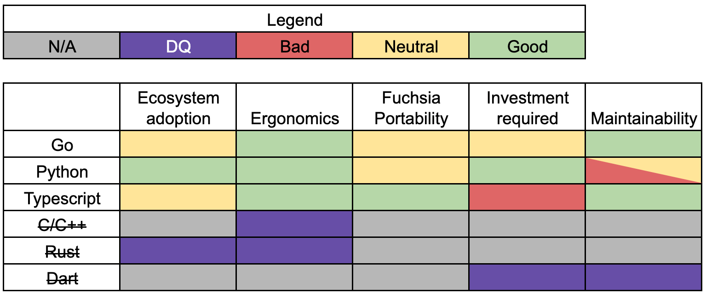

<!-- Generated with `fx rfc` -->
<!-- mdformat off(templates not supported) -->


# {{ rfc.name }}: {{ rfc.title }}
{# Fuchsia RFCs use templates to display various fields from _rfcs.yaml. View the #}
{# fully rendered RFCs at https://fuchsia.dev/fuchsia-src/contribute/governance/rfcs #}
<!-- SET the `rfcid` VAR ABOVE. DO NOT EDIT ANYTHING ELSE ABOVE THIS LINE. -->

<!-- mdformat on -->

## Summary

Approve Python for out of tree (OOT) system testing.

## Motivation

There is a [known need][OOT system testing] for improving Fuchsia's
end-developer facing system testing support. With driver development moving
out-of-tree (OOT), this presents an immediate demand for shipping a standardized
system testing solution via the SDK to support hardware qualification.

As a prerequisite to starting this work, the programming language to build the
solution with needs to be selected. This document considers various programming
languages for OOT system testing by proposing an evaluation criterion and
providing data points for each language. The findings from the evaluation
exercise will be used to make an informed recommendation on the programming
language Fuchsia should use for meeting today's OOT system testing needs.

## Stakeholders

_Facilitator:_

* David Moore (davemoore@google.com)

TBD

_Reviewers:_

* abarth@google.com
* cpu@google.com
* jamesr@google.com
* keir@google.com
* rlb@google.com

_Consulted:_

* amituttam@google.com
* crjohns@google.com
* dannyrosen@google.com
* dworsham@google.com
* fmeawad@google.com
* guptaritu@google.com
* jeremymanson@google.com

_Socialization:_

The OOT system testing evaluation rubric and the evaluation of each programming
language in consideration were discussed in Google Docs with members from the
FEC, Testing Architecture team, Testing Infrastructure team, and Tools Team.

## Definitions

*   **System Tests** are often referred to as E2E or CUJ tests, these are tests
conducted on a complete assembled system to validate that the system meets
certain requirements. For a comprehensive definition, see
[What are system tests?][system test def].

## Product requirements

Summary of the product motivation and requirements to support next generation
OOT system testing for Fuchsia.

**Primary user(s):** Developers and system integrators testing the Fuchsia
platform and products.

**Environments:** In-tree, and all environments and petals that the SDK ships
to.

### Strategy

*   Scope use cases to E2E device testing involving one or more target devices.
*   Provide a path to migrate existing SL4F tests and users to the new
framework.
*   Address existing pain points with SL4F, with a focus on ergonomics of
writing tests in an easy to use language.
*   Ensure easy integration with Google's E2E test frameworks.
*   Invest in additional features requested by Fuchsia users to address platform
testing needs (e.g. performance monitoring, memory usage, etc.).

### Importance of programming language choice

Test framework adoption depends heavily on language choice. An easy to use
language that is already widely adopted in this system testing use case is
highly beneficial to expand beyond core SWEs and include Test Engineers and
System Integrators as well.

## Evaluation rubric

The general pros and cons of each language (with the exception of TypeScript and
JavaScript) are already well documented in the
[Fuchsia Programming Language Policy][FPLP] (FPLP). The metrics used in this
document cover language aspects that are specifically relevant to OOT system
testing.

Evaluation rubric (in no particular order):

*   **Ecosystem adoption: Language popularity in the OOT system testing space**
    *   A mainstream and widely used language for system testing is beneficial
    for OOT adoption.
    *   Prefer languages that are already used for system testing in OOT
    customer codebases.

*   **Ergonomics: How well a language supports the common modes of system
testing usages**
    *   A common system testing pattern is to coordinate host-device
    interactions - e.g. trigger APIs on Fuchsia device(s)-under-test (DUTs) and
    assert behavior. This type of usage benefits from a different set of
    language features than traditional Fuchsia platform development; some key
    differences:
        *   Prioritize development agility over performance.
            *   Prefer automatic memory management and garbage collection.
            *   Test performance on host is often a minor consideration.
        *   Prefer interactive mode/REPL for rapid prototyping.
        *   Larger binary/source footprint is less detrimental.
        *   Asynchronous language support is a nice-to-have but not a must.
        *   System tests are often smaller projects with lines of codes only in
        the order of hundreds. Prefer readable language that's easy to inspect
        for correctness over a few hundred lines. (tests are production code
        often without adequate testing themselves - so ease of correctness
        reasoning is useful).

*   **Fuchsia portability: Ease of running on both host and Fuchsia target**
    *   While the language being evaluated in this doc will primarily be used as
    a host language, there exists test-cases that can only be accomplished via
    target-driven means (e.g. use of interfaces not exported to host, timing and
    throughput guarantees that are only possible target-side); therefore a
    language's portability to be run on the Fuchsia target for system testing is
    important to consider. There are also reusability benefits to using a
    portable language for system testing (e.g. reusing common logic like
    encode/decode on host and target).

*   **Investment required: Work required to productionize an OOT system
testing solution**
    *   Understanding the language specific gaps allows us to better compare
    between alternatives with time and resource constraints in mind.
    *   Some examples of investments required:
        *   Build support
        *   Existing library support
        *   Test framework development
        *   Host-Device interaction library & tooling (e.g. SL4F support)
        *   Language support in SDK
        *   Documentation and developer education

*   **Maintainability: Work required to sustain an OOT system testing
solution**
    *   There may be long term ramifications of staffing requirements, code
    health, and technical debt depending on the language chosen.
    *   Example maintainability aspects:
        *   Runtime updatability - ability to update runtime without breaking
        OOT users.
        *   Fuchsia API Versioning - tooling to prevent OOT breakages caused by
        Fuchsia API changes. e.g. how to detect breaking changes in system
        testing APIs that are exported to OOT users.
        *   Code health
            *   Large software projects generally benefit from language features
            such as static typing.
            *   Ease of enabling automated static analysis tooling (e.g. linter,
            coverage, etc...).

## Languages in consideration

This section goes over several languages that are being considered for OOT
system testing and provides evidence for/against each evaluation metric. To make
the comparisons between the languages simpler, a score of either **Infeasible**,
**Bad**, **Neutral**, or **Good** is assigned for every category in the
evaluation rubric for each language.

Note: This coarse-grained bucketing obfuscates many nuances within or around the
same "score", but the aim of this approach is to surface the significant
differences between the languages.

### Go

**Ecosystem adoption: Neutral**

*   Neutral: Go is a popular language in general ([TIOBE][TIOBE],
[PYPL][PYPL]) but there's no evidence that Go is widely used in the system
testing space for Fuchsia's existing OOT partners.
*   Pro: There is evidence of Go being used for system testing in the wider
scope of all testing solutions in the wild:
    *   Chromium uses Go in the [Tast effort][Tast].
    *   [GCP Android system testing][Go cloud testing] is written in Go.

**Ergonomics: Good**

*   Pro: People using this language are highly productive ([FPLP][FPLP]).
*   Pro: Supports garbage collection and provides memory safety guarantees
([FPLP][FPLP]).
*   Pro: Goroutines make asynchronous communications compact and easier to
reason about.
*   Con: Compiled language not as desirable for interactive system test
development.

**Fuchsia portability: Neutral**

*   Pro: There is prior art in Go runtime support in Fuchsia (e.g.
[fidlgen][fidlgen]).
*   Con: Go for platform development is discouraged ([FPLP][FPLP]).

**Investment required: Neutral**

*   Con: There's no generic in-tree system testing solution implemented in this
language.
    *   There's some prior art in Go based system tests in
    [System OTA tests][OTA tests] but there is no solution for generically
    supporting all types of system tests (e.g. multi-device tests).
    *   No generic host to Fuchsia device interaction library.
*   Pro: [SL4F client library][Go SL4F] exists in Fuchsia source code.
*   Neutral: Requires investment in OOT similar to other
[languages in consideration](#languages-in-consideration).
    *   Source distribution
        *   Neutral: investment similar to other languages.
    *   Static analysis
        *   Pro: `gofmt` and `govet` are already enabled in Fuchsia CI.
    *   Bazel integration
        *   Pro: Bazel build system [supports Go][Bazel Go].

**Maintainability: Good**

*   Pro: Updatability - No evidence of major updatability issues.
    *   Tooling exists to rewrite Go files to be compliant with new Go releases
    - https://pkg.go.dev/cmd/fix.
*   Pro: Code health - Statically typed language is beneficial for OOT code
health.
*   Neutral: Fuchsia API Versioning - Requires investment in API versioning
similar to the other [languages in consideration](#languages-in-consideration).

### Python

**Ecosystem adoption: Good**

*   Pro: Python is a popular language in general ([TIOBE][TIOBE], [PYPL][PYPL]).
    *   Python is the fastest growing major programming language industry and
    highly taught in top universities.
    *   It's also second only to JavaScript in GitHub activity, a sign of active
    development.
*   Pro: [Mobly](https://github.com/google/mobly), an open source multi-device
e2e test framework, is the well-lit path internally for multi-device system
testing in Google.

**Ergonomics: Good**

*   Pro: People using this language are highly productive ([FPLP][FPLP]).
*   Pro: Supports garbage collection ([FPLP][FPLP]).
*   Pro: Python interpreter allows users to interactively develop/test without
need of compilation which is especially useful in the context of remote control.

**Fuchsia portability: Neutral**

*   Pro: Python is a portable language for all existing host platforms and
should be supported on Fuchsia in the fullness of time for Fuchsia to be a
viable option as a general purpose OS.
*   Con: Python has a substantial runtime environment and there's no prior-art
in supporting the Python runtime in Fuchsia; so the investment required to
support Python would be significant.

**Investment required: Good**

*   Pro: Python Mobly-based system testing solution already exists
[in-tree][In-tree e2e].
    *   Pro: [SL4F client library][Python SL4F] exists.

*   Pro: Pigweed in Fuchsia is heavily invested in Python.
    *   Python is overwhelmingly used in our downstream projects for
    development, test automation, factory tooling, etc.
    *   Will continue investing heavily in OOT Python indefinitely
    ([Link 1](https://pigweed.dev/python_build.html#docs-python-build),
    [Link 2](https://pigweed.dev/pw_build/python.html)).
    *   Invested in both GN and Bazel tooling; GN tooling is mature, Bazel
    tooling is under active development.
*   Neutral: Requires investment in OOT similar to other
[languages in consideration](#languages-in-consideration).
    *   Source distribution
        *   Neutral: investment similar to other languages.
    *   Static analysis
        *   Con: Static typing benefits via type hint ([PEP 484][PEP 484])
        require infra investment to automate static type checking.
        *   Pro: Pigweed has [automated these in GN][PW GN]
        which Fuchsia.git can leverage.
    *   Bazel integration
        *   Pro: Bazel build system
        [supports Python](https://bazel.build/reference/be/python).
        *   Pro: Pigweed is going to extend the existing Bazel Python
        integration even further, regardless of Fuchsia decision.

**Maintainability: Bad (Neutral with investment)**

*   Con (Neutral with investment): Updatability - Requires investment in Python
static analysis tooling to reach neutral score, otherwise Python's large runtime
interface and nature of being a non-compiled language leads to higher
probability of breakages on runtime updates and difficulty in asserting runtime
support respectively.
    *   Pro: Updatability - [RFC-0129][RFC-0129] establishes in-tree Python best
    practices (e.g. Python 3.8+) which should prevents major Python runtime
    updatability issues.
        *   Python has tightened rules on backwards compatibility in 2020
        ([PEP 387][PEP 387]).
        *   Python creator and core Python devs cite lessons learned from Python
        2 to 3 as reason for not having major version updates any time soon due
        to the wide-spread incompatibility issues that would occur.
    *   Con: Python has a relatively large runtime interface and so runtime
    updates are more likely to cause breakages than other
    [languages in consideration](#languages-in-consideration).
    *   Con: Python is an interpreted language so it's more difficult to detect
    API breakages that may occur on runtime updates so correctness can only be
    asserted through execution instead of compilation. Though since the APIs
    developed for OOT system testing will be testing-oriented, they should be
    thoroughly exercised through existing in-tree checks any time a runtime
    version is bumped. For maximum confidence, there will need to be investments
    made in Python source code coverage to monitor and enforce a high level of
    absolute coverage for all SDK-based Python modules.
*   Con (Neutral with investment): Code health - Requires investment in Python
static analysis tooling to reach neutral score, otherwise Python's lack of
static-typing enforcement can lead to poor code health.
    *   May not be able to extend static-typing enforcement to OOT system
    testing projects that build upon the SDK's Python APIs. Even though Fuchsia
    can enforce type hints and code coverage in the Python APIs exported OOT,
    there are no built-in language features in Python to require this practice
    to be continued OOT.
    *   There is line-of-sight for addressing these challenges (e.g. invest in
    upstream Bazel Python support for build-time enforcement of Type hints).
*   Neutral: Fuchsia API versioning - Requires investment in API versioning
similar to the other [languages in consideration](#languages-in-consideration).

### TypeScript

**Ecosystem adoption: Neutral**

*   Neutral: TypeScript/JavaScript is a popular language ([TIOBE][TIOBE],
[PYPL][PYPL]) but there's no evidence that TS/JS is widely used in the system
testing space for Fuchsia's existing OOT partners.

**Ergonomics: Good**

*   Pro: Async support is robust, good for scripting the device itself.
*   Pro: Supports garbage collection.
*   Pro: JS interpreter allows users to interactively develop/test without need
of compilation which is especially useful in the context of remote control.

**Fuchsia portability: Good**

*   Pro: Fuchsia has demonstrated JS runtime support with the experimental
JavaScript interpreter/shell - [Josh][Josh] (not productionized).

**Investment required: Bad**

*   Con: Not an approved language for use in Fuchsia ([FPLP][FPLP]).
*   Con: No in-tree GN build system support for this language.
*   Con: No in-tree system testing solution implemented in this language.
*   Con: SL4F client library does not exist in Fuchsia source code.
*   Neutral: Requires investment in OOT similar to other
[languages in consideration](#languages-in-consideration).
    *   Source distribution
        *   Neutral: investment similar to other languages.
    *   Static analysis
        *   Con: No existing in-tree support for TypeScript.
    *   Bazel integration
        *   Pro: Bazel build system [supports TypeScript][Bazel TS].
        *   Con: Pigweed team had a negative experience with integrating TS with
        Bazel to the point where all TS Bazel integration have since been
        deleted. Quoting the Pigweed team:
            *   TS Bazel breakages were not debuggable.
            *   Node ecosystem did't integrate reliably.
            *   Lack of support from Bazel team as Google internal tooling was
            prioritized.
    *   OOT infra integration
        *   Con: No evidence of TS/JS being used for device centric system
        testing in Bazel.

**Maintainability: Good**

*   Pro: Code health - Statically typed language is beneficial for OOT code
health.
*   Neutral: Fuchsia API versioning -  Requires investment in API versioning
similar to the other [languages in consideration](#languages-in-consideration).

## Languages deemed infeasible

The programming languages are removed from in-depth analysis due to
infeasibilities in one or more evaluation metrics.

### C/C++

**Ergonomics: Infeasible**

*   Con: Manual memory management is detrimental to development agility.
    *   The performance boons of C/C++ are not applicable for common OOT System
    testing use cases that prefer simplicity over performance.
*   Con: Compiled language is not as desirable for system test development.

### Rust

**Ecosystem adoption: Infeasible**

*   Con: Rust is not a popular language in general ([TIOBE][TIOBE],
[PYPL][PYPL]) and is not widely used for system testing.

**Ergonomics: Infeasible**

*   Con: Rigorous language syntax for memory safety reduces development agility.
    *   The performance boons and memory safety guarantees from Rust are
    not applicable for common OOT system testing use cases that prefer
    simplicity over performance.
*   Con: Rust has a relatively steep learning curve.
*   Con: Rust is not supported in Google's internal codebase.
*   Con: Compiled language is not as desirable for system test development.

### Dart

**Investment required: Infeasible**

*   Con: Dart has historically required 2 full-time engineers to maintain the
in-tree infrastructure surrounding the language.
    *   Currently rollers are frozen and maintenance is best-effort by the
    performance team for existing tests.
    *   Historically managing 3p library ecosystem would break often upon new
    rolls from upstream.
*   Con: Historical usages are allowlisted in Fuchsia.git, new additions require
exemption ([RFC-0176][RFC-0176], [FPLP][FPLP]).

**Maintainability**: **Infeasible**

*   Con: The tight coupling between runtime and libraries among other well
documented short-comings noted in [RFC-0176][RFC-0176] makes Dart a non-starter.
    *   Summarized learnings from Dart deprecation:
        1. Don't rely on an unstable, in-development language.
        2. Don't rely on a language with a small, bespoke user base.
        3. Lack of upstream support makes wide adoption difficult.
*   Con: Dart is missing key language features required to support FIDL
versioning (lack of conditional compilation) or dynamically generated bindings -
it would be difficult to evolve the dart FIDL bindings alongside the Fuchsia API
surface.

## Evaluation Summary

Here is a visual summary of programming language evaluation for OOT system
testing.

## Conclusion

Based on the evaluation above, it's seen that Go, Python, and Typescript are all
languages that can feasibly fit the task of OOT system testing. However, each
language has its own tradeoffs that make selecting a clear consensus "winner"
difficult. Ultimately, customer demand ("Ecosystem Adoption" dimension) is
indexed heavier to tie-break in order to align on a language to unblock our OOT
customers today.

Python is recommended for OOT system testing approval at the current time
primarily due to its alignment with
[Product requirements](#product-requirements); especially in its ease of
integration with Google's existing test frameworks. Python may not be absolutely
preferred for system testing due to technical reasons, but Fuchsia's OOT
customers require it.

In summary, Python's advantages:

1. Ubiquitous adoption for system tests in OOT partners
1. Ergonomic language features that benefit system testing UX
1. Shorter path to productionization due to existing solutions in Fuchsia source
code

While additional investment is required both in-tree and OOT to reach
maintainability parity with other statically typed languages, there is
line-of-sight to achieve parity through type hints and coverage enforcement
via improving Fuchsia's Python static analysis tooling.

With that said, the use of Python for OOT system testing will be revisited if
there is a significant amount of bugs and concerns related to Python
maintainability 6 months after type hints and coverage have been enforced
in-tree, and type hints have been enforced in one OOT repo.

Note that the approval of Python for OOT system testing in this RFC does not
foreclose other languages from being used in this space. In fact, the key OOT
system testing component that Fuchsia will be exporting in the SDK will be the
[Fuchsia Controller][Fuchsia Controller] which is designed specifically to be
extensible to any host-side language to support host-to-Fuchsia-device
communication.

## Implementation

The [Fuchsia Programming Language Policy][FPLP] will need to be updated to
reflect this RFC's proposal of approving Python for OOT system testing.

* Update Python language decision from "Python is not supported for
end-developers" to "Python 3 is approved for use by end developers for system
testing".

## Ergonomics

Discussed above for each language as part of the evaluation metric - ergonomics.

## Backwards Compatibility

Discussed above for each language as part of the evaluation rubric -
maintainability.

## Drawbacks, alternatives, and unknowns

Discussed above in [Languages in consideration](#languages-in-consideration).

## Performance

N/A

## Security considerations

N/A

## Privacy considerations

N/A

## Testing

N/A

## Prior art and references

* [OOT system testing][OOT system testing]
* [Fuchsia Programming Language Policy][FPLP]
* [RFC-0129][RFC-0129]
* [RFC-0176][RFC-0176]
* [PEP 387][PEP 387]
* [PEP 484][PEP 484]
* [TIOBE][TIOBE]
* [PYPL][PYPL]

<!-- xrefs -->
[OOT system testing]: /docs/contribute/roadmap/2021/oot_system_testing.md
[Go cloud testing]: https://pkg.go.dev/google.golang.org/api@v0.122.0/testing/v1
[Go SL4F]: https://cs.opensource.google/fuchsia/fuchsia/+/main:src/testing/host-target-testing/sl4f/client.go;drc=c609c53aca0f8c4d926c23049cdd3bc0f4bfb1eb
[Python SL4F]: https://cs.opensource.google/fuchsia/fuchsia/+/main:src/testing/end_to_end/honeydew/transports/sl4f.py;drc=33a1caf51d58ac3a413522fc210ad5b526f3fc18
[system test def]: /docs/contribute/roadmap/2021/oot_system_testing.md#what_are_system_tests
[FPLP]: /docs/contribute/governance/policy/programming_languages.md
[RFC-0129]: /docs/contribute/governance/rfcs/0129_python_in_fuchsia.md
[RFC-0176]: /docs/contribute/governance/rfcs/0176_disallow_new_dart_programs.md
[TIOBE]: https://www.tiobe.com/tiobe-index/#:~:text=The%20TIOBE%20Programming%20Community%20index,the%20popularity%20of%20programming%20languages
[PYPL]: https://pypl.github.io/PYPL.html
[PEP 387]: https://peps.python.org/pep-0387/
[PEP 484]: https://peps.python.org/pep-0484/
[Tast]: https://chromium.googlesource.com/chromiumos/platform/tast/+/HEAD/docs/writing_tests.md
[fidlgen]: https://cs.opensource.google/fuchsia/fuchsia/+/main:tools/fidl/fidlgen_go/codegen/codegen.go;drc=de60385f02bc4b7fc9c1d0735094a7b13567639b
[Josh]: https://cs.opensource.google/fuchsia/fuchsia/+/main:src/developer/shell/josh/
[OTA tests]: https://cs.opensource.google/fuchsia/fuchsia/+/main:src/sys/pkg/tests/system-tests/upgrade_test/upgrade_test.go;drc=f8debaf13f2a5b31b516e9c857daf7f7c8af7fed
[In-tree e2e]: https://cs.opensource.google/fuchsia/fuchsia/+/main:src/testing/end_to_end/README.md;drc=c0a4ffba21d17e3c68cd3fe83e11bf8eff6b0f92
[Bazel Go]: https://github.com/bazelbuild/rules_go
[Bazel TS]: https://bazel.build/docs/bazel-and-javascript
[PW GN]: https://pigweed.dev/python\_build.html#static-analysis
[Fuchsia Controller]: /docs/contribute/governance/rfcs/0222_fuchsia_controller.md
