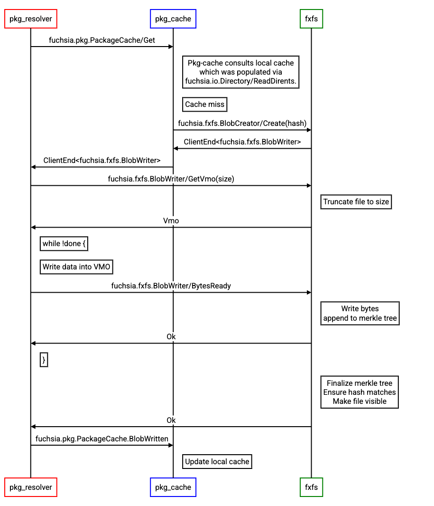

<!-- Generated with `fx rfc` -->
<!-- mdformat off(templates not supported) -->



# {{ rfc.name }}: {{ rfc.title }}

{# Fuchsia RFCs use templates to display various fields from _rfcs.yaml. View the #}
{# fully rendered RFCs at https://fuchsia.dev/fuchsia-src/contribute/governance/rfcs #}
<!-- SET the `rfcid` VAR ABOVE. DO NOT EDIT ANYTHING ELSE ABOVE THIS LINE. -->

<!-- mdformat on -->

<!-- This should begin with an H2 element (for example, ## Summary).-->

## Summary

A proposal to replace Fuchsia's volume manager (FVM) and blob storage filesystem
(Blobfs) with Fuchsia's next-generation filesystem, Fxfs. System blobs,
including libraries, binaries, and static configuration, will be stored in an
Fxfs volume with identical properties to Blobfs (content-addressable, verified,
and immutable).

## Motivation

Fxfs is Fuchsia's next-generation filesystem which was designed for performance,
updateability, and a rich feature-set. It has proven to be a solid foundation
upon which the Storage team can work, and an increasing amount of engineering
effort is centered on enhancing Fxfs. Blobfs and FVM were created in the early
days of Fuchsia, and were built with specific purposes in mind:

* Blobfs was designed to provide verified, immutable, content-addressable
  storage.
* FVM was designed to enable Blobfs and Minfs (a generic mutable filesystem) to
  share a single block device, dynamically allocating from the device as the
  partitions grow.

These systems served an important role as Fuchsia evolved, but they have become
a limiting factor for the goals of the Storage team: performance, updateability,
and maintainability.

### Performance Improvements

Much of the low-hanging fruit for improving the performance of Fuchsia's storage
stack has been plucked, and improvements now depend on more complex changes to
filesystems.

For example, Blobfs' write performance is limited by the fact that Blobfs is a
single-threaded implementation. Adding multi-threading support to a filesystem
is no trivial matter, and would require substantial changes.

The format of Blobfs works against us in our effort to improve performance, due
to high write amplification. Several metadata structures stored in a variety of
locations must be updated to write a file, resulting in significant write
amplification. Additionally, Blobfs' journal is block-based (versus a logical
journal like Fxfs), which is less efficient in many cases.

These efforts have to be duplicated across each filesystem that we maintain,
which substantially increases the cost of having a variety of filesystems. It is
advantageous to be able to focus efforts on a single filesystem (Fxfs), which
was a key motivator for this proposal.

Fxfs' performance benefits have already been proven with our Fxblob prototype.
On an Intel NUC, Fxblob is:

* 55-80% faster at paging in blobs,
* 17% faster at writing a single blob, and
* 130% faster at writing multiple blobs concurrently, compared to Blobfs.

And there are further performance enhancements in progress.

### Updateability

One of the key design principles of Fxfs is updateability: we designed Fxfs to
accommodate changes to its storage format over time. This is detailed in
[RFC-0136: Fxfs](0136_fxfs.md).

FVM and Blobfs were not designed with this in mind, and in practice it is
infeasible at this point to make any major changes to FVM or Blobfs without
forking the format and implementations.

If features need to be added, or if performance optimizations need to be made to
how we store data on-disk, FVM and Blobfs will be very difficult to work with.
There are already several examples of this:

* [RFC-0005: Blobfs Snapshots](0005_blobfs_snapshots.md), which proposed format
  changes to FVM to improve Fuchsia's resilience for software updates. This RFC
  was withdrawn after it was deemed too risky and technically complex to change
  FVM's format.
* Compact Merkle Trees in Blobfs, which was a space-saving feature implemented
  in 2021 which was never fully released due to complexity of rolling out the
  feature. Support for both the compact and legacy layout still exist in C++
  Blobfs.

In contrast, Fxfs' on-disk format is regularly changed with minimal fuss. At the
time of writing this RFC (July 2023), Fxfs is on version
[31](https://cs.opensource.google/fuchsia/fuchsia/+/main:src/storage/fxfs/src/serialized_types/types.rs),
and has undergone 10 format changes since the last breaking change (version 21,
created on 2022-06-14). (It should be noted that even this breaking change could
have been done in a backwards-compatible way, but for pragmatic reasons we chose
not to do so.)

### Maintainability

Fxfs has proven to be a well-tested and productive environment for engineers to
work in. It is implemented in Rust, has extensive unit, integration, and fuzzing
test coverage, and has encapsulated more subtle or difficult problems (layer
file merging, journaling, transactions and locks, etc) well. Additionally, the
fact that Fxfs' layer files are immutable once created, and metadata updates are
appended to an in-memory layer file (and the journal) rather than being written
piecemeal to disk, has made dealing with concurrency a much simpler problem.

In contrast, FVM has substantial technical debt, lacks robust test coverage, and
its format is poorly encapsulated (a substantial amount of software in Fuchsia
interprets the FVM format), all of which makes it a very difficult system to
change.

As mentioned in [Performance Improvements](#performance-improvements), most
improvements have to be duplicated in each filesystem implementation we
maintain, which multiplies the cost of improvements. This also applies for the
maintenance costs. Less software to maintain means less engineering effort
spent.

Note that we won't be able to do away with FVM and Blobfs completely for some
time, since existing products rely on them. However, we expect FVM and Blobfs to
be stable enough on existing products that maintenance costs are negligible.

## Stakeholders

_Facilitator:_

<abarth@google.com>

_Reviewers:_

* Security (<joshlf@google.com>)
* Storage (<csuter@google.com>)
* Software Delivery (<galbanum@google.com>)
* Kernel (<cpu@google.com>)

_Consulted:_

* Software Delivery (<galbanum@google.com>)
* Security (<joshlf@google.com>, <mvanotti@google.com>, <markdittmer@google.com>)

_Socialization:_

The design was socialized first to relevant stakeholders (Software Delivery was
involved early on, and Security/Kernel were involved once the initial prototype
was more thoroughly fleshed out).

## Requirements

* Fxblob MUST provide a filesystem API which exactly matches the semantics of
  Blobfs. That is:
  * Fxblob MUST permit creating static files (write-once, read-many).
  * Fxblob MUST have filenames which are content-addressable (i.e. the name of a
    file must be the merkle root of its contents).
  * For portability's sake and ease of migration, the same merkle tree algorithm
    from Blobfs SHOULD be used (i.e. the filenames in Blobfs should match those
    in Fxblob).
  * Fxblob MUST ensure that the contents of files matches their merkle root hash
    before allowing clients to read them.
  * Fxblob MUST present a flat directory structure to pkg-cache containing every
    blob on the system.
  * Fxblob MUST support executable files and paging.
* Fxblob MUST support the "Delivery blob" wire format specified in
  [RFC-0207](0207_offline_blob_compression.md).
* Fxblob SHOULD have comparable or better performance than Blobfs in all
  dimensions.
  * Fxblob SHOULD have strictly better read and write performance than Blobfs in
    terms of latency and throughput.
  * Fxblob SHOULD have comparable disk usage and memory usage to Blobfs.
* Fxblob MUST have a precise mechanism for accounting so that storage budgets
  can be pre-determined and reasonably narrow bounds can be established on
  available space, based on what other blobs are known to be present on the
  system.
* Fxblob SHOULD result in minimal expansion of the Trusted Code Base (TCB), i.e.
  the set of all code which has to be correct for the security properties of
  Fuchsia's Verified Execution to hold.  Fxfs SHOULD not need to be trusted and
  trusted operations shall be delegated to other places.

## Design

From an architectural perspective, the goal is to move from Figure 1 to Figure
2:

**Figure 1: The current storage architecture for Fuchsia devices.**

**Figure 2: The Fxblob storage architecture for Fuchsia devices.**

The "blob" volume within Fxfs will be a special volume emulating the properties
of blobfs -- content-addressability, immutability, etc. To the upper layers of
the system, this change is transparent, although changes are necessary in many
lower-level parts of the system:

* System assembly and build tooling,
* Device bootstrap software and tooling (paving and flashing),
* Recovery software,
* Fshost,
* Fxfs, to support the new blob partition's special properties,
* Pkg-cache and pkg-resolver, to use a set of new APIs for reading and writing
  blobs.

### Changes to Fxfs

Fxfs is already well-positioned to accommodate this architecture, having native
support for volumes, and having a format which is designed for flexibility and
which can be changed over time.

A prototype implementation has been completed (see
//src/storage/fxfs/platform/src/fuchsia/fxblob), which implements a special
volume which satisfies the blob storage properties. The volume has a single root
directory in which no file or directory can be created using the fuchsia.io
protocol. Instead, the volume offers a special BlobWriter protocol which
pkg-cache will use to install new blobs to the volume.

The files in this volume are content-addressable using the same merkle tree
algorithm that blobfs uses (the filename is the root hash). The merkle tree is
generated while installing the blob and Fxfs ensures that the merkle root
matches the file's name before persisting the file. Any time a section of a file
is read from disk, Fxfs verifies the contents against the merkle tree for the
file, providing integrity.

### Changes to Fshost

Fshost is a low-level component which detects block devices and mounts their
contained filesystems, providing connections to /blob and /data to the rest of
the system.

When Fshost is configured (via static configuration) to expect an
Fxblob-formatted system, it will connect the /blob directory to the blob volume
in the Fxfs instance, and the /data directory to the data volume in the Fxfs
instance. Fshost will continue to support the legacy configuration of FVM+Blobfs
as well.

### Changes to system assembly and build tooling

System assembly is the final step of the Fuchsia build, in which artifacts are
assembled together into a set of images and manifests which comprise a Fuchsia
system image.

One of the outputs of system assembly is an FVM+Blobfs image containing the
"base" set of blobs in the system. We will adapt system assembly to also be able
to emit an Fxfs-formatted image containing these blobs, depending on build-time
configuration.

We will also emit an Fxfs image in a "sparse" format, which is more efficient
for transfer to devices. The sparse format used is the Android sparse format,
which is already supported by fastboot and was therefore a natural choice.

### Changes to device bootstrap (paving and flashing)

Although paving is formally deprecated for device bootstrap
([RFC-0075: Deprecate zedboot-based paving](0075_deprecate_zedboot_paving.md)),
it is still used widely enough that we have chosen to add support for Fxfs
images to the paving workflow.

Flashing is the modern device bootstrap workflow which relies on the fastboot
protocol. This protocol is relatively simple compared to paving (which
interprets the FVM images it receives), making this a straightforward change.
(Fastboot doesn't interpret the raw images it receives, so there's no difference
flashing an FVM versus an Fxfs image; in contrast, paving interprets the FVM
image, so custom logic had to be added to handle Fxfs images to the paver.)

The sparse image format mentioned above is used both for paving and flashing, to
reduce the number of bytes transferred to the device and to reduce the memory
footprint.

### Changes to the package installation and OTA path

Unlike blobfs, Fxblob does not support the fuchsia.io write path (which has
significant performance issues). Instead, fxblob supports a new write API that
utilizes a shared VMO for its data plane (instead of FIDL) and thus reduces the
total number of FIDL round trips required to write a blob.

The new API is split into two protocols: fuchsia.fxfs.BlobCreator and
fuchsia.fxfs.BlobWriter. BlobCreator is a discoverable protocol that pkg_cache
uses to create new blobs (if they don't already exist), and BlobWriter is a
private protocol used to facilitate the mechanics of streaming the blob data to
Fxfs.

The shared VMO is organized as a ring buffer, which allows us to pipeline write
requests. Pkg_cache fills up a section of the ring buffer and then notifies Fxfs
of the availability of some bytes using the `BlobWriter.BytesReady` FIDL method.
Fxfs awaits these notifications, loads some data from the ring buffer, computes
the merkle hashes for that data, and streams the data to disk.

When the final BytesReady request is sent to Fxfs, Fxfs will block that request
until the merkle tree has been fully computed and validated against the received
contents; Fxfs will fail this request with ZX_ERR_IO_DATA_INTEGRITY if the hash
and contents mismatch. Fxfs will ensure that the file is visible (i.e. to
fuchsia.io.Directory.ReadDirents) once the final call is complete.

A client library was created to encapsulate the ring buffer management.

The flow looks like the following:

### Changes to Merkle-tree verification, decompression and VMEX handling

Blobfs currently holds the VMEX capability and is responsible for minting
executable VMOs when required, as well as decompressing blob contents at read
time. Because VMEX allows arbitrary code execution, blobfs also relies on a
sandboxed decompressor to decompress blob contents at read time. (Blob contents
are externally provided and therefore can be considered as untrusted data.) This
additional hop and context switches associated with decompression come at a
significant performance cost.

With Fxblob, we are aiming to optimize the performance of the paging path, which
requires (among other things) moving decompression into the Fxfs process itself.
However, accumulating more functionality into a highly trusted component
presents possible security concerns. We believe that we can address these
concerns through removing trust from Fxfs.

Two trusted operations need to be moved out of Fxfs to achieve this goal:

1. Verifying the contents of files against the merkle tree,
1. Minting executable pages using the VMEX resource.

To avoid the need for Fxfs to hold the VMEX capability, pkg-cache will take over
this responsibility. Given pkg-cache already must be trusted to map from blob
name to hash, this does not materially affect the scope of trust assigned to
that component and it avoids the need to treat Fxfs as a high-trust component.

We will also need to give `/bootstrap/base_resolver` the VMEX resource; this
component serves packages out of the base set. It is similar to pkg-cache (and
in fact uses the same libraries for the bulk of its business logic).

To make Fxfs fully untrusted, we will also need to move merkle verification
elsewhere (although Fxfs will still store and supply the merkle tree contents).
There are a few options here:

1. Creating a separate highly-trusted component which only verifies data.
1. Moving this functionality into the kernel, which is already highly trusted.

Note that pkg-cache would either need to directly communicate with the trusted
verifier when opening a blob, or it would need to be able to directly query this
trusted verifier, in order to compare the root hash the verifier is using
against the expected hash for a given blob. That way, even if a compromised Fxfs
completely changes both the data and the merkle tree (so the verifier sees the
tampered data as correct), pkg-cache will be able to detect tampering and reject
the file contents.

The choice of where merkle verification happens boils down to tradeoffs between
security and performance, and deserves a detailed exploration. As such, this
will be addressed in a separate RFC, and for now verification will happen
in-process in Fxfs.

Note that there are two other features which Fuchsia needs to support at some
point in the future, which also rely on merkle trees: Fs-verity and dm-verity,
which are used by some Linux applications for file and image integrity
respectively. Fuchsia intends to support both of these as part of
[RFC-0082: Running unmodified Linux programs on Fuchsia](0082_starnix.md). These
use cases will also need to be taken into account when designing out-of-process
merkle verification.

## Implementation

We have taken the approach of implementing functional prototypes and enabling
them in test and development environments to "soak", which has worked well so
far. We intend to continue to do so for future work and for unfinished features
(see "Security" section for work related to merkle verification).

Features will be gated behind feature flags enabled at build time. For example,
pkg-cache will detect whether the new Fxblob read and write APIs exist and
prefentially use those when available, but otherwise will fall back to the usual
fuchsia.io mechanism.

## Performance

Preliminary results from benchmarking our prototype demonstrates an improvement
in read and write performance. On an Intel NUC, Fxblob is:

* 55-80% faster at paging in blobs,
* 17% faster at writing a single blob, and
* 130% faster at writing multiple blobs concurrently, compared to Blobfs.

Other important facets of performance include memory consumption and storage
usage. These facets are being analyzed and any significant gaps between Blobfs
and Fxblob will be addressed. In general, Rust components tend to be more
memory-hungry, but the majority of memory usage in Blobfs is due to cached pages
which will be an identical cost for Fxblob.

Fxfs' storage usage is more complex than Blobfs' due to the fact that Fxfs
stores metadata updates as a series of changes in a set of layer files, rather
than having fixed allocations for inodes, extents, etc. However, we also stand
to gain back some storage due to removing FVM (which requires some disk space
for its own metadata, and which induces internal fragmentation within allocated
slices), and Fxfs has more flexibility to change its format in the future to
improve storage performance (e.g. optimizing the layer file format). At the time
of writing this RFC, our prototype implementation uses a comparable amount of
disk space to store an equivalent number of blobs as Blobfs.

## Ergonomics

These changes are transparent to the vast majority of Fuchsia components. Only
pkg-cache directly interacts with Blobfs at this time.

## Backwards Compatibility

We will continue to support systems in the legacy configuration (FVM + Blobfs),
which will support products that have already been released. Support for the
legacy configuration will be maintained (as well as appropriate testing
infrastructure) until the relevant products are at end-of-life.

All future Fuchsia products will use this new configuration, including most
developers.

No migration path is planned; devices will either use Fxblob or use the legacy
configuration.

## Security considerations

Blobfs is a highly trusted component in Fuchsia, and plays a key role in
Fuchsia's [Verified Execution](//docs/concepts/security/verified_execution.md),
since it verifies the integrity of the software of almost every other component
on the system. (Low-level components stored in bootfs are verified through
different means). Moreover, blobfs has the ability to create executable pages,
and since the other system components trust the contents that blobfs provides
them, blobfs can insert arbitrary code into any component's address space,
enabling blobfs to impersonate the capabilities of any component relying on
Blobfs for executable code.

One strategy we have taken to mitigate these risks in Blobfs is to sandbox
certain operations. For example, decompression was moved to a separate process
due to the risk of parsing untrusted input. If the sandboxed decompressor is
compromised, the worst that can happen is a denial-of-service since Blobfs would
simply reject any invalid data coming back from the decompressor. We don't think
that this same strategy is necessary on the read path for Fxfs, since local
attacks present a lower risk, but we will explore implementing a similar
sandboxing strategy on the write path to guard against remote attacks.

Although Fxfs has some advantages from a security perspective over Blobfs (for
example, it is implemented in Rust, a memory-safe language), it is still
substantially more complex than C++ Blobfs, and with complexity comes risk, so
the need for mitigation is greater.

Our proposed mitigations are described in the Design section above.

The security team notes that shared memory based IPC mechanisms (i.e. the ring
buffer used for blob writing) requires some extra care to ensure that the
readers and writers are robust against an uncooperative peer, particularly if
the shared memory is mapped. We'll take care to design these protocols and
consult with the security team as needed.

### Results of compromising Fxfs

Since this proposal expands the attack surface of Fxfs, it is worth documenting
what an attacker who is able to compromise Fxfs would be able to do (and what
they cannot do).

Fxfs would not have the Vmex resource in this proposal, and although Fxblob
serves the (executable) contents of binaries and libraries for most packages in
the system, since the contents will be independently verified by another
component (either the kernel or some userspace component), Fxfs is not able to
forge executable pages, nor is Fxfs able to convince other processes to run
arbitrary executable data.

As such, the threat model covers what Fxfs directly has access to:

* Fxfs can read and write data file contents arbitrarily. This could result in
  leaking sensitive information of user data, or possibly exploiting bugs in
  other components which do not validate their stored data.
* Fxfs can delete blob contents, which would be a denial-of-service for other
  components.
* Fxfs can prevent system updates by rejecting blob writes.
* Fxfs can interact with block device drivers and could potentially exploit
  vulnerabilities there to gain access to whatever capabilities the drivers have
  which Fxfs does not.

## Privacy considerations

N/A.

## Testing

We have implemented a prototype of this proposal which can boot Fuchsia and
perform all the usual system functions. This prototype is enabled on a builder
in CQ which runs the regular system test suite, ensuring that we have realistic
usage and coverage of the prototype.

Eventually we will expand this to be used in more contexts (for example,
enabling on a specific product, which will result in organic usage from
developers and greater usage in CQ/CI). Extensive soak time is expected before
we use this architecture on any user devices.

The usual testing pyramid of unit tests, integration tests, and e2e tests have
also been added for relevant features. We have also implemented automated
benchmarks to track the performance of reading and writing from Fxblob,
comparing it to blobfs' performance.

## Documentation

Some storage documentation will need to be updated as part of this proposal. For
example, the
[Filesystem Architecture](//docs/concepts/filesystems/filesystems.md) document
should be updated.

## Drawbacks, alternatives, and unknowns

### Drawback: Risk of bricking devices

With the legacy architecture, bugs in minfs only affect minfs -- the system
remains in a functional state even if the data partition is reset, since the
important parts of the system (binaries, libraries, config, etc) are stored in
blobfs.

Combining blobs and data into a single filesystem means that bugs in Fxfs could
potentially brick devices, so the same safety net does not exist here.

We believe that Fxfs is robust enough to serve as a critical piece of Fuchsia's
infrastructure, having been extensively tested and used since 2021. The
probability of filesystem corruptions is low.

If corruptions do happen, the best course of action is similar to what other
operating systems do: provide a recovery path which can be used to restore the
device to a functional state. The ability to perform an OTA from recovery
(fxrev.dev/563864) would be one way to get out of this, which the authors
support (due to it providing an opportunity to repair devices from a wider range
of issues).

Note that this is not a unique risk for Fuchsia -- most other operating systems
have a single global filesystem that stores all data, essential or not.

### Alternative: Relying on zx::streams for faster blob writes

The custom write API created for Fxblob shares some similarity with zx::streams,
which use a VMO as a shared data buffer and use page faults as a control
mechanism. However, streams are designed to accommodate a much broader use case
(general file I/O), and come with more baggage -- content size tracking, page
fault overhead, less batching of I/O (since the faults are page-granularity). A
purpose-built API can be simpler and more performant.

Blob write performance is important enough (since it is a key bottleneck for
system OTAs and installing large packages), and has enough specific constraints
compared to general file I/O, that we decided a custom interface was worth the
effort. Our promising performance results have validated this effort.

## Prior art and references

Arguably, this proposal brings Fuchsia closer towards the majority of operating
systems which use general-purpose filesystems for a wider range of purposes, and
provide specialized functionality such as content addressability and
verification using other mechanisms. While we are adding some special
functionality to Fxfs for this proposal, the majority of that work occurs in the
outer layers of Fxfs; the core filesystem is unchanged.

For example, on Linux, a general-purpose filesystem can be combined with
dm-verity or fs-verity to provide content verification (of the image, and of
specific files, respectively).
