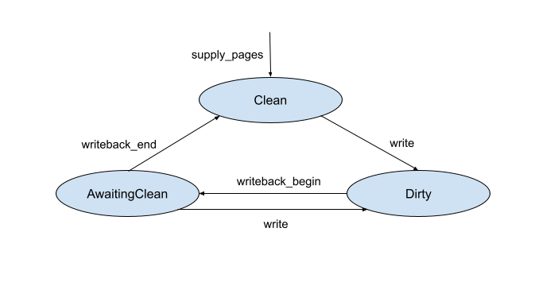

<!-- Generated with `fx rfc` -->
<!-- mdformat off(templates not supported) -->


# {{ rfc.name }}: {{ rfc.title }}
{# Fuchsia RFCs use templates to display various fields from _rfcs.yaml. View the #}
{# fully rendered RFCs at https://fuchsia.dev/fuchsia-src/contribute/governance/rfcs #}
<!-- SET the `rfcid` VAR ABOVE. DO NOT EDIT ANYTHING ELSE ABOVE THIS LINE. -->

<!-- mdformat on -->

<!-- This should begin with an H2 element (for example, ## Summary).-->

## Summary

This document describes Zircon kernel support for pager-backed memory that can
be modified and then written back (synced) to the pager source, e.g. a storage
disk.

## Motivation

Zircon supports creating VMOs (virtual memory objects) that are backed by a
userspace pager service, typically hosted by a filesystem. An individual file is
represented in memory as a VMO. As the VMO's pages are accessed, they are
faulted in on demand, with the user pager reading in the pages' contents from
disk.

The Zircon pager API originally only supported read-only files; there was no
mechanism for VMO pages that had been dirtied in memory to be written back to
disk. This design suffices to host an immutable filesystem like `blobfs`, which
serves all the executables and other read-only files on Fuchsia. However,
writeback support is required for a general purpose filesystem where file
contents can be modified by clients, and need to be synchronized back to disk.

Without writeback support, mutable filesystems like `minfs` and `fxfs` cannot
take advantage of demand paging. As a workaround, mutable filesystems would have
to use anonymous (non pager-backed) VMOs to cache files in memory, and manage
contents of these VMOs themselves. These VMOs would likely need to be held in
memory in their entirety even when certain pages within them are rarely or never
accessed. Switching these anonymous VMOs to pager-backed ones, where pages can
be faulted in and evicted as needed, allow mutable filesystems to better utilize
memory. Writeback support also allows clients of mutable filesystems to directly
perform reads and writes on VMOs, instead of relying on channels for data
transfer, which being constrained by the channel limit can be extremely slow.

The terms user pager and filesystem are used interchangeably in the rest of this
document, depending on the context.

## Stakeholders

_Facilitator:_

- cpu@google.com

_Reviewers:_

- adanis@google.com, csuter@google.com

_Consulted:_

- brettw@google.com, cdrllrd@google.com, godtamit@google.com,
maniscalco@google.com, travisg@google.com

_Socialization:_

This RFC went through a design review with the Local Storage team.

## Requirements

The proposed design caters to the following goals:

1. Enhance Zircon to support writeback of pager-backed VMOs to allow building
   high performance mutable filesystems (using Zircon streams).
2. Support file reads and writes through VM mappings (think `mmap`'d files).
3. Provide user pager initiated best effort flushing of dirty pages to reduce
   risk of data loss caused by unexpected shutdown.
4. In a future iteration, allow the kernel to evict (via the user pager) dirty
   pages in response to system memory pressure.

And some non-goals:

1. Outside of user pager initiated flushes, the kernel does not make any
   guarantees as to the rate at which dirty pages will be cleaned. That said,
   future evolution may add the ability to limit the amount of outstanding dirty
   data and for the kernel to initiate writeback requests based on that amount.
2. Preventing data loss arising from violations of the kernel/pager protocol is
   a non-goal. If a user pager fails to query dirty pages and write them back
   prior to closing its handle to the VMO (or terminating), then data loss may
   occur.

## Design

### Overview

There are two immediate use cases the proposed design is intended to support:

- Filesystem clients can access files through streams which are kernel objects
  that wrap file VMOs. This can be roughly thought of as being similar to
  `zx_vmo_read()` and `zx_vmo_write()`, since the stream syscalls internally
  wrap the VMO read/write kernel routines.
- Filesystem clients can also `mmap` a file, which would roughly translate to
  mapping (using `zx_vmar_map`) the file VMO into the client process' address
  space.

For simplicity, the rest of the document will talk about direct interactions
with the file VMO, either through syscalls (`zx_vmo_read/write`) or through VM
mappings (`zx_vmar_map`).

Here are a couple of examples showing what interactions involving writeback
might look like.

Example 1

1. A filesystem client performs `zx_vmo_read()` on a file VMO for a given range.
2. Since the VMO is pager-backed, the kernel generates a read request for the
   associated user pager.
3. The user pager hosted by the filesystem fulfills this request. It supplies
   pages with their contents read from disk.
4. The filesystem client performs `zx_vmo_write()` on the VMO for the same
   range. The VMO's pages were previously populated in step 3, so they can
   simply be written to. The modifications made are only in memory just yet, but
   need to be reflected back on disk at some point.
5. The user pager queries the kernel for the ranges in the VMO that have been
   dirtied / modified. This can be done as part of a periodic background flush
   the filesystem performs, or in response to a flush requested by a filesystem
   client.
6. The user pager writes back the queried dirty ranges to the disk. At this
   point the modified file contents have successfully been persisted to disk.

Example 2

1. A filesystem client maps a file VMO using `zx_vmar_map()`. The mapping starts
   at address `addr`. The client reads a range starting at `addr`.
2. Same as example 1.
3. Same as example 1.
4. The filesystem client now writes to the same range starting at `addr`. The
   underlying pages have already been populated, and so the contents are
   modified in memory. The modifications need to be reflected back on disk at
   some point.
5. Same as example 1.
6. Same as example 1.

The examples here start off with VMO reads before performing writes. Note that
this is done just to break up the population of pages by the user pager into a
separate step for clarity. Clients can directly write to a file offset not in
memory yet; the write will just block until the user pager has supplied the page
first.

Both the examples above assume that the filesystem follows an Overwrite model
for writes, where populated (committed) pages can be written to directly without
requesting extra space first. Modified contents are written back to the same
location on disk, so no extra space needs to be allocated for the modifications.
However, filesystems like `fxfs` and `minfs` use a Copy-on-Write (CoW) model,
where every modification requires new space to be allocated on disk. So we also
need a mechanism to reserve space for writes to pages that were already
committed; step 4 is modified to wait on that reservation before the write can
proceed.

To perform writeback, the Zircon pager API is extended to support the following:

- The kernel blocks writes to VMOs that the user pager has indicated should
  follow a Copy-on-Write scheme, and proceeds once the user pager has
  acknowledged the write.
- The kernel tracks dirty pages in the VMO and has a mechanism to surface that
  information to the user pager.
- The user pager indicates to the kernel when it is syncing a dirty range in a
  VMO and when it is done, so that the kernel can update the dirty tracking
  state accordingly.
- The kernel also surfaces information about VMO resizes to the user pager.
- The user pager has a way to query relevant information that the kernel tracks
  on its behalf, e.g. when the VMO was last modified.

### Pager and VMO creation

The pager creation syscall remains unchanged, i.e. `zx_pager_create()` is used
to create the pager with `options` set to 0.

Pager-backed VMOs are created with `zx_pager_create_vmo()`, and are associated
with a pager port, and a key that will be used in page request packets for that
VMO. The `zx_pager_create_vmo()` syscall also supports a new `options` flag
`ZX_VMO_TRAP_DIRTY`. This indicates that the kernel should trap any writes to
the VMO, and request acknowledgement for the write from the user pager first.
This flag is meant to be used for files that operate in Copy-on-Write mode. More
details about this flag can be found later.

```c
// Create a VMO (returned via |out|) backed by |pager|. Pager requests will be
// queued on |port| and will contain the provided |key| as an identifier.
// |size| will be rounded up to the page boundary.
//
// |options| must be 0 or a combination of the following flags:
// ZX_VMO_RESIZABLE - if the VMO can be resized.
// ZX_VMO_TRAP_DIRTY - if writes to clean pages in the VMO should be trapped by the
// kernel and forwarded to the pager service for acknowledgement before proceeding
// with the write.
zx_status_t zx_pager_create_vmo(zx_handle_t pager,
                                uint32_t options,
                                zx_handle_t port,
                                uint64_t key,
                                uint64_t size,
                                zx_handle_t* out);
```

All pager-backed VMOs are treated as mutable by default; this also works for
implementing a read-only filesystem without additional cost. The code paths that
modify pages will presumably not be exercised for read-only VMOs. If the VMOs
are modified though (accidental misuse perhaps), but the user pager never
queries dirty pages in them and attempts to write them back, the modified
contents will remain in memory only. In the future when the kernel generates
writeback requests, the user pager can either treat writeback requests for such
VMOs as errors, or simply ignore them.

### Supplying VMO pages

Pages in a pager-backed VMO are populated by the user pager on demand with
`zx_pager_supply_pages()` upon receiving a pager read request. This syscall
already existed for use with read-only VMOs.

### Page states for writeback

VMOs backed by a pager can have pages in three states - `Dirty`, `Clean` and
`AwaitingClean`. These states are encoded in the `vm_page_t`.

Transitions between the three states follow these steps:

1. A page that has been newly supplied with `zx_pager_supply_pages()` starts out
   as `Clean`.
2. When the page is written to, it transitions to `Dirty`. If the VMO has been
   created with `ZX_VMO_TRAP_DIRTY`, the kernel blocks on acknowledgement of a
   `DIRTY` pager request from the user pager first. More details about this
   interaction can be found later.
3. The user pager queries the kernel for a list of dirty pages in the VMO via a
   syscall at some later point.
4. For each dirty page that the kernel returns, the user pager invokes a syscall
   to signal to the kernel that it is starting to write back the page, which
   changes its state to `AwaitingClean`.
5. If the page is written to beyond this point, its state switches back to
   `Dirty`.
6. The user pager issues another syscall when it is done writing back the page.
   If the page state was `AwaitingClean` at this point, it transitions to
   `Clean`.
7. If the user pager encounters an error while writing back, the page remains in
   `AwaitingClean`. A future query for dirty pages returns both `AwaitingClean`
   and `Dirty` pages, so that the user pager can attempt to write back the page
   again.

The state diagram below shows the transitions between these states.



`AwaitingClean` needs to be tracked as a separate state for a few different
reasons:

- Even though pages in both `Clean` and `AwaitingClean` states transition to
  `Dirty` when written to, pages that the user pager is in the process of
  writing back need to be treated differently from `Clean` pages. `Clean` pages
  are eligible for reclamation under memory pressure, but pages that are being
  written back need to be protected from being reclaimed.

- The kernel needs to know which version of the page has been written back so it
  can correctly transition it to `Clean` when the user pager is done. This is
  important to differentiate page writes that came in before the flush (which
  will have safely made it to disk) from ones that came in after (which need to
  be written back later).

- We could avoid the syscall from the user pager at the start of the writeback,
  and the kernel could simply mark pages as `AwaitingClean` when it returns the
  page as part of the dirty pages query to the user pager. However, it might
  still be a while before the user pager starts flushing out the page after the
  query, which leaves a longer window for it to get dirtied again. Having a
  tighter window bracketing the writeback increases the likelihood that the user
  pager will be able to successfully move the page to the `Clean` state.

In order to update the dirty state, the kernel tracks when pages are written to
both through VMO and stream write syscalls and through VM mappings. Note that
this applies to any write that happens through a VM mapping, whether performed
by the user or the kernel, i.e. it also applies to writes done by the kernel
with a `user_copy` as part of a syscall like `zx_channel_read()`.

Inferring dirty pages during a syscall like `zx_vmo_write()` is straightforward,
since the range is specified. The other way a VMO can be accessed is through VM
mappings in a process' address space.  In order to track dirty state in
pager-backed VMOs, writable mappings start off with the write permission removed
in the corresponding page table entries. So a write generates a protection
fault, which is resolved by restoring the write permission and marking the page
state as `Dirty`.

The `Dirty` state referred to here is the state being tracked by the
`vm_page_t`, i.e. the dirty state tracked by software. Dirty bit tracking is
supported in hardware page tables on x86, but we're choosing not to use that to
derive a page's dirty state for the initial implementation. We need to track
dirty bits in software anyway for older arm64 platforms that don't support dirty
bits in page tables. So for consistency and simplicity of implementation, we
choose to start out without using the hardware dirty bits to infer a page's
dirty / clean state. Relying on hardware page table bits also poses
complications with page table reclamation, which will need to be accounted for
in the future when we do rely on hardware bits.

It is worth noting that only VMOs directly backed by a pager qualify for dirty
tracking. In other words, CoW clones of VMOs backed by a pager are not opted
into dirty tracking, and will not see any writeback requests. Pages that are
written in clones are forked from the parent's copy of the page, and the clone
owns them directly as a distinct page.

### Reserving space for pending writes

Writes to VMOs that are tagged to trap dirty transitions with the
`ZX_VMO_TRAP_DIRTY` creation option flag, require acknowledgement from the
filesystem. The solution is proposed in two parts, with v1 starting off simple
and focusing more on correctness, and v2 building upon v1 to improve
performance. The v1 proposal follows mostly a synchronous model, with the
filesystem reserving space for new writes. With v2 we will add another layer to
express dirty reservation quotas in the kernel and how they apply to VMOs, so
that the kernel can track reservations itself. This will help performance by
cutting down on the majority of back and forth communication between the kernel
and the filesystem.

#### `ZX_VMO_TRAP_DIRTY` v1

The `ZX_VMO_TRAP_DIRTY` VMO creation flag indicates that the kernel should trap
any `Clean->Dirty` page transition (or `AwaitingClean->Dirty` transition) in the
VMO. When a write comes in on a page not already dirty, the kernel generates a
`ZX_PAGER_VMO_DIRTY` pager request. For writes via a VM mapping, the request
spans the single page containing the faulting address. For stream/VMO writes,
the kernel sends a request for each contiguous run of non-dirty pages in the
range that need to be written to.

A dirty request for the range `[start, end)` looks as follows.

```c
zx_packet_page_request_t request {
    .command = ZX_PAGER_VMO_DIRTY,
    .flags = 0,
    // |offset| and |length| will be page-aligned.
    .offset = start,
    .length = end - start,
};
```

The `ZX_VMO_TRAP_DIRTY` creation flag is intended for files being written in CoW
mode, and for sparse files in Overwrite mode. When the flag is not specified,
pages are marked `Dirty` and writes proceed without user pager involvement; this
is intended for non-sparse files being written in Overwrite mode.

The user pager acknowledges the `ZX_PAGER_VMO_DIRTY` request(s) with
`zx_pager_op_range()`:

- `ZX_PAGER_OP_DIRTY` sets the state for page(s) not already `Dirty` to `Dirty`,
  and the kernel proceeds with the blocked write.
- `ZX_PAGER_OP_FAIL` does not alter the current state of the page, and fails the
  `zx_vmo_write()` call the write originated in, generates a fatal page fault
  exception for VM mappings, and in the case of `zx_stream_write()` returns
  successfully with a partial write.

```c
// |pager| is the pager handle.
// |pager_vmo| is the VMO handle.
// |offset| and |length| specify the range, i.e. [|offset|, |offset| + |length|).
//
// |op| can be:
//
// ZX_PAGER_OP_DIRTY - The userspace pager wants to transition pages in the range
// [offset, offset + length) from clean to dirty. This will unblock any writes that
// were waiting on ZX_PAGER_VMO_DIRTY page requests for the specified range.
// |data| must be 0.
//
// ZX_PAGER_OP_FAIL - The userspace pager failed to fulfill page requests for
// |pager_vmo| in the range [offset, offset + length) with command
// ZX_PAGER_VMO_READ or ZX_PAGER_VMO_DIRTY.
//
// |data| contains the error encountered, a zx_status_t error code sign-extended
// to a |uint64_t| value - permitted values are ZX_ERR_IO, ZX_ERR_IO_DATA_INTEGRITY,
// ZX_ERR_BAD_STATE and ZX_ERR_NO_SPACE.
zx_status_t zx_pager_op_range(zx_handle_t pager,
                              uint32_t op,
                              zx_handle_t pager_vmo,
                              uint64_t offset,
                              uint64_t length,
                              uint64_t data);
```

Depending on how often the filesystem is flushing dirty data and marking pages
`Clean`, this approach could incur significant performance cost when pages are
written by clients. To avoid this cost, filesystems might want to delay flushing
dirty data for as long as they can, which is not a good incentive to provide -
dirty pages cannot be evicted and will contribute to memory pressure, and longer
intervals between flushes could also increase the likelihood of data loss. The
v2 proposal attempts to reduce some of this performance cost from client-facing
writes.

#### `ZX_VMO_TRAP_DIRTY` v2

A new syscall `zx_pager_set_dirty_pages_limit()` will be added to specify a
certain number of dirty pages the kernel is allowed to accumulate. The
expectation here would be that the filesystem has reserved space for these many
dirty pages beforehand. This will be a per-pager limit, set to zero by default.
The limit can be set to a non-zero value (multiple times if required) using
`zx_pager_set_dirty_pages_limit()`. The v1 design essentially operates with this
limit set to zero.

```
zx_status_t zx_pager_set_dirty_pages_limit(zx_handle_t pager_handle,
                                           uint64_t num_dirty_pages);
```

The kernel will track the number of dirty pages per pager (more on types of
pages that qualify for being tracked later), incrementing the count on
transitions to `Dirty` and decrementing it on transitions to `Clean`. The kernel
will still trap every Dirty transition as in v1, but it will simply increment
the number of outstanding dirty pages, if it can do so without exceeding the
allotted dirty limit. If the new count does not exceed the limit, the kernel
will proceed with the write without involving the user pager. This is expected
to be the normal mode of operation, and so will save the cost of a roundtrip to
the user pager every time a page is dirtied.

With this approach, the user pager needs to communicate two things to the
kernel:

1. The pager-wide dirty limit
2. Pages that will count against that limit when they are dirtied

For 2) we once again rely on the `ZX_VMO_TRAP_DIRTY` VMO creation flag. This
flag now triggers the generation of a new type of pager request:
`ZX_VMO_DIRTY_MODE`. When the kernel traps writes now, it consults the
filesystem to figure out whether it should opt in those pages into being counted
against the dirty limit. The user pager responds with `zx_pager_op_range` with
one of two new operation types.

- `ZX_PAGER_OP_DIRTY_MODE_POOLED` tells the kernel that pages in the range will
  count against the per-pager dirty limit. This is intended to be used for files
  operating in CoW mode, and for sparse regions of files in Overwrite mode.

- `ZX_PAGER_OP_DIRTY_MODE_UNPOOLED` tells the kernel that pages in the range
  will not count against the dirty limit. This is intended for non-sparse
  regions of sparse files operating in Overwrite mode.

Pages indicated `ZX_PAGER_OP_DIRTY_MODE_POOLED` are transitioned to `Dirty` and
the outstanding pager dirty count is incremented, provided it does not exceed
the pager dirty limit. If dirtying the page would exceed the pager dirty limit
however, the kernel starts generating `ZX_PAGER_VMO_DIRTY` packets, i.e. the
default mode as described in v1. An optional flag can be provided to set the
dirty mode when pages are being written back (transitioning to `Clean`), which
will save the cost of trapping future writes to generate `ZX_VMO_DIRTY_MODE`
pager requests.

This design allows for a flexible model where the filesystem can mix different
types of write modes on its VMOs. Files that are written in CoW mode would have
their VMOs created with `ZX_VMO_TRAP_DIRTY`, and their pages can use the Pooled
mode. Similarly, sparse files in Overwrite mode can be created with the
`ZX_VMO_TRAP_DIRTY` flag, and use the Pooled and Unpooled modes for sparse and
non-sparse regions respectively. Files that always use Overwrite mode can omit
the `ZX_VMO_TRAP_DIRTY` flag altogether and they would never have to pay the
cost of pager requests on writes.

Once the user pager starts receiving `ZX_PAGER_VMO_DIRTY` requests when out of
dirty quota, it is expected to start cleaning pages in order to create space for
new dirty pages. It will signal when it is done with
`zx_pager_set_dirty_pages_limit()`, using the same limit as before or a new one.
After this call, the kernel will resume checking the accumulated dirty count
against the dirty limit on future writes, and will generate `ZX_PAGER_VMO_DIRTY`
requests only when the dirty limit is hit again.

#### Differences between `ZX_VMO_TRAP_DIRTY` v1 and v2

The major difference between v1 and v2 lies with the entity that is responsible
for tracking reservation counts. In v1 the filesystem is responsible for
tracking reservations, and the kernel informs it of when and by how much to
increase the reservation count. Since the entity responsible for intercepting
potential changes to reservation (the kernel) is not the same as the entity
doing the actual bookkeeping (the filesystem), tight coupling is required
between the two. In v2, we try to relax this a little by having the kernel track
the reservation count itself. So communication with the filesystem is required
only when - 1) VMO ranges need to be set up to opt in to (or out of) the kernel
reservation tracking and 2) the kernel runs out of reservation quota and the
filesystem needs to intervene.

We expect 2) to be the edge case here, since the filesystem will periodically be
flushing dirty pages to disk. Majority of the communication is expected to be
due to 1). The kernel can request information for the same range multiple times
(e.g. for writes spanning overlapping ranges), and similarly the filesystem can
supply redundant information to the kernel about the same range multiple times.
Setting the dirty mode on a page does not actually cost anything against the
dirty limit, as the dirty count is only incremented when the page is actually
written to. For this reason, the filesystem can also set the dirty mode on pages
speculatively to cut down on the performance cost for future pager requests
(with some caveats, since page eviction might come into play).

### Discovering dirty ranges

The user pager needs a mechanism to find out about dirty pages in a VMO so it
can write them back. There are two different models to consider here: a pull
model when the user pager queries dirty page information from the kernel, and a
push model where the kernel indicates dirty pages by sending the user pager
writeback requests. The initial design starts off with the simpler pull model
and introduces a dirty ranges querying syscall, which might look as follows:

```c
// |pager| is the pager handle.
// |pager_vmo| is the vmo handle.
// |offset| and |length| specify the VMO range to query dirty pages within.
// Must be page-aligned.
//
// |buffer| points to an array of type |zx_vmo_dirty_range_t| defined as follows.
// typedef struct zx_vmo_dirty_range {
//   // Represents the range [offset, offset + length).
//   uint64_t offset;
//   uint64_t length;
//   // Any options applicable to the range.
//   // ZX_VMO_DIRTY_RANGE_IS_ZERO indicates that the range contains all zeros.
//   uint64_t options;
// } zx_vmo_dirty_range_t;
//
// |buffer_size| is the size of |buffer|.
//
// |actual| is an optional pointer to return the number of dirty ranges that were
// written to |buffer|.
//
// |avail| is an optional pointer to return the number of dirty ranges that are
// available to read. If |buffer| is insufficiently large, |avail| will be larger
// than |actual|.
//
// Upon success, |actual| will contain the number of dirty ranges that were copied
// out to |buffer|. The number of dirty ranges that are copied out to |buffer| is
// constrained by |buffer_size|, i.e. it is possible for there to exist more dirty
// ranges in [offset, offset + length) that could not be accommodated in |buffer|.
// The caller can assume than any range that had been made dirty prior to
// making the call will either be contained in |buffer|, or will have a start
// offset strictly greater than the last range in |buffer|. Therefore, the caller
// can advance |offset| and make another query to discover further dirty ranges,
// until |avail| is zero.
//
zx_status_t zx_pager_query_dirty_ranges(zx_handle_t pager,
                                        zx_handle_t pager_vmo,
                                        uint64_t offset,
                                        uint64_t length,
                                        void* buffer,
                                        size_t buffer_size,
                                        size_t* actual,
                                        size_t* avail);
```

The user pager is expected to invoke this query multiple times, advancing the
offset it is querying until it has processed all dirty pages.

With the pull model, the rate of cleaning pages is entirely dependent on the
rate at which the filesystem chooses to query the dirty ranges and attempt
writeback. There might be a few scenarios however where the kernel itself needs
to initiate a request to write back pages, such as under memory pressure, so
that dirty pages can be cleaned and subsequently freed. The kernel may send
writeback requests for dirty pages in LRU order in this case. This is meant to
serve as a hint to the user pager so it can ramp up the rate at which it is
flushing pages, e.g. if it is processing requests in a delayed manner.

A writeback request for dirty range `[start, end)` in the VMO might look as
follows.

```c
zx_packet_page_request_t request {
    .command = ZX_PAGER_VMO_WRITEBACK,
    .flags = ZX_PAGER_MEMORY_PRESSURE,
    // |offset| and |length| will be page-aligned.
    .offset = start,
    .length = end - start,
};
```

### Writing back dirty ranges

The `zx_pager_op_range()` syscall is extended to support two additional ops,
`ZX_PAGER_OP_WRITEBACK_BEGIN` and `ZX_PAGER_OP_WRITEBACK_END`, to signal when
the user pager is starting to flush the pages and when it is done, respectively.

- `ZX_PAGER_OP_WRITEBACK_BEGIN` changes the state of any `Dirty` pages in the
  specified range to `AwaitingClean`. It is ignored for any pages already in
  `AwaitingClean` or `Clean` states, and leaves those states unchanged.
- `ZX_PAGER_OP_WRITEBACK_END` changes the state of any `AwaitingClean` pages in
  the specified range to `Clean`. It is ignored for any pages that are already
  `Clean` or pages that are `Dirty`, and leaves their state unchanged.

If any errors are encountered while performing the flush, i.e. after
`ZX_PAGER_OP_WRITEBACK_BEGIN` but before `ZX_PAGER_OP_WRITEBACK_END`, the user
pager is required to do nothing more.  Those pages remain in the `AwaitingClean`
state in the kernel, assuming another write does not come through. When the
kernel is queried for dirty pages again, it will include `AwaitingClean` pages
along with `Dirty` pages, and the user pager can then attempt writeback on those
failed pages again.

```c
// Supported |op| values are:
// ZX_PAGER_OP_WRITEBACK_BEGIN indicates that the user pager is about to
// begin writing back the specified range and the pages are marked |AwaitingClean|.
// ZX_PAGER_OP_WRITEBACK_END indicates that that user pager is done writing
// back the specified range and the pages are marked |Clean|.
//
// |pager| is the pager handle.
// |pager_vmo| is the VMO handle.
// |offset| and |length| specify the range to apply the |op| to, i.e. [|offset|,
// |offset| + |length|).
// For ZX_PAGER_OP_WRITEBACK_*, |data| is unused and should be 0.
zx_status_t zx_pager_op_range(zx_handle_t pager,
                              uint32_t op,
                              zx_handle_t pager_vmo,
                              uint64_t offset,
                              uint64_t length,
                              uint64_t data);
```

For `ZX_PAGER_OP_WRITEBACK_BEGIN`, `data` can optionally be set to
`ZX_VMO_DIRTY_RANGE_IS_ZERO` to indicate that the caller wants to write back the
specified range as zeroes. This is intended to be used when the caller is
processing a range that was returned by `zx_pager_query_dirty_ranges()` with its
`options` set to `ZX_VMO_DIRTY_RANGE_IS_ZERO`. It ensures that any non-zero
content that was created in the range after the query but before the writeback
was started is not lost, by incorrectly assuming it is still zero and marking it
clean (hence evictable).

### Resizing the VMO

Pager-backed VMOs differ from anonymous (non pager-backed) VMOs in the way
absence of content in the VMO is handled.  Anonymous VMOs have implicit initial
content of zero, so uncommitted pages imply zeros. The same is not true for
pager-backed VMOs, where uncommitted pages do not imply zeros; they simply mean
that the pager has not supplied content for those pages yet. On a resize to a
larger size however, the pager _cannot_ supply pages in the newly extended
range, simply because that content does not exist on the backing source (e.g.
storage disk) yet, and so there is nothing to page in. The kernel can supply
pages in this newly extended range as zeros without consulting the user pager.

Resizes are handled by a tracking a zero interval spanning the newly resized
range, for which the kernel implicitly supplies zero pages. The user pager is
not aware of this zero interval yet, so this range gets reported as dirty when
the user pager queries for dirty ranges. Additionally, the options field in the
`zx_vmo_dirty_range_t` is set to `ZX_VMO_DIRTY_RANGE_IS_ZERO` for this range to
indicate that it is all zeros.

If the VMO has been created with the `ZX_VMO_TRAP_DIRTY` flag, and pages are
written to in this newly extended range, the kernel generates
`ZX_PAGER_VMO_DIRTY` pager requests for them before committing them. This is
because the filesystem might need to reserve space for actual (non-zero) pages.
This model assumes that zeros can be represented efficiently on disk by the
filesystem as sparse regions, so the filesystem is only consulted when pages are
committed in the newly extended range.

### Detaching the VMO from the pager

A `zx_pager_detach_vmo()` queues the `ZX_PAGER_COMPLETE` packet, which indicates
that the user pager should expect no further pager requests for that VMO in the
future. This also indicates that the user pager should query and write back any
outstanding dirty pages. Note that the detach does not block until the dirty
pages have been written back; it simply informs the user pager that a flush
might be needed.

After a detach, a `zx_vmo_read()` / `zx_vmo_write()` that would have required a
pager request to be generated fails with `ZX_ERR_BAD_STATE`. Reads and writes
through mappings that would similarly have required pager requests generate
fatal page fault exceptions. The kernel is free to discard clean pages from the
VMO. However, the kernel holds on to dirty pages until they have been cleaned by
the user pager. That is, `ZX_PAGER_OP_WRITEBACK_BEGIN` and
`ZX_PAGER_OP_WRITEBACK_END` continue to be supported on the VMO even after it
has been detached. `zx_pager_op_range()` on all other ops and
`zx_pager_supply_pages()` fail with `ZX_ERR_BAD_STATE` on a detached vmo.

If the pager is destroyed with dirty pages in associated VMOs, the kernel is
free to remove those pages at that point, regardless of whether there were any
outstanding writeback requests. In other words, dirty pages are guaranteed to be
held in memory only as long as a pager is around to be able to clean them.

### Querying pager VMO stats

The kernel also tracks whether the VMO was modified, which can be queried by the
user pager. This is intended to be used by the user pager to track `mtime`.

```c
// |pager| is the pager handle.
// |pager_vmo| is the VMO handle.
// |options| can be ZX_PAGER_RESET_VMO_STATS to reset the queried stats.
// |buffer| points to a struct of type |zx_pager_vmo_stats_t|.
// |buffer_size| is the size of the buffer and should be large enough to
// accommodate |zx_pager_vmo_stats_t|.
//
// typedef struct zx_pager_vmo_stats {
//   uint32_t modified;
// } zx_pager_vmo_stats_t;
zx_status_t zx_pager_query_vmo_stats(zx_handle_t pager,
                                     zx_handle_t pager_vmo,
                                     uint32_t options,
                                     void* buffer,
                                     size_t buffer_size);
```

The `modified` field of the returned `zx_pager_vmo_stats_t` is set to
`ZX_PAGER_VMO_STATS_MODIFIED` if the VMO was modified, or 0 otherwise. The
`zx_pager_vmo_stats_t` struct can be extended in the future with more fields
that the user pager might find useful to query.

The `modified` state is updated on syscalls that modify the VMO, like
`zx_vmo_write()` and `zx_vmo_set_size()`, and also the first time a write page
fault comes through via a mapping. The very first write fault on a page is
already tracked to correctly manage the `Clean` to `Dirty` transition, so the
`modified` state is updated then. Future writes that come in via the mapping on
a dirty page are not tracked though; doing so would significantly slow down
writing to mapped VMOs. So the `modified` state might not be entirely accurate
for mapped VMOs.

`options` can be `ZX_PAGER_RESET_VMO_STATS` if the user pager also wishes to
reset the queried stats. An `options` value of 0 does not reset any state, and
performs a pure query. Note that this call can have an effect on future
`zx_pager_query_vmo_stats()` calls by consuming queryable state if the
`ZX_PAGER_RESET_VMO_STATS` option is specified. For example, if a
`zx_vmo_write()` is followed by two consecutive `zx_pager_query_vmo_stats()`
calls with the `ZX_PAGER_RESET_VMO_STATS` option, only the first of those will
see `modified` set. Since no further modifications took place after the first
`zx_pager_query_vmo_stats()`, the second `zx_pager_query_vmo_stats()` will
return `modified` as 0.

## Implementation

Pager writeback has been in development for a while, with all the new API pieces
available in the `@next` vDSO. `fxfs` has adopted the writeback APIs to support
stream reads/writes and `mmap`.

## Performance

With pager writeback, `fxfs` was able to switch from performing I/O over
channels to using streams, which resulted in around 40-60 times performance
improvements across various benchmarks.

## Security considerations

None.

## Privacy considerations

None.

## Testing

Kernel core tests and stress tests have been written to exercise the pager
syscalls. There are also storage tests and performance benchmarks.

## Documentation

The kernel syscall documentation is updated.

## Drawbacks, alternatives, and unknowns

### Rate limiting writeback requests

In a future iteration when the kernel generates writeback requests, (under
memory pressure or at a steady background rate), we will need some kind of
policy controlling the number of writeback requests queued on the pager port.
One option is for the kernel to track the number of outstanding requests in
flight and try to keep them within a certain limit.

Another option is for the user pager to configure tunables that determine,
directly or indirectly, the rate of writeback request generation. For example,
the user pager could specify the recommended length of time a page can be left
dirty before queuing a writeback, or the typical data transfer rate the user
pager can support for writes. There might be filesystems that need a background
writeback rate much higher than the global system default. It might also be
helpful for the user pager to specify the granularity (multiple of system page
size) at which it can process requests. The kernel could then take this into
account when computing ranges, and might be able to generate fewer requests
overall.

### Tracking and querying page age information

For the initial implementation, the kernel tracks dirty pages in a page queue,
which is ordered by when a page is first dirtied. This queue can be used to
generate writeback requests in the future, and once pages have been cleaned,
they can be moved out of the dirty queue to the (clean) pager backed queues,
which currently track and age read-only pages. We might want to more finely
track ages of dirty pages too; it might make sense to unify dirty and clean
pages into a common pool to take advantage of aging and accessed bit tracking
w.r.t. a global working set. We might also want to expose this age information
to the user pager via a new API, so that it can be factored in when processing
writeback requests.

### Blocking further writes during writeback

The design proposed here does not block new writes that come in while a
writeback is in progress, i.e. between `ZX_PAGER_OP_WRITEBACK_BEGIN` and
`ZX_PAGER_OP_WRITEBACK_END`. Instead, pages that are written to are simply
marked dirty again. Perhaps certain filesystems would like to block writes on
pages when they are in the `AwaitingClean` state. We could consider adding a
`ZX_PAGER_OP_WRITEBACK_BEING_SYNC` in the future, which blocks writes during
writeback. Note that `ZX_VMO_TRAP_DIRTY` v1 does provide a way to solve this
with the `ZX_PAGER_VMO_DIRTY` pager requests, which the filesystem can hold off
on processing while a flush is ongoing.

## Prior art and references

- [`zx_pager_create()`](/reference/syscalls/pager_create.md)
- [`zx_pager_create_vmo()`](/reference/syscalls/pager_create_vmo.md)
- [`zx_pager_op_range()`](/reference/syscalls/pager_op_range.md)
- [`zx_stream_create()`](/reference/syscalls/stream_create.md)
