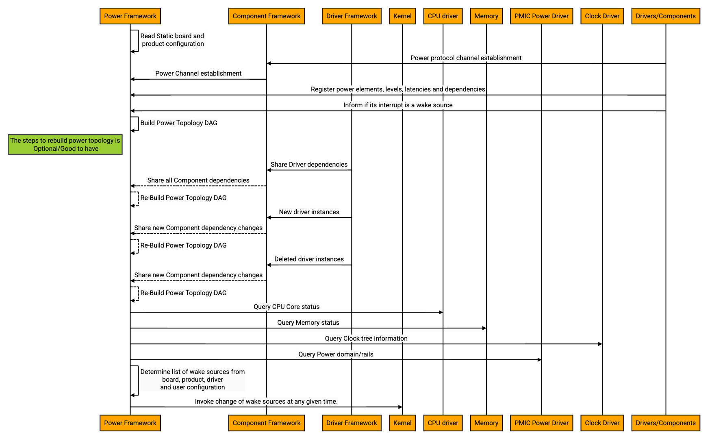
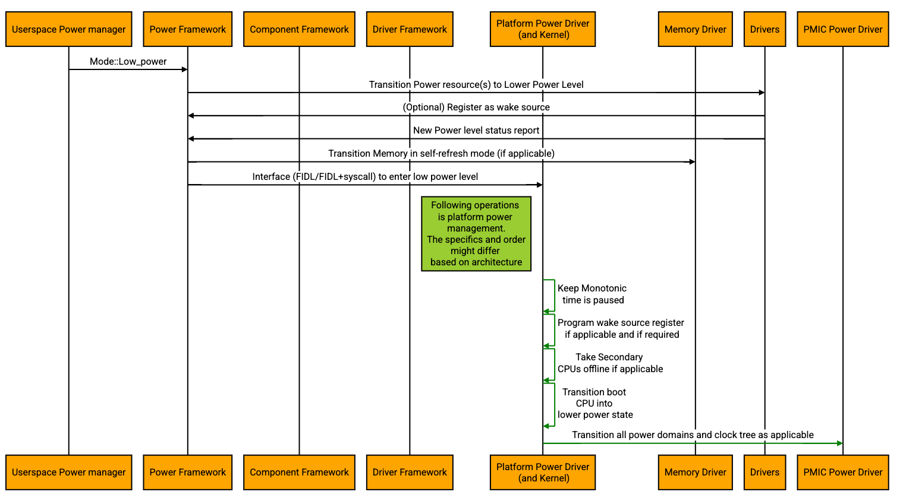
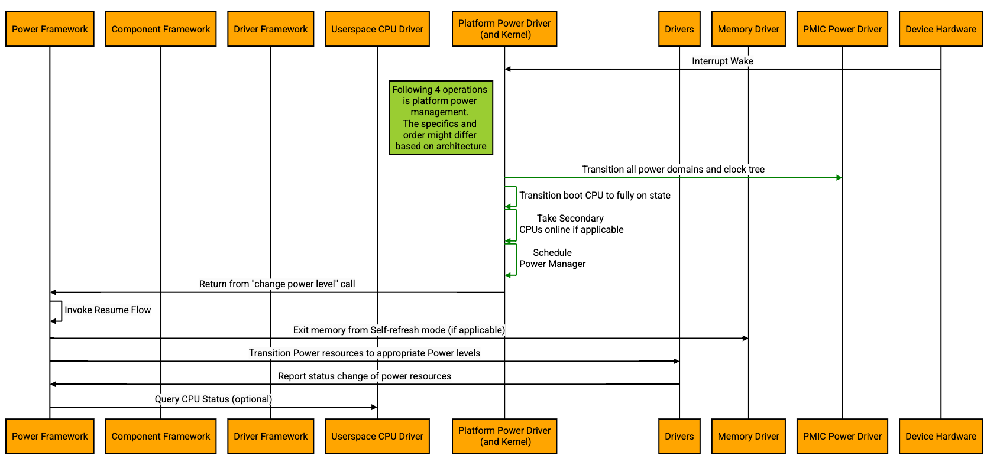

<!-- mdformat off(templates not supported) -->


# {{ rfc.name }}: {{ rfc.title }}
{# Fuchsia RFCs use templates to display various fields from _rfcs.yaml. View the #}
{# fully rendered RFCs at https://fuchsia.dev/fuchsia-src/contribute/governance/rfcs #}
<!-- SET the `rfcid` VAR ABOVE. DO NOT EDIT ANYTHING ELSE ABOVE THIS LINE. -->

<!-- mdformat on -->

## Summary

This RFC proposes adding support for one system power level, Suspend-to-Idle,
along with support for resuming from this state. This document presents the
high level requirements and design of the Suspend-to-Idle flow for Fuchsia.
This is a first level RFC defining the process and the design as a whole.
There will be further RFCs or design documents that cover implementation
details for each module.

The crux of power management is taking a system to a lower power level when
it's not being used actively and bringing it back to fully functional. The
system levels can be compared to [ACPI S states][1]. Different types of systems
have different requirements for power and wake latency which directs the
"System Power level" a system can transition to. Power managing a system
while it's fully-on (or active) by turning off or taking the parts of the
system to lower power levels is termed as Runtime Power Management.

Defining a set of standard system power levels and implementing only those
defined levels will not help achieve the goal of reaping best possible power
benefits and honoring the system resume time latencies. Some OSes have also
tried to retrofit Runtime Power Management which has not yet led to realizing
full power benefits.

To solve this problem, Fuchsia will incorporate granular level power management
using its centralized Power Framework. The Power Framework is a term used in
this document for all power managing components that will be responsible for
making policy decisions and implementing them. Each sub-device of the system
(part on SoC/peripheral/bus/etc) has the freedom to define any number of power
levels it can get into with corresponding wake latencies and publish the same
to the Power Framework. The Power Framework will play a major role by making
informed policy decisions and implementing them to take the system or parts of
the system to a low power level. The Power Framework will act based on the
information received from user space system components (like request to take
system to lower power level with a guaranteed resume time), board configuration
information (system power levels supported, resume time and wake capabilities
for each level) and learning the current power level of the system (like the
level of the each sub-device, their wake latencies, their power resource
dependencies and their I/O queues).

[1]: https://uefi.org/htmlspecs/ACPI_Spec_6_4_html/16_Waking_and_Sleeping/sleeping-states.html#

### Examples:

1. Power Framework receives a request from the system components in userspace
to take the system to a lower power level and to ensure a guaranteed resume
time of 500ms. The Power Framework would be aware of all of the sub-devices'
levels and some or all of their wake latencies. Based on the information, the
Power Framework may decide to only take the secondary CPUs offline, the Audio
Speakers (not Microphone) offline, the WiFi to one of its low power modes,
and transition display to a slower refresh rate. The actions are taken because
they can be restored back to fully functional in 500ms. It cannot take the rest
of the sub-devices to lower power levels because they either might require to
be always-on or their wake latency is >500 ms.

2. Power Framework receives a request from the system components in userspace
to take the system to a lower power level as there is no active user
interaction. The Power Framework does not have the resume time requirement to
exit the lower power level it's taking the system into. Power Framework may
decide to take the system to Suspend-to-Idle and then transition to
Suspend-To-RAM if possible over time. These will be some well-defined Fuchsia
system power levels that the Power Framework would know and act on.

## Motivation

As Fuchsia expands to supporting different types of products that are battery
operated, power management is an essential feature to support. This
document specifically covers all the aspects of Fuchsia taking the system
to Suspend-to-Idle and back to fully active. The design principles adopted are

1. The drivers and components can become "power aware" by implementing
well-defined protocols and interfaces. The exact interfaces are not defined in
this RFC. They will be discussed in detailed design documents.

2. The drivers and components will be agnostic to the system level changes.

3. The design will incorporate infrastructure to implement any kind of future
power policy enforcement (like other system power level transition, runtime
power management) without having to change the driver code.

This requires various layers of Fuchsia to participate with well-defined
functionalities which are covered in this RFC. This RFC does not include all
the metrics required to help measure the power and performance of the system
across various system power levels.

## Stakeholders

_Facilitator:_  James Robinson <jamesr@google.com>

_Reviewers:_

* Carlos Pizano <cpu@chromium.org>
* Christopher Anderson <cja@google.com>
* Justin Mattson <jmatt@google.com>
* Kyle Gong <kgong@google.com>
* Mukesh Agrawal <quiche@google.com>
* Nick Maniscalco <maniscalco@google.com>
* Onath Dillinger <claridge@google.com>
* Suraj Malhotra <surajmalhotra@google.com>

_Consulted:_

* Christopher Anderson <cja@google.com>
* Justin Mattson <jmatt@google.com>
* Nick Maniscalco <maniscalco@google.com>
* Onath Dillinger <claridge@google.com>
* Suraj Malhotra <surajmalhotra@google.com>

_Socialization:_

This design was discussed with the extended Power team (the leads of the
various modules of Fuchsia like kernel, drivers, driver framework, component
framework and Power Framework are part of the Power team).

## Requirements
When the system wants to save power and use the available low power levels,
Fuchsia should implement transitioning to lower power system levels (depending
on the architecture it could be ACPI S-states or any proprietary way) and honor
power management requests from user space system components. This RFC targets
the Suspend-to-Idle system power Level. The basic requirements for
Suspend-to-Idle and Resume back are:

1. Fuchsia should take hints from the userspace system components and make its
own choice (based on the capability and state of the system) to go into
Suspend-to-Idle.

2. If the user space provides a resume latency requirement, Fuchsia should
honor the same. If no resume latency is provided, Fuchsia should enter
Suspend-To-Idle with the lowest possible resume latency.

3. Fuchsia shall provide a way to get board specific configurations to define
sub-device interrupts that are allowed to bring the system back into fully
active mode from Suspend-to-Idle.

4. The Suspend-to-Idle feature should have comparable or better power
consumption against other OSes.

5. Fuchsia shall expose the health and metrics of CPU, memory and sub-devices
as required by user space components for debugging, power measurements and
making policy decisions.

6. Fuchsia shall provide a way to order operations across components as
demanded by suitably-defined power dependencies.

7. Fuchsia shall expose telemetry data on sub-devices that honored the power
level change and the sub-devices that declined/ignored the request. When a
change request is declined, optionally a reason shall be communicated and
logged by the sub-devices that could be used for debugging and fine tuning
power consumption.

8. Fuchsia drivers should provide information about their power elements using
the appropriate defined interfaces.

## Design

Suspend-to-Idle is a low power system level that is supported in many OSes.
Each OS defines this low power level in a different way. In Fuchsia, we choose
to have a definition that reaps the best power saving and also meets the
requirements listed above. This power level definition is based on but not
limited to the definition in one of the standard specifications which is ACPI.
As per the definition in the ACPI specification, S1 is defined as a low wake
latency sleep state. There are multiple example implementations provided in the
specification. Suspend-to-Idle for Fuchsia aims to get as close as possible
to one of the ACPI S1 state implementations.

Below is an excerpt from the specification that details the implementation
we want to achieve.

    In this ACPI S1 implementation, all system context is preserved
    except CPU caches. Before entering S1, the system caches are flushed and the
    hardware is expected to

    1. Place processor in stop grant state.

    2. Stop the processor input clock, placing the processor into the stop clock
    state.

    3. Placing system memory into a self-refresh or suspend-refresh state.
    Refresh is maintained by the memory itself or through some other reference
    clock that is not stopped during the sleeping state.

    4. Stopping all system hardware clocks (asserts standby signal to system
    PLL)

    Normally the RTC will continue running. In this case, all clocks in the
    system have been stopped (except for the RTC). Hardware must reverse the
    process (restarting system clocks) upon any enabled wake event whereby
    OSPM must first invalidate the CPU caches and then transition back
    into the working state.

Different OSes implement Suspend-to-Idle in their own way improvising on the
definition of ACPI specification. This document outlines the design for
Suspend-to-Idle and discusses how Fuchsia can do better.
In a nutshell, Fuchsia would implement Suspend-to-Idle as follows which gives a
advantage over other OSes which do not completely implement the table below.

| Sub-system | Power Levels | Notes |
| ---------- |--------------|-------|
| Boot CPU   | C0 (Pn)      | Run the boot CPU in its lowest power consuming state |
| Non-Boot CPU | Off or lower C state if available | Lowest power level of the non-boot CPU if we cannot take them offline |
| Memory | Self-Refresh | If the option is available |
| Sub-Devices | Lowest power level possible (like D3Hot defined in ACPI) | The sub-devices will be taken to their lowest power level based on resume time requirements.
| Clock Tree and Power Rails | Best effort | Based on the board configuration and known system wake requirements, the Power Framework can turn off parts of clock-tree and power rails |

Example of a sub-device power state transition:

    Considering a sub-device can support power levels as follows;

    0 - off state with wake latency to fully functional being at most 650 ms
    1 - higher power level with wake latency being at most 500 ms
    2 - higher power level with wake latency being at most 450 ms
    3 - higher power level with wake latency being at most 100 ms

    If Fuchsia receives a request to go to low power state and the resume time
    to be <=500ms, it can choose to take down the sub-device to level 2.

Broad comparison with other OSes:

The Linux kernel does not provide a way to query the drivers for power state
information like wake latencies, granular power transition states and power
consumption in each state. It does not provide a way to get this information
from product designers in the firmware/board drivers. Linux does not
incorporate any of the policy decisions in its kernel layer as a design
principle to keep proprietary un-open-sourceable code outside the Linux Kernel.
Linux-based OSes like Android and Ubuntu build their power management
on the power management features provided by the Linux kernel. They have
to act only on the minimal information queried and provided to the user space.
Lack of details like wake latencies and power consumption, limits the
Linux-based OSes to reach its full potential of saving power and extending
battery life. For example, Android power management is designed as a wrapper to
Linux power management. It has created several power policies and features like
"early suspend framework", "wake lock mechanism" to reap power benefits. But it
is still battling issues like increasing the battery life and reducing the
system resume time.

Windows on the other hand queries wake latencies from drivers for functional
power states which can be optionally supplied by the drivers. This helps
Windows to do aggressive Runtime power management. Windows drivers are not
required to be open sourced thus allowing vendors to create drivers embedding
with proprietary information. But Windows does not receive any board
specific configuration which limits customizing runtime power policy decisions
and also might cause multiple driver versions to exist with proprietary board
specific configuration embedded in each version.

Fuchsia will incorporate the learnings of both the OSes and also ensure the
known design issues are addressed. There are many silicon limitations and
differentiations that Fuchsia will need to incorporate to make the right
decisions.

a) Each silicon has its own design of power rail management, clock tree
management, CPU state management and RTC clock management. Fuchsia should
have the infrastructure to provide information for taking appropriate policy
decisions.

b) Fuchsia should provide the infrastructure for drivers to define different
levels of power consumption and allow them to transition through them instead of
having fixed power levels like ACPI D states (D0, D0i1/2/3, D1, D2 and D3).

c) Fuchsia should provide the infrastructure for drivers to report the power
configurations like wake latency and dependencies on other drivers.
The Power Framework will require access to this information for aggressive
power management. This will help get an edge over other OSes that are trying
to retrofit this information for making power related system level decisions.

## High Level Design

### Startup/Setup:

The Power Framework would be the first Fuchsia module to receive the low power
mode request from the system components in the user-space. To execute the
command, the Power Framework should be equipped with

1. Power topology of the entire system

    The Power Framework would need to create or receive the power topology graph
and own the same. This would enable the Power Framework to place the sub-devices
into lower power levels. The final design of constructing the power topology
graph will be discussed in the Power Framework design document. The following
information could be useful for creating and maintaining the power topology
graph.

    a) Component Dependency DAG:

    With DFv2, all the drivers are components and the component manager has the
"capability graph" of the drivers and other components. This dependency graph
could be a good input to the Power Framework to construct the power topology
graph. The driver manager and component manager have different aspects of
the system view that are exchanged. The component manager finally owns the
component dependency graph as a single source of truth. Power Framework
should have ways to query or access this information. This graph is however
not sufficient for the Power Framework.

    b) Power Element Dependency Information:

    The power topology must capture the relationship between power levels of
different sub-devices and maintain dynamic awareness of the same. At any given
point it must ensure that a given device's power dependencies are fulfilled.
Neither the component nor driver topologies can do this today.

2. Current state of the drivers and components

    The runtime information of changes in drivers' existence and power levels
should be communicated to the Power Framework. For example, plug and play can
introduce new drivers and kill some driver instances. There might be some
sub-device that is not functioning and the corresponding driver might cease to
exist. Some drivers could be implemented to intelligently turn off the parts of
its device contributing to runtime power management.

    All the power level changes should be communicated to the Power Framework.
Some of this could be runtime information supplied by the component manager or
driver manager and some of this could be information directly reported by the
drivers.

3. Status of the system like cpu, memory, clock and power state. (Optional)

    In addition to all the information mentioned, the Power Framework having
access to information like the status of CPU, clock tree, memory and power rail
will help making the right decisions of suspending down the system in a
failsafe way. Corresponding drivers or kernel would expose interfaces for the
Power Framework to query the current power level and also system calls to
execute a set of activities during suspend and resume.

4. Receive static board specific configuration and product specific
configuration.

5. Receive user configurations for Suspend-to-Idle and Resume, like wake
capabilities and Resume latency.

6. Determine wake capabilities before transitioning to a lower power level.

    The Power Framework can make list of sub-devices capable of waking up from
different system low-power levels through various configurations it has access
to. The drivers that know/learn that they can wake the system from low power
levels can register their interrupts to be wake-capable with the Power
Framework. The Power Framework will use this information along with the board
configuration, product configuration and user space configuration to decide
which of the sub-devices are wake capable and communicate the same with the
kernel.

Following is the high level flow for init/startup.

### Suspend-to-Idle Entry flow:

The Power Framework would be responsible for transitioning the entire system in
or out of any given system power level by communicating with the Fuchsia modules
like component manager, driver manager and with Zircon. If the mode/state/power
level requested by the user space is not supported, the Power Framework can
choose to reject the request.  Each mode/state/power level entry will require a
different set of actions to be taken in a particular order.

The specific mode discussed here is one of the low power modes which is
Suspend-to-Idle. This mode is a low wake latency sleep state. The Power
Framework needs to maintain the state machine of the components and the system
as a whole for the following reasons.

1. The decisions to transition in and out of a mode or decision to reject a
mode transition is all handled internally by the Power Framework.

2. When a system is already in a given mode and the Power Framework receives a
request to enter the system into another mode; the Power Framework would need to
know the state machine and its transitions to enter the system into the new
mode.

3. Some transitions might not succeed and the system mode might not change.
Such cases should be handled by the Power Framework. The Power Framework
should be aware of the resulting mode/power level after every mode transition.

When Fuchsia chooses to go to Suspend-to-Idle mode to save power/battery, the
Power Framework would have the most recent view of the system with the power
topology. The Power Framework would decide which components need to transition
to low power levels and invoke the interface to transition them. This requires
all the components and drivers to register and implement the interfaces to
change their power levels defined by the framework to reap the best power
benefits. The details of this design would be covered in the Power Framework
design document and Power-Aware Drivers and Components design document.

It's important to define which hardware/software interrupts are wake capable.
The Power Framework will invoke the Power Element owners' appropriate interface
to program their Wakeup Triggers. It may optionally request the kernel
to set the wake source register (if applicable and if required). These design
details will be covered in the Power-Aware Kernel design document.

In case the driver/component fails to make a power level change, the
Power Framework could choose to either abort the operation or follow through.

The Power Framework should initiate a request to pause the monotonic time, take
the CPUs offline or put them in low power state, turning off the clock and
power as much as possible and other architecture dependent actions, if any.
This could either be a direct syscall to the kernel or routed through a driver
or a component or HAL, which will be discussed in the further design documents.

The following is the high level flow diagram when a Suspend call is received.

### Resume from Suspend-to-Idle flow:

The system resumes from Suspend-to-Idle, when the boot CPU receives an
interrupt to wake up. Only wakeable interrupts programmed either in the
interrupt controller or in some cases, the PMIC or in some cases, locally at
each device will be delivered by the hardware to the CPU. Not all interrupts
will trigger a resume. The interrupts that trigger resume would be the ones
decided by Power Framework and programmed before transitioning the system
into Suspend-to-Idle.

Since the boot CPU is not taken offline, the interrupt will be delivered to the
boot CPU which will invoke the right interrupt service routine. The Power
Framework would receive the status for its suspend call either directly from
the kernel as a syscall function returns or routed through a driver. Either that
driver or the Power Framework has to take the actions in the reverse order to
bring the entire system up, starting from enabling the clock and power domains,
taking boot CPU to fully functional state, powering up the secondary CPUs,
exiting memory out of self-refresh and other architecture dependent actions,
if any. The Power Framework will be responsible for resuming all the devices
using their corresponding drivers and components in an orderly fashion.

The following is an example of the high level resume from Suspend-to-Idle flow.

## Module Responsibilities

### Power Framework components:

The Power Framework components would be the ones orchestrating the entire
suspend and resume flow. The Power Framework would need to

1. Maintain power topology with the services from component framework and Driver
framework.

2. Maintain dependency relationships between components, including drivers.

3. Use services from the kernel or an appropriate driver to receive the
capabilities and current status of the CPU.

4. Call into the services from kernel or appropriate drivers to

    a. To take the CPUs online/offline

    b. To set the wake source interrupts registers (if any and if required)

    c. To pause the monotonic time

    d. Architecture specific changes and programming

    All the above steps could either be separate service calls or a single
    service call to do all of them. This design decision and details will be
    documented in appropriate design documents of Power Framework and Power
    Aware Kernel design document.

5. Interface to receive the power elements and their properties like power
levels, power dependencies and wake latencies from drivers and components.

6. Interface to set the appropriate power levels for drivers and components
in an orderly way.

7. To expose the metrics like current status of the power topology, status
of each driver/component, wakeup triggers for debug and telemetry.

### Drivers

Each of the Fuchsia driver that manages power-critical resources would need to
implement the following to aggressively save power.

1. Register a channel with Power Framework

    a. Provide information about the supported power elements, their power
    levels, dependencies and wake latencies.

    b. Implement interfaces that change their power levels

    c. Provide information about their power state at all times (e.g. if
    triggered internally).

    d. Expose the metrics like current status and internal configurations
    for debug and telemetry purposes.

### Kernel

On a high level the kernel could implement each of the following
responsibilities as a separate syscall or a single syscall.

1. Ensure the monotonic time is paused when the system enters Suspend-to-Idle.
The time should not advance when the system is in suspended mode. On resume,
this will ensure threads to have a consistent awareness of the relative measure
of time for which the system was active. This will ensure that the time the
system is suspended does not affect the correctness of the programs. It is
critical to have a consistent behavior with respect to advancing the time
while the system is in suspend.

2. Program the Wake Sources (if applicable and if required) before the CPU
power level change is made. This would be architecture specific and the kernel
would need to set appropriate registers based on the board type.

3. Take the CPUs offline or back online.

4. Export CPU metrics. This could be returned when the resume is complete or
this could be a separate syscall invoked by the Power Framework or
debugger/power measuring tools to get the status of each CPU.

Suspend-to-Idle invoked by the user space is independent of the scheduling
behavior of the system. However it is important for the scheduler to be aware
and take appropriate actions. The detailed design of the same will be discussed
in the "Power Aware Kernel" design document.

## High-level design of new interactions

### Drivers registering as wake capabilities with Power Framework

Device drivers can learn if their interrupt(s) are wake capable from the board
driver or from other sources based on the type of the driver and the
architecture. For example, the interrupt generated from Audio, Touch, and lid
device could be defined as wake capable. In the current design, the
corresponding device drivers call the SetWakeDevice() as a part of the suspend
function to register as wake sources. (Example: [ACPI Lid Driver](https://cs.opensource.google/fuchsia/fuchsia/+/main:src/devices/acpi/drivers/acpi-lid/acpi_lid.cc;l=87)
). This internally invokes the ACPI driver's [SetWakeDevice()](https://cs.opensource.google/fuchsia/fuchsia/+/main:src/devices/board/lib/acpi/device.cc)
call. This is architecture specific and not scalable.

Power Framework being the centralized location for deciding all power related
settings, would decide on what can wake the system from the power level
it is transitioning the entire system into. Given this, the drivers that have
wake capable interrupts should share the information with the Power Framework
using a predefined and shared channel. The Power Framework could set up the
wakeup triggers with Kernel syscall or communicate with the driver to set the
same. This design decision will be part of the <em>Power Framework
Design </em>, <em>Power-Aware Kernel design</em> and <em>Power-Aware Drivers
and components design</em> documents.

### Provision Power configurations for a board through static configuration

Each board can define configuration and properties that would be useful to
make meaningful power policy decisions. Some of the examples are how
sub-devices/peripherals are dependent on each other, the different system power
levels to support and the sub-devices that can wake the system from low power
levels. For example, some sub-devices that are allowed to wake the system from
Suspend-to-Idle might not be allowed to wake the system from Suspend-to-RAM.
Given this, it's important for the Power Framework to know which of the
sub-devices are allowed to wake the system from the current power level it is
transitioning the system to.

This board configuration could be a one-time configuration read by the Power
Framework after boot (Example:[Central thermal trip point
configuration](https://cs.opensource.google/fuchsia/fuchsia/+/main:src/power/power-manager/thermal_config/README.md))
or it could be information that is fed by the board driver to other device
drivers. The drivers would then process the information and feed the final
configuration to the Power Framework during their initialization/registration.

### Creating Power topology

The Power Framework should maintain the power topology to make efficient power
level transition decisions. The Power Framework would have appropriate channels
setup with component manager and driver manager or with the drivers and
components themselves to collect information such as

1. Power elements

2. Corresponding power levels supported

3. Dependencies on other power elements

4. Latency to transition to each level

5. Wake capability

6. Status of Self-initiated power level changes

During driver initialization, the drivers and components should communicate
with the Power Framework by appropriate channels provided.

Further, the drivers and components can extend to use this channel for
Runtime Power Management as well.  For example, if a driver or component
understands that its power element is not being used, it can use the channel to
request a power level change. The Power Framework can either ignore or honor
the request based on the system state, dependencies and power policies. If it
would like to honor the request, it can use the channel and request the power
element to transition to a specific power level.

### Defining and Invoking change of Power levels for each driver/component

The Power Framework will decide which sub-devices should transition to lower
power levels, choosing from the supported levels reported by the driver.
Power Framework will make this decision based on the power levels of certain
elements that represent policy from outside the topology and a narrow set of
rules for managing power dependencies. The Power Framework will communicate the
power levels the sub-device has to transition to by sending messages over the
appropriate established channels. The drivers/components would have to report
back on the same channel with the status after the transition is attempted or
done.

## Implementation

Suspend/Resume flow is the first of the many power management flows for Fuchsia
and is a feature that spans across multiple building blocks of Fuchsia.
This RFC is an overall design. There would be further RFCs or design documents
that would cover implementation details for each module. Each module is bound
to have a lot of design aspects that would need multiple gerrit changes to
complete the entire implementation.

## Testing

This feature spans across multiple building blocks of Fuchsia. All the changes
made to each part of Fuchsia should be unit tested. The integration tests for
testing the interaction and flow across modules should be available and running
in CI/CQ to ensure other features do not breaks this complicated flow and
vice versa. Driver test realms could be used to test the drivers in isolation.
Lacewing (if and when ready) could be used to create and run host based
tests. Any new interfaces created should be available as a part of Partner
SDK and should have CTF tests to keep them on check.

## Further Documentation required

The following design documents will need be produced to make the design
complete and implementation ready.

* Power Framework Design document
* Power-Aware Kernel Design document
* Power-Aware Drivers and Components document
* Power Management for each domain like Audio/Graphics/Connectivity (optional)

## Drawbacks, alternatives, and unknowns

This proposal will require many implementation phases with all the modules
like Kernel, Drivers, Power Framework, Driver Framework and Component Framework
delivering in every phase. Designing the baseline for power management flow is
vital to incorporate various power management features making Fuchsia a
desirable OS for battery powered products. The cost of implementing this
proposal will span across quarters.

There are other strategies to get suspend/resume working. They are:

* Using the existing suspend flow to suspend the drivers and components

    This strategy would not give a complete solution and not deliver the best
    battery life. This solution does not have a way to take into account the
    various power dependencies that drivers/components have, the intelligent
    clustering of sub-devices based on dependent power elements and handling
    of the sub-devices based on their power domain. This design would be
    incomplete because of the lack of features like programing runtime wake
    source changes and exposing sub-device information to the user space.

* Follow the design of suspend/resume as in Linux

    This strategy would only ensure Fuchsia being equivalent to Linux. Fuchsia
    has to operate under the limitations like Linux being a monolithic
    kernel and not entertaining policy decisions. This strategy would not allow
    us to leverage the benefits that Fuchsia brings to the table. Linux power
    management is largely a matter of sequencing particular callbacks that are
    performed by the kernel. By contrast, much of Fuchsia is implemented in
    userspace across many processes, so our power management support must be
    more distributed by nature.

While these strategies might be quick to implement, their drawbacks listed are
not acceptable.

The current design proposed is completely new with a lot of additions and
changes across Fuchsia. This strategy would take time and effort but would
ensure that we have a secure and scalable way to enable power management in
Fuchsia. This would ensure we do not have power management flows being retrofit
into the OS with limitations.

The unknowns in the design would unfold in the next level of design documents
where the mitigations will also be documented.

## Glossary of terms

* Power Element: Power elements is an entity representing the power aspects of
either hardware sub-devices (including power rails and clocks) or composition
of these hardware elements into higher-level abstractions like audio streams,
ultrasound, the camera subsystem.
 

* Power Level: A power element may occupy different power levels. Power levels
are a sequence of states obeying the following constraints: They are indexed
by nonnegative integers; Level 0 has no power level dependencies" and in most
devices it could be an "off" state; They are ordered by increasing power
consumption. (There are lots of ways to measure power; for current intents and
purposes, a context-specific definition of "typical" power consumption
suffices.) In the simplest non trivial case, an element would have two possible
levels, with 0 being off and 1 being on. ACPI D-states may also be mapped to
power levels, although with their ordering inverted: D3cold=0, D3hot=1, D2=2,
D1=3, D0=4.
 

* Wakeup Triggers: When the system is in low power mode (suspend) and the CPU
is offline, the interactions in the real world that cause an interrupt being
triggered with the system, waking the system from low power levels is
termed as "Wakeup Triggers".
 

* Sub-device: Part of the SoC or a peripheral or a system bus that has a driver
attached to it.
 

* System Power level/Sleep states: Well-defined system level states that have
known wake latency, approximate power consumption. This is very similar to
ACPI S-States.
 

* Wake Latency: Time taken by a sub-device or system as a whole to transition
from a lower power level state to fully functional state.
 

* Resume Time: Maximum time the system can take to resume from a low power level
to a fully functional state.
 

* OSPM: Operating System-directed configuration and Power Management
 

* ACPI S0 state - Fully active or fully on state with high power consumption.
 

* ACPI S1 state - The S1 state is defined as a low wake-latency sleeping state.
In this state, all system context is preserved except for the CPU caches.
 

* Monotonic time - Monotonic time is a measurement of the time since the system
was powered on and is maintained by the kernel.
 

## Prior art

* [Sleeping States — ACPI Specification](https://uefi.org/htmlspecs/ACPI_Spec_6_4_html/16_Waking_and_Sleeping/sleeping-states.html#)
* [A Minimum Complete Tutorial of CPU Power Management, C-states and P-states](https://metebalci.com/blog/a-minimum-complete-tutorial-of-cpu-power-management-c-states-and-p-states/)
* [Device Low-Power States - Windows drivers](https://learn.microsoft.com/en-us/windows-hardware/drivers/kernel/device-sleeping-states)
* [D0ix States](https://www.intel.com/content/www/us/en/docs/socwatch/user-guide/2020/d0ix-states.html)
* [Supporting Functional Power States](https://learn.microsoft.com/en-us/windows-hardware/drivers/wdf/supporting-functional-power-states)
* [System Sleep States — The Linux Kernel documentation](https://www.kernel.org/doc/html/next/admin-guide/pm/sleep-states.html#suspend-to-idle)
* [Suspend-to-Idle history in Linux](https://static.sched.com/hosted_files/osseu2020/75/suspend-to-idle-history.pdf)

## Further Reading:

* [Presentation on Fuchsia Power topology overview](https://docs.google.com/presentation/d/17zsNOwWpGW3rHw1bF6DBysAd0AwwV9OXMLPvotb9bx4/edit#slide=id.p)
* [go/fuchsia-power-topology](http://goto.google.com/fuchsia-power-topology)
