# Driver unit testing tutorial

This guide provides a detailed understanding of the Driver Framework v2 testing libraries and how
to use them including the
[DriverRuntime](/docs/development/sdk/driver-testing/driver-testing-reference.md#driverruntime),
[TestNode](/docs/development/sdk/driver-testing/driver-testing-reference.md#testnode),
[TestEnvironment](/docs/development/sdk/driver-testing/driver-testing-reference.md#testenvironment), and
[DriverUnderTest](/docs/development/sdk/driver-testing/driver-testing-reference.md#driverundertest) classes.

The following image shows the entirety of the driver testing framework:

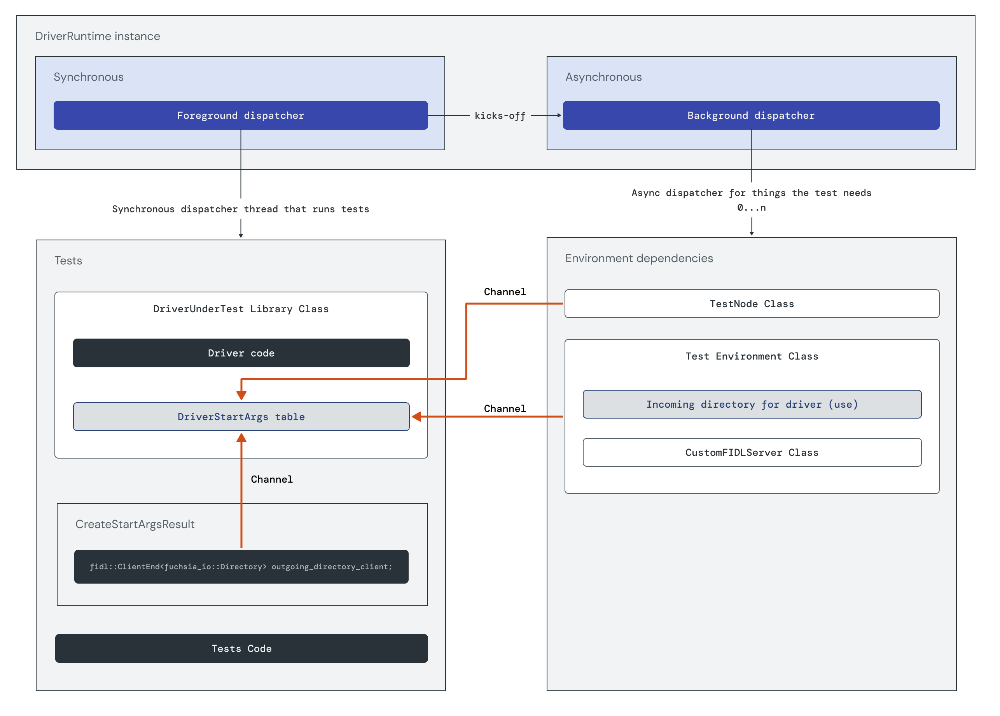

At a glance, the `DriverRuntime` automatically creates the
[foreground dispatcher](/docs/development/sdk/driver-testing/driver-testing-reference.md#foreground-dispatcher)
and attaches it to the main testing thread.
The foreground dispatcher synchronously runs tests and uses what
it needs in the test environment, including FIDL services, through the
[background dispatcher(s)](/docs/development/sdk/driver-testing/driver-testing-reference.md#background-dispatchers).
`DriverUnderTest` wraps the driver being tested and provides the ability
to call its lifecycle hooks.

Throughout this tutorial, you will dive into each specific part of the driver
testing framework and learn how to write code to make your tests work. It may
help to return to this image as you dive into each of its parts. Once you are
familiar with the testing framework, refer to the
[quick start](/docs/development/sdk/driver-testing/driver-unit-testing-quick-start.md) and
[reference](/docs/development/sdk/driver-testing/driver-testing-reference.md)
as needed.

## Set up testing framework

### Set up dispatchers and create driver runtime instance

The first step in setting up the testing framework is to create the driver
runtime instance and start the background dispatchers.

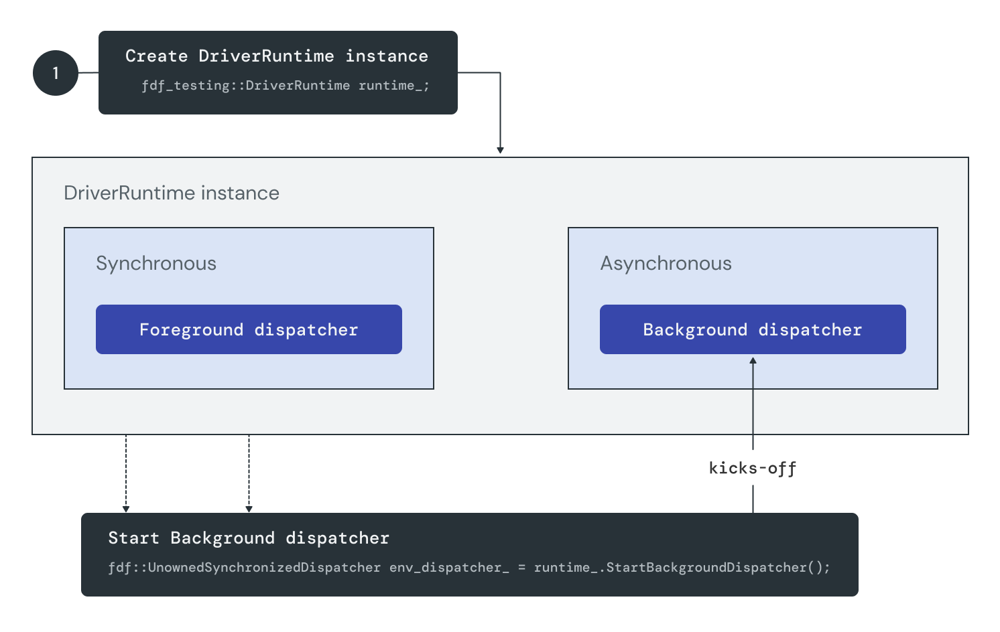

#### Create driver runtime instance

When you start your test, you create the instance of your driver runtime. This
automatically creates the foreground dispatcher:

```cpp
fdf_testing::DriverRuntime runtime_;
```

Examples:

-   [iwlwifi driver lifecycle test, line 184](https://fuchsia.googlesource.com/drivers/wlan/intel/iwlwifi/+/refs/heads/main/third_party/iwlwifi/test/driver-lifecycle-test.cc#184)
-   [Driver FIDL test, line 115](https://fuchsia.googlesource.com/fuchsia/+/refs/heads/main/sdk/lib/driver/component/cpp/tests/driver_fidl_test.cc#115)

#### Start background dispatcher

Use the
[StartBackgroundDispatcher method on the DriverRuntime](https://fuchsia.googlesource.com/fuchsia/+/refs/heads/main/sdk/lib/driver/testing/cpp/driver_runtime.cc)
to start the background dispatcher(s)manually (if needed):

```cpp
fdf::UnownedSynchronizedDispatcher env_dispatcher_ = runtime_.StartBackgroundDispatcher();
```

This method gives a pointer for the background dispatcher where you can put
your environment dependencies.

Examples:

-   [iwlwifi driver lifecycle test, line 187](https://fuchsia.googlesource.com/drivers/wlan/intel/iwlwifi/+/refs/heads/main/third_party/iwlwifi/test/driver-lifecycle-test.cc#187)
-   [Driver FIDL test, line 118](https://fuchsia.googlesource.com/fuchsia/+/refs/heads/main/sdk/lib/driver/component/cpp/tests/driver_fidl_test.cc#118)

### Create TestNode object

The second step in setting up the testing framework is to create the test node object.
[TestNode](/docs/development/sdk/driver-testing/driver-testing-reference.md#testnode)
is a mock server for the driver framework node protocol.

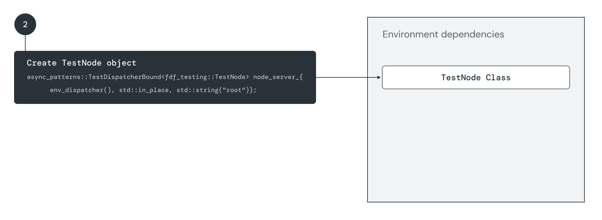

Use the wrapper class, `TestDispatcherBound`, to instantiate the class by
creating the TestNode object. This is done through a wrapper class for memory
and thread safety:

```cpp
async_patterns::TestDispatcherBound<fdf_testing::TestNode> node_server_{
    env_dispatcher(), std::in_place, std::string("root")};
```

At this point, you aren't serving anything yet, just representing the root node
of your tests. The driver being tested binds to this node. It is completely
detached from the tree so that you can hook your driver to it.

The point of the node protocol is to add children into the node topology.
Similar to how components live inside a tree structure, so do drivers.
The node protocol is how you add children to the node topology in the driver
framework. The driver binds to the node and can add children to node for other
drivers to bind to.

Examples:

-   [iwlwifi driver lifecycle test, lines 189-190](https://fuchsia.googlesource.com/drivers/wlan/intel/iwlwifi/+/refs/heads/main/third_party/iwlwifi/test/driver-lifecycle-test.cc#189)
-   [Driver FIDL test, lines 127-128](https://fuchsia.googlesource.com/fuchsia/+/refs/heads/main/sdk/lib/driver/component/cpp/tests/driver_fidl_test.cc#127)

### Create TestEnvironment object

The third step in setting up the testing framework is
to create the test environment object.
The [TestEnvironment](/docs/development/sdk/driver-testing/driver-testing-reference.md#testenvironment)
provides FIDL services to the driver,
simulating the FIDL server that's accessible to the driver.

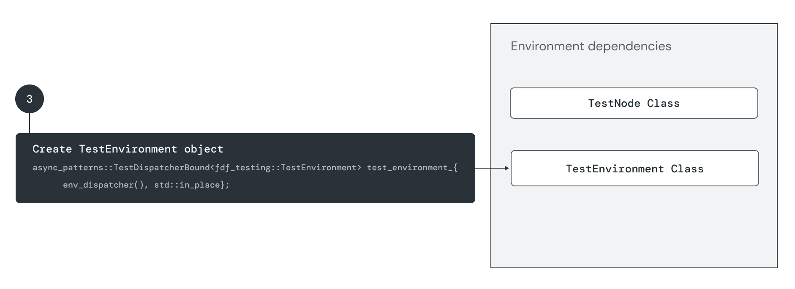

As with `TestNode`, use the wrapper class, `TestDispatcherBound`, to instantiate
the class by creating the `TestEnvironment` object. This is done through a wrapper
class for memory and thread safety:

```cpp
async_patterns::TestDispatcherBound<fdf_testing::TestEnvironment> test_environment_{
    env_dispatcher(), std::in_place};
```

Examples:

-   [iwlwifi driver lifecycle test, lines 192-193](https://fuchsia.googlesource.com/drivers/wlan/intel/iwlwifi/+/refs/heads/main/third_party/iwlwifi/test/driver-lifecycle-test.cc#192)
-   [Driver FIDL test, lines 131-132](https://fuchsia.googlesource.com/fuchsia/+/refs/heads/main/sdk/lib/driver/component/cpp/tests/driver_fidl_test.cc#131)

### Set up custom FIDL server class

The fourth step in setting up the testing framework is to setup the custom FIDL
server class. This is an optional step, required to support any FIDLs that the
driver needs for this particular unit test. There are three parts to this
set-up: create the custom FIDL server class, get the server handler, and
move the server handler into the `TestEnvironment` class.

#### Create custom FIDL server class

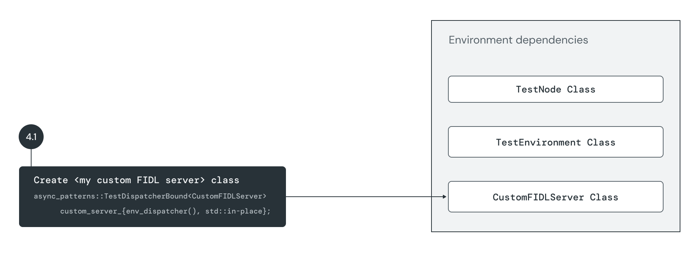

This example code in
[Driver FIDL test, lines 121-124](https://fuchsia.googlesource.com/fuchsia/+/refs/heads/main/sdk/lib/driver/component/cpp/tests/driver_fidl_test.cc#121)
creates server classes for Zircon and Driver to support both Zircon and Driver
services.

```

```

#### Get custom FIDL server handler

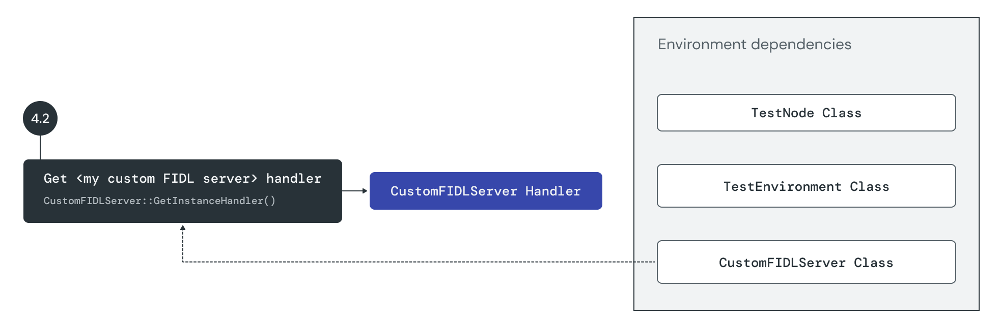

This example code in
[Driver FIDL test, lines 71-74](https://fuchsia.googlesource.com/fuchsia/+/refs/heads/main/sdk/lib/driver/component/cpp/tests/driver_fidl_test.cc#71)
gets handlers for both the Zircon and Driver services:

```

```

#### Move custom FIDL server handler into test environment

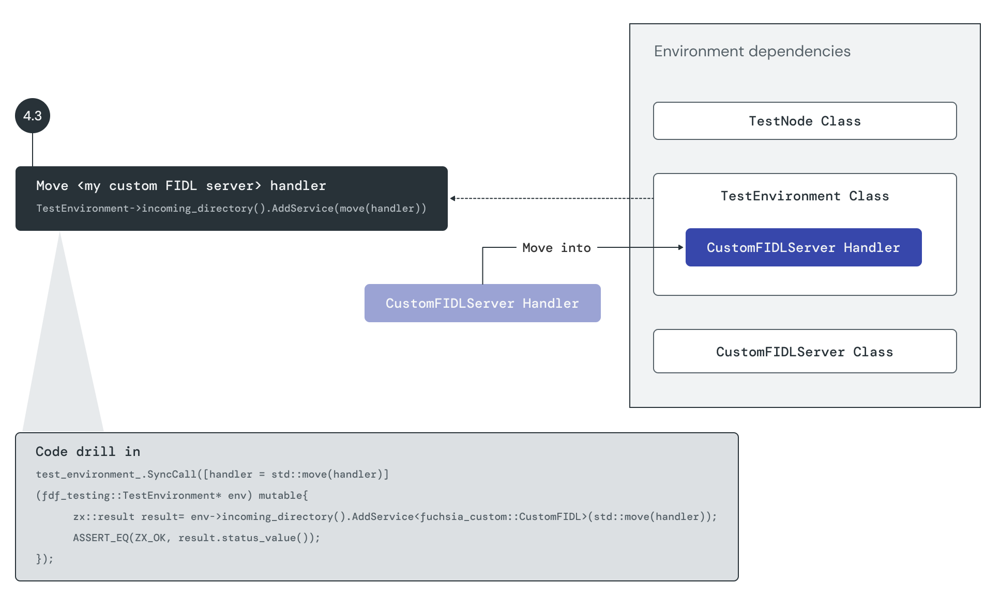

This example code in
[Driver FIDL test, lines 76-87](https://fuchsia.googlesource.com/fuchsia/+/refs/heads/main/sdk/lib/driver/component/cpp/tests/driver_fidl_test.cc#76)
moves both the Zircon and Driver handlers into the test environment:

```

```

### Call CreateStartArgsAndServe

The fifth step in setting up the testing framework is to call the
[CreateStartArgsAndServe method on the TestNode class](https://fuchsia.googlesource.com/fuchsia/+/refs/heads/main/sdk/lib/driver/testing/cpp/test_node.cc).
Calling this method returns three objects:
driver `start_args` table, `outgoing_directory_client`,
and `incoming_directory_server`:

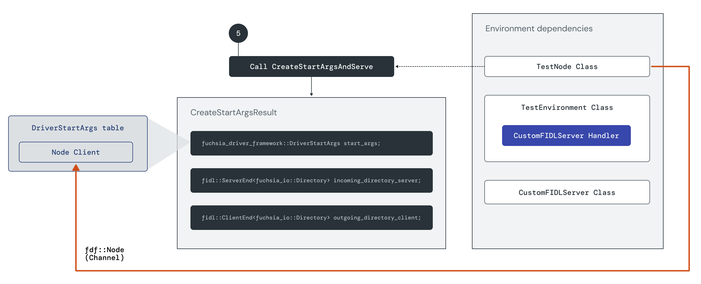

Calling this method also starts serving the node protocol (`fdf::Node`). This is
a channel from the `TestNode` class to the client of `TestNode` in the
`DriverStartArgs` table.

```cpp
zx::result start_args = node_server_.SyncCall(&fdf_testing::TestNode::CreateStartArgsAndServe);
ASSERT_EQ(ZX_OK, start_args.status_value());
```

Examples:

-   [iwlwifi driver lifecycle test, lines 147-148](https://fuchsia.googlesource.com/drivers/wlan/intel/iwlwifi/+/refs/heads/main/third_party/iwlwifi/test/driver-lifecycle-test.cc#147)
-   [Driver FIDL test, lines 59-60](https://fuchsia.googlesource.com/fuchsia/+/refs/heads/main/sdk/lib/driver/component/cpp/tests/driver_fidl_test.cc#59)

### Initialize test environment

The sixth step in setting up the testing framework is to initialize the
test environment. Calling the
[initialize() function on the TestEnvironment class](https://fuchsia.googlesource.com/fuchsia/+/refs/heads/main/sdk/lib/driver/testing/cpp/test_environment.cc)
moves the incoming directory server (from `CreateStartArgsResult`)
into the test environment:

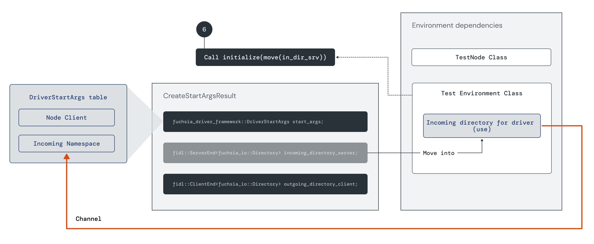

The purpose of this call is to tell the test environment to start serving on
the channel from the server end. The channel now goes from the `DriverStartArgs`
incoming namespace client to the test environment class.

```

```

Both the `TestNode` and `TestEnvironment` are things that the driver needs to run and
so are passed to the driver through its start arguments. Note, however, they go
in as different channels.

`TestEnvironment` contains the VFS (virtual file system) that provides FIDL
services to the driver. When your driver connects to a protocol through it's
incoming directory, the server providing the protocol is on the test
environment, simulating that the FIDL server is accessible by the driver.

Examples:

-   [iwlwifi driver lifecycle test, lines 132-133](https://fuchsia.googlesource.com/drivers/wlan/intel/iwlwifi/+/refs/heads/main/third_party/iwlwifi/test/driver-lifecycle-test.cc#132)
-   [Driver FIDL test, lines 65-68](https://fuchsia.googlesource.com/fuchsia/+/refs/heads/main/sdk/lib/driver/component/cpp/tests/driver_fidl_test.cc#65)

## Run actual tests

### Start driver

[DriverUnderTest](/docs/development/sdk/driver-testing/driver-testing-reference.md#driverundertest)
is a wrapper class that provides life cycle hooks for the driver being tested.
To start the driver, call the `start` method on the DriverUnderTest class:

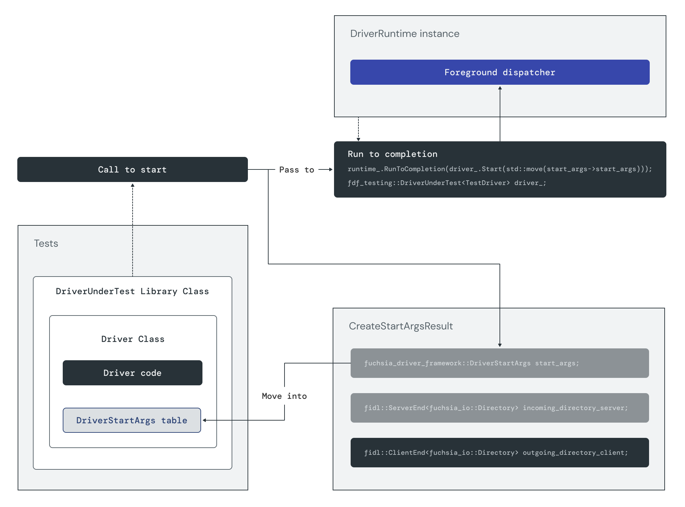

The driver lives on the
[foreground dispatcher](/docs/development/sdk/driver-testing/driver-testing-reference.md#foreground-dispatcher).
The `start` method is an asynchronous operation and won't wait
for the foreground dispatcher to run.
The `start` method is passed to the `RunToCompletion` method and
the `RunToCompletion` method runs the foreground dispatcher
until the start class is complete.

```cpp
zx::result result = runtime().RunToCompletion(driver_.SyncCall(
  &fdf_testing::DriverUnderTest<TestDriver>::Start, std::move(start_args())));
```

Once start happens, the driver and everything in the testing environment runs
on the foreground dispatcher.

Examples:

-   [iwlwifi driver lifecycle test, lines 161-163](https://fuchsia.googlesource.com/drivers/wlan/intel/iwlwifi/+/refs/heads/main/third_party/iwlwifi/test/driver-lifecycle-test.cc#161)
-   [Driver FIDL test, lines 237-238](https://fuchsia.googlesource.com/fuchsia/+/refs/heads/main/sdk/lib/driver/component/cpp/tests/driver_fidl_test.cc#237)

### Run tests

The next step is to run the actual unit tests themselves. At this point, you
can call into any of the driver methods to test the driver.

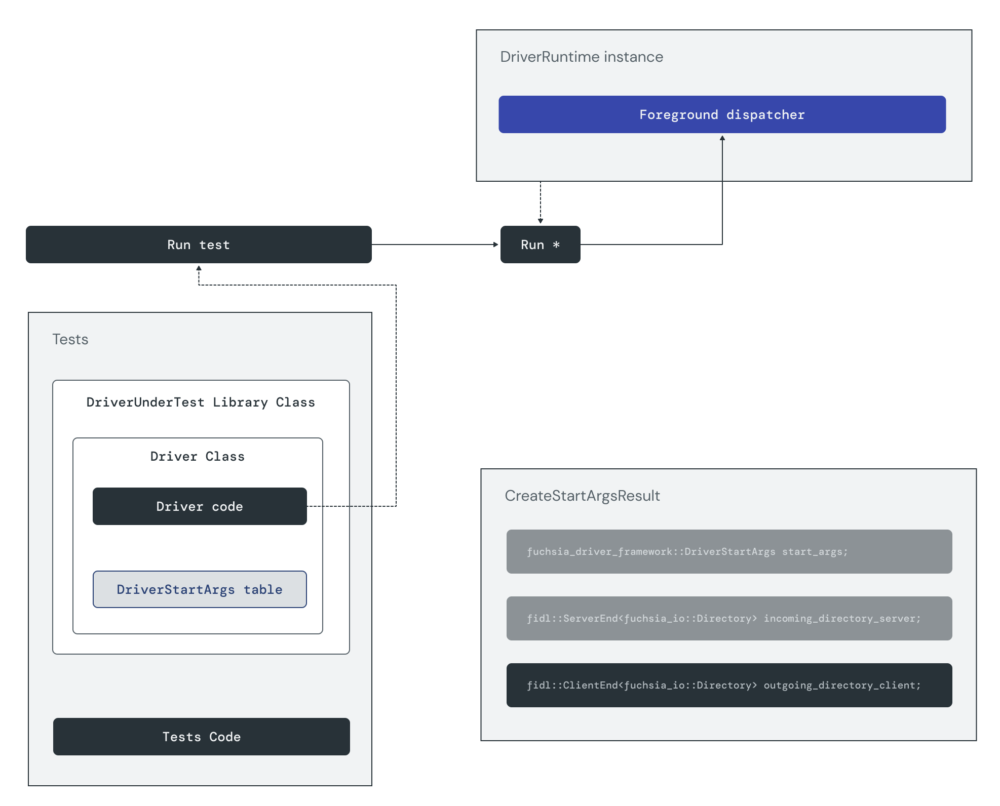

Each test is unique in what it's testing on the driver. For example, starting
the PcielwlwifiDriver triggers `AddNode` for the wlanphy virtual device. The
[iwlwifi driver lifecycle test, line 176](https://fuchsia.googlesource.com/drivers/wlan/intel/iwlwifi/+/refs/heads/main/third_party/iwlwifi/test/driver-lifecycle-test.cc#176),
gets the number of  children nodes:

```cpp
size_t GetNodeNumber() { return node_server_.SyncCall(&TestNodeLocal::GetchildrenCount); }
```

And checks that the number of nodes is 1 ([line
204](https://fuchsia.googlesource.com/drivers/wlan/intel/iwlwifi/+/refs/heads/main/third_party/iwlwifi/test/driver-lifecycle-test.cc#204):

```cpp
EXPECT_EQ(GetNodeNumber(), (size_t)1);
```

### Set up channel for outgoing directory, if needed

There's one last object left in the `CreateStartArgs` table: the outgoing
directory. Use this object to validate something the driver interacts with, for
example, if the driver is exporting services.

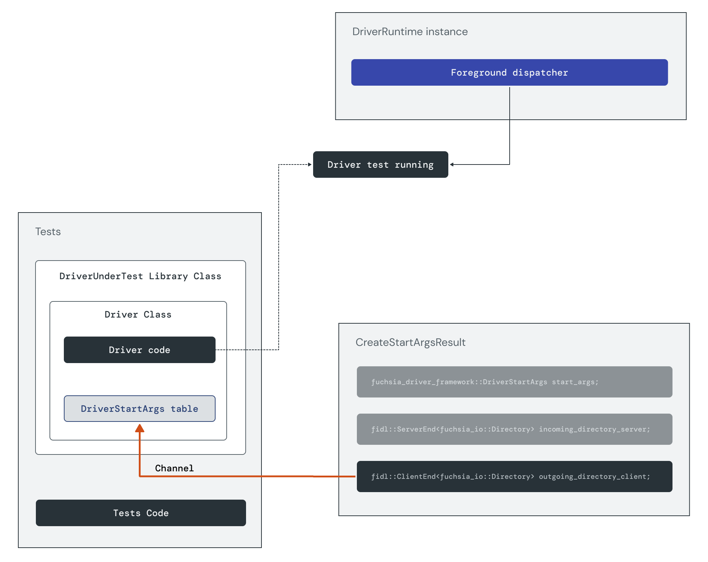

The following code sets up a channel that will allow you to connect any FIDLs
your driver is exporting as part of its outgoing directory
([Driver FIDL test, lines 100-102](https://fuchsia.googlesource.com/fuchsia/+/refs/heads/main/sdk/lib/driver/component/cpp/tests/driver_fidl_test.cc#100)):

```

```

### Call PrepareStop

The final step is to call `PrepareStop` and pass to `RunToCompletion`:

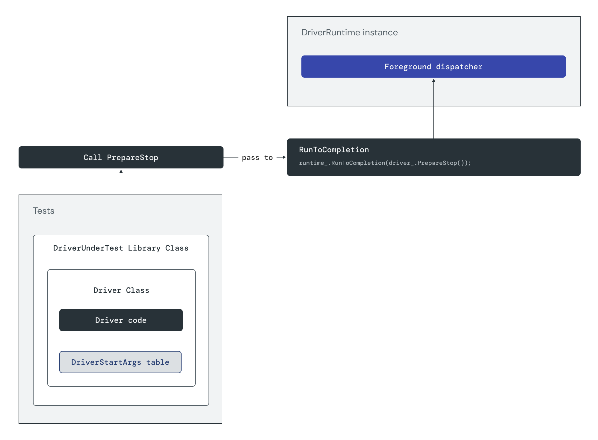

Like the `start` method, `PrepareStop` method is asynchronous, and hence it is
passed to the `RunToCompletion` method which runs the foreground dispatcher until
`PrepareStop` is complete
([Driver FIDL test, line 159](https://fuchsia.googlesource.com/fuchsia/+/refs/heads/main/sdk/lib/driver/component/cpp/tests/driver_fidl_test.cc#159)):

```cpp
zx::result result = runtime().RunToCompletion(driver_.PrepareStop());
```

`RunToCompletion` goes until the driver is prepared to fully stop. At this point,
all of the classes go out of scope and are turned down automatically. All
objects go out of scope until everything is gone.
