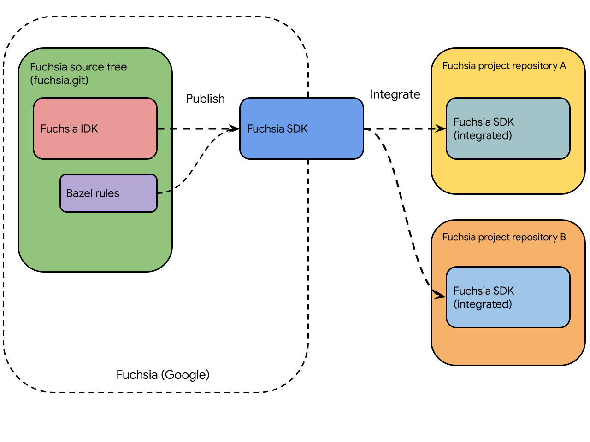

# Navigating a Bazel-and-Fuchsia-SDK-based development environment

This page describes how to identify and locate [FIDL][fidl] files, client
libraries, and build artifacts on your host machine for Fuchsia projects
using the Fuchsia SDK with the [Bazel][bazel]{:.external} build system.

When developing [Fuchsia components][fuchsia-components] in a
Fuchsia-SDK-based development environment, developers use the following
interfaces and libraries included in the Fuchsia SDK:

- [FIDL files](#fidl-files-in-a-fuchsia-sdk-based-project) – Interfaces
  for inter-process communication (IPC) protocols used by programs running
  on Fuchsia.
- [Client libraries](#client-libraries-in-a-fuchsia-sdk-based-project) –
  Libraries that provide features and building blocks on top of
  the Fuchsia APIs.

With these interfaces and libraries available in the development
environment, the Bazel build system can build
[Fuchsia packages][fuchsia-package] (containing Fuchsia components)
and generate [build artifacts](#build-artifacts-from-the-bazel-build-system)
on the host machine.

## FIDL files in a Fuchsia-SDK-based project {:#fidl-files-in-a-fuchsia-sdk-based-project}

Important: You must run a `bazel build` command first to create symlinks to
FIDL files in your local project setup.

All FIDL files (`.fidl`) included in a Bazel-and-Fuchsia-SDK-based project
can be found in the following directory of a local project checkout:

``` {:.devsite-disable-click-to-copy}
<YOUR_PROJECT_CHECKOUT_DIR>/bazel-<PROJECT_NAME>/external/fuchsia_sdk/fidl
```

To identify the absolute path to `<YOUR_PROJECT_CHECKOUT_DIR>/bazel-<PROJECT_NAME>`
on the host machine, you can run the `bazel info output_base` command.

For more details on each FIDL interface, see the
[FIDL reference pages][fidl-reference].

Note: To understand how FIDL files are selected and added to a project, see
[Flow of FIDL files and client libraries from the Fuchsia source tree to
Fuchsia-SDK-based projects](#flow-of-fidl-files-and-client-libraries)
in Appendices.

### List FIDL targets using Bazel commands {:#list-fidl-targets-using-bazel-commands}

You can also use Bazel commands to list FIDL targets in your
Bazel-and-Fuchsia-SDK-based development environment.

To list FIDL targets available in the development environment,
run a `bazel query` command using the template below:

```posix-terminal
bazel query 'ATTR(<GENERATOR_FUNCTION>, <FUCHSIA_FIDL_LIBRARY>, <PATH>)'
```

See the following example commands:

- List all targets from the top FIDL directory of your local project
  checkout:

  ``` {:.devsite-disable-click-to-copy}
  $ bazel query '@fuchsia_sdk//fidl/...'
  ```
- List all targets in a specific FIDL protocol directory:

  ``` {:.devsite-disable-click-to-copy}
  $ bazel query '@fuchsia_sdk//fidl/fuchsia.auth/...'
  ```

- List all generated C++ libraries from the top FIDL directory:

  ``` {:.devsite-disable-click-to-copy}
  $ bazel query 'kind(cc_library, @fuchsia_sdk//fidl/...)'
  ```

  Fuchsia generates multiple `cc_library` targets for each FIDL target.
  Therefore, these commands tend to print a large list. Consider
  filtering the output using a `grep` command.

## Client libraries in a Fuchsia-SDK-based project {:#client-libraries-in-a-fuchsia-sdk-based-project}

Important: You must run a `bazel build` command first to build
client libraries in your local project setup.

C++ client libraries included in the Fuchsia SDK provide useful features and
building blocks on top of the APIs available in Fuchsia. However, unlike FIDL
files (which describe the services that must be provided by the system at runtime),
the code from client libraries (either in source or prebuilt form) is never
part of the Fuchsia platform, so it must be added directly to Fuchsia packages
at build time.

All client libraries, header files (`.h`) and prebuilt files (`.so`), included
in a Bazel-and-Fuchsia-SDK-based project can be found in the following directories
of a local project checkout:

``` {:.devsite-disable-click-to-copy}
<YOUR_PROJECT_CHECKOUT_DIR>/bazel-<PROJECT_NAME>/external/fuchsia_sdk/arch
<YOUR_PROJECT_CHECKOUT_DIR>/bazel-<PROJECT_NAME>/external/fuchsia_sdk/pkg
```

For more details on each client library, see comments in the header files.

Note: To understand how client libraries are selected and added to a project, see
[Flow of FIDL files and client libraries from the Fuchsia source tree to
Fuchsia-SDK-based projects](#flow-of-fidl-files-and-client-libraries)
in Appendices.

## Build artifacts from the Bazel build system {:#build-artifacts-from-the-bazel-build-system}

When you run a `bazel build` command in a Bazel-and-Fuchsia-SDK-based
development environment, the Bazel build system compiles target Fuchsia
software (specified in a `BUILD.bazel` file) and generates the following
build artifacts:

- [Fuchsia packages][create-a-package-repository] (`.far`) – Contain
  newly built Fuchsia components and binaries (for example, driver binaries).
- [Debug symbols][debug-symbols] – Needed for symbolizing debug messages
  and logs.

The exact locations of where these build artifacts are generated in your
development environment depend on the configuration of your Fuchsia project.
To identify these locations, examine the settings of the project's Bazel
build system. For instance, by default the SDK driver samples repository
([`fuchsia-drivers`][fuchsia-drivers]) stores Bazel build artifacts
in the `$HOME/.cache/bazel` directory on the host machine.

### List build artifacts using Bazel commands {:#list-build-artifacts-using-bazel-commands}

You can also use Bazel commands to list and locate all build artifacts for
a specific Fuchsia package in your Bazel-and-Fuchsia-SDK-based development
environment.

To list all build artifacts generated for a newly built Fuchsia package in
your development environment, run a `bazel cquery` command using
the template below:

```posix-terminal
bazel cquery <PATH:TARGET> --output files
```

Replace the following:

- `PATH` – The directory path of the target Fuchsia package
  in your development environment.
- `TARGET` – The label of the target Fuchsia package.

The example command below prints a list of the build artifacts generated
for the `iwlwifi` driver package:

``` {:.devsite-disable-click-to-copy}
$ bazel cquery //third_party/iwlwifi/platform:iwlwifi_pkg --output files
```

## Appendices

### Difference between bazel query and bazel cquery {:#difference-between-bazel-query-and-bazel-cquery}

The `bazel query` command returns information about non-configurable targets;
therefore, it cannot list generated build artifacts. On the other hand, the
`bazel cquery` command returns information about targets evaluated in a
specific build configuration.

By default, the `bazel cquery` command uses a build configuration that
matches the architecture of your host system. For instance, on an `x64`
Linux host machine, the `bazel cquery` command lists `Fuchsia/x64`
artifacts. However, Bazel allows command-line flags to be used to change the
build configuration. For example, `bazel cquery --cpu=aarch64` commands can be
used to list `Fuchsia/arm64` artifacts on an `x64` host machine. By the way,
this also applies to `bazel build` commands. For example,
`bazel build --cpu=aarch64` commands can be used to generate `Fuchsia/arm64`
artifacts on an `x64` host machine.

However, one difficulty is that there are too many different ways to change
the build configuration in Bazel. For instance, the correct way to configure
for a specific Fuchsia CPU architecture may be to use `--config=fuchsia_arm64`
instead of using the mentioned `--cpu=aarch64` flag. This may depend on the
settings of the project in the `.bazelrc` file.

### Flow of FIDL files and client libraries from the Fuchsia source tree to Fuchsia-SDK-based projects {:#flow-of-fidl-files-and-client-libraries}

{: width="600"}

**Figure 1**. Flow of files and libraries from the Fuchsia source to various
Bazel-and-Fuchsia-SDK-based Fuchsia projects.

Note: The information in this section may be of less interest if you're
not a project integrator or you do not contribute directly to the
Fuchsia source tree (`fuchsia.git`).

The sequence below describes how some FIDL files and client libraries
are selected from the Fuchsia source tree (`fuchsia.git`) and become
available in Bazel-and-Fuchsia-SDK-based projects:

1. The Fuchsia source tree builds a new version of
   [the Fuchsia IDK][fuchsia-idk] (Integrator Development Kit), which
   contains collections of FIDL files, libraries, headers, and more.
1. The Fuchsia IDK is combined with Bazel build system integrations to
   create a new version of the Fuchsia SDK.
1. The new Fuchsia SDK is published and becomes available to project
   integrators.
1. Project integrators download [the latest Fuchsia SDK][download-sdk] and
   publish all or selected contents of the SDK to their Fuchsia project
   repositories (usually through automation).
1. Developers get access to the new contents of the Fuchsia SDK when they
   update their development environment (which then downloads the latest
   changes in the project).

The directory structure and layout of these FIDL files and client
libraries may vary among the Fuchsia projects, especially if the projects
use different build systems other than Bazel.

<!-- Reference links -->

[fidl]: /docs/development/languages/fidl/README.md
[bazel]: https://bazel.build/docs
[fuchsia-package]: /docs/concepts/packages/package.md
[fuchsia-components]: /docs/concepts/components/v2/README.md
[fidl-reference]: https://fuchsia.dev/reference/fidl
[create-a-package-repository]: /docs/development/sdk/ffx/create-a-package-repository.md
[debug-symbols]: /docs/development/sdk/ffx/register-debug-symbols.md
[fuchsia-drivers]: https://fuchsia.googlesource.com/sdk-samples/drivers
[fuchsia-idk]: /docs/development/idk/README.md
[download-sdk]: https://chrome-infra-packages.appspot.com/p/fuchsia/sdk/core/linux-amd64/+/latest
