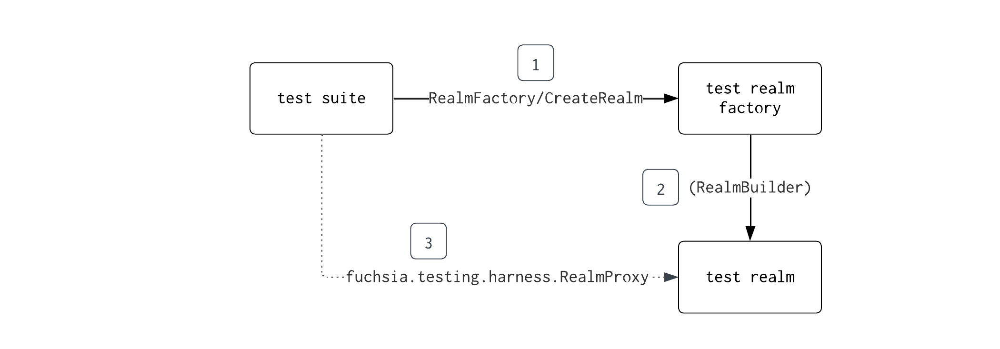
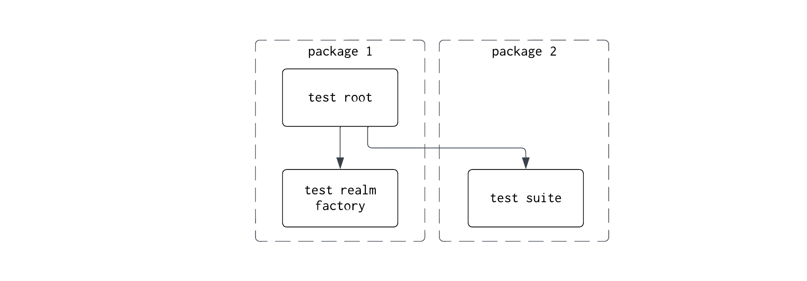
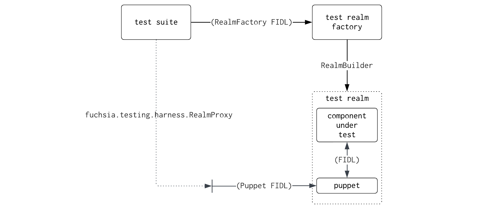

# Test realm factory

To promote test reuse, Fuchsia test suite components should avoid using
[RealmBuilder] directly. Instead, tests should use FIDL to call a separate
test realm factory component (TRF) which creates the test realm and returns a
[RealmProxy] connection. The RealmProxy connection provides access to the
realm's exposed capabilities.

This pattern makes it easier to reuse a test in [CTF] because the test suite and
and test realm factory are separated by FIDL interfaces, enabling different
versions of the test suite to run against the same test realm factory and vice
versa. Tests that follow this pattern will also be [reusable for different types
of testing](#test-reusability) in the future.

## Quickstart

* To write a new test, run [testgen] to generate test boilerplate.
* To refactor an existing test, run [testgen] and copy the old test code into
the generated test.

See the list of [examples](#examples) below for additional help.

## Test topology

Rather than directly using RealmBuilder, tests should use FIDL to call a test
realm factory component which creates the test realm. The realm factory
component returns a [RealmProxy] FIDL connection which the test suite can use to
connect to the realm's exposed capabilities. By convention, RealmFactory FIDL
protocols accept a test specific `RealmOptions` FIDL table as an argument to
support configuration.

### Package structure

The test suite and test realm factory must belong to separate packages. This
allows releasing the test suite's package in CTF without also releasing the test
realm factory. At build time, subpackaging combines both components into a
single package.

### RealmFactory SDK requirements

If a RealmFactory FIDL protocol will be used by CTF tests, it should have
[FIDL availability] annotations. The protocol must also be added to the
`partner_internal` [SDK category] to indicate that the API can be used by CTF
tests and must maintain backward compatibility but is not be exposed to SDK
users or the `partner` category if it should be available to SDK users.

## Common testing patterns

### Puppet components {#puppets}

A puppet is a test-only component that runs in the test realm and exposes a FIDL
protocol to the test suite. The test suite connects to the protocol using the
RealmProxy connection, and the puppet interacts with the other components in
the realm by following commands sent from the test suite.

Puppets allow a test to interact with the test realm without exposing the
realm's implementation details. For example, a puppet could be used to provide
test input data to a component or to inspect its state.

Puppets can be written to support a single test or as general purpose components
that can be reused in different test realms.

For an example of a puppet component, see the [Archivist test puppet] which
emits logs and [Inspect data] to Archivist, and is controlled by
[this FIDL protocol][Archivist test puppet fidl]. Any test may use the Archivist
test puppet to inject arbitrary logs and Inspect data into test realms.

Note: If the puppet's FIDL protocol will be used by CTF tests, remember to
add the protocol to the `partner_internal` [SDK category] to indicate that the
API can be used to CTF tests and must maintain backward compatibility, but is
not be exposed to SDK users.

### Injecting test data

Some tests provide input data to the component under test such as structured
configuration values or data read from a directory. When using a test realm
factory component, there are at least two ways to provide input data to your
component:

* Pass the data in a FIDL call to `RealmFactory/CreateRealm` using some field
  of a `RealmOptions` FIDL table.
* Create a [puppet](#puppets) to provide the data.

The first approach is the simplest and is usually required when the test data
must be provided before the component starts running, but contributors should
take care to avoid a [leaky abstraction] with this approach. For example: if the
component reads input data from a `/config/data` directory capability, consider
passing the data from the test suite (as a VMO) and have the test realm serve
this directory, rather than passing a handle to a `fuchsia.io.Directory`
capability.

### Mocking FIDL interactions {#mocking-fidl}

RealmBuilder makes it possible to define 'local components' to stub FIDL
protocols or to record FIDL traffic. However, with TRF the test suite and the
test realm run in different processes. Instead, consider creating a
[puppet](#puppets) component that the test suite can use to send stub requests
or responses to the component under test.

## Examples

Below are some examples of test suites and test realm factory components.

| Test suite | Realm Factory Component |
|-|-|
| [WLAN hw-sim tests]          | [WLAN hw-sim test realm factory] |
| [Diagnostics detect tests]   | [Diagnostics detect test realm factory] |
| [Diagnostics sampler tests]  | [Diagnostics sampler test realm factory] |
| [pkgdir tests]               | [pkgdir test realm factory]
| [CTF example Rust test]      | [CTF example test realm factory]
| [CTF example C++ test]       | [CTF example test realm factory]
|                              | [Mock hwinfo test realm factory]

## Frequently asked questions

### When should I apply this pattern to my test? {#test-reusability}

If your test uses RealmBuilder to run and test a component, it should wrap all
RealmBuilder code in a test realm factory component instead. Even if you do not
plan to run your test in CTF, you must adopt this pattern to take advantage of
the Fuchsia team's future plans to make tests more reusable in different
contexts, such as performance testing, system (non-hermetic) testing, and
end-to-end testing.

### How do I mock, fake, or stub my component's FIDL protocols?

See this section on [mocking FIDL interactions](#mocking-fidl).

## Known issues

### My test cannot access non-protocol capabilities in the realm

The RealmProxy protocol does not provide access to non-protocol capabilities.
Consider creating a [puppet](#puppets) to mediate access to non-protocol
capabilities.

<!-- Links -->
[leaky abstraction]: https://en.wikipedia.org/wiki/Leaky_abstraction

<!-- References to other docs -->
[CTF]: /docs/development/testing/ctf/compatibility_testing.md
[FIDL availability]: /docs/reference/fidl/language/versioning.md
[Inspect data]: /docs/development/diagnostics/inspect/README.md
[RealmBuilder]: /docs/development/testing/components/realm_builder.md
[SDK category]: /docs/contribute/sdk/categories.md

<!-- Source code and examples. Please link to https://cs.opensource.google -->
[testgen]: https://cs.opensource.google/fuchsia/fuchsia/+/main:tools/testgen/
[RealmProxy]: https://cs.opensource.google/fuchsia/fuchisa/+/main:sdk/fidl/fuchsia.testing.harness/realm_proxy.fidl
[Archivist test puppet]: https://cs.opensource.google/fuchsia/fuchsia/+/main:src/diagnostics/archivist/testing/puppet
[Archivist test puppet fidl]: https://cs.opensource.google/fuchsia/fuchsia/+/main:src/diagnostics/archivist/testing/fidl/puppet.test.fidl
[WLAN hw-sim tests]: https://cs.opensource.google/fuchsia/fuchsia/+/main:src/connectivity/wlan/testing/hw-sim/test
[WLAN hw-sim test realm factory]: https://cs.opensource.google/fuchsia/fuchsia/+/main:src/connectivity/wlan/testing/hw-sim/testing/realm-factory
[Diagnostics detect tests]: https://cs.opensource.google/fuchsia/fuchsia/+/main:src/diagnostics/detect/integration
[Diagnostics detect test realm factory]: https://cs.opensource.google/fuchsia/fuchsia/+/main:src/diagnostics/detect/testing/realm-factory
[Diagnostics sampler tests]:  https://cs.opensource.google/fuchsia/fuchsia/+/main:src/diagnostics/sampler/tests
[Diagnostics sampler test realm factory]: https://cs.opensource.google/fuchsia/fuchsia/+/main:src/diagnostics/sampler/testing/realm-factory
[pkgdir tests]:  https://cs.opensource.google/fuchsia/fuchsia/+/main:src/sys/pkg/tests/pkgdir/src
[pkgdir test realm factory]: https://cs.opensource.google/fuchsia/fuchsia/+/main:src/sys/pkg/tests/pkgdir/test_realm_proxy
[CTF example Rust test]: https://cs.opensource.google/fuchsia/fuchsia/+/main:sdk/ctf/tests/examples/fidl/fuchsia.examples/rust
[CTF example C++ test]: https://cs.opensource.google/fuchsia/fuchsia/+/main:sdk/ctf/tests/examples/fidl/fuchsia.examples/cc
[CTF example test realm factory]: https://cs.opensource.google/fuchsia/fuchsia/+/main:sdk/ctf/tests/examples/fidl/fuchsia.examples/testing/realm-factory
[Mock hwinfo test realm factory]: https://cs.opensource.google/fuchsia/fuchsia/+/main:src/hwinfo/mock/integration/testing/realm-factory