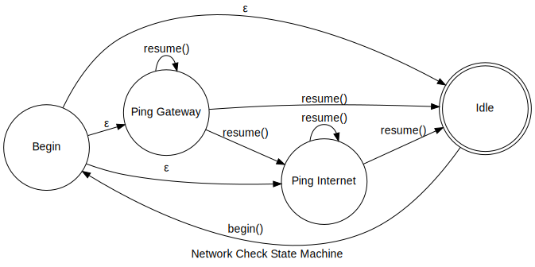

# Reachability

The reachability component runs network health checks to determine the service
level of networks known to the host. It exposes an API
[`fuchsia.net.reachability`], that components can use to subscribe to changes
in network service levels. The intricacies of the API behavior are located in
the API's [FIDL definition].

The rest of the README will outline the architecture for the reachability
component and how it is used to calculate reachability state for different
network conditions.

## Overview

Reachability is expected to run while the device is running, so panicking
or returning out of the loop is avoided when error handling is possible.

Its state calculations are dependent on real-time data from its
sources. These sources include:

* [`fuchsia.net.interfaces`]: provides interface events
* [`fuchsia.net.neighbor`]: provides neighbor cache updates
* [`fuchsia.net.routes.ipv4`]: provides IPv4 route change events
* [`fuchsia.net.routes.ipv6`]: provides IPv6 route change events

The data retrieved from these sources are used to make more informed decisions
surrounding the device's level of reachability.

## Architecture

Reachability conducts health checks to determine the service level of
network services and reports its findings via the API.

To accomplish this, the component creates a state machine for each
interface to perform a network check at a constant cadence. The state
machine runs each interface through a network check, which is a suite of
health checks for typical network services. The network check state
machine is re-entrant and asynchronous to allow Reachability to schedule
network service checks and run them alongside the intake of new data from
the watchers. After a network check has completed, another one can be
started for the associated interface.

## Policy

There are several services tested in reachability:

* Gateway reachability
* Internet availability
* DNS functionality

These signals are exported via the [`fuchsia.net.reachability`] API.

Gateway and internet state are determined in sequence. For example, if
a system does not have gateway reachability, internet availability will
not be evaluated.

Gateway reachability is successful if one of the two checks pass:
* The neighbors retrieved from [`fuchsia.net.neighbor`] contain a healthy
router
* `>=` 1 attempted ICMP echo requests to a gateway address responded to the
host

Internet is available if `>=` 1 attempted ICMP echo requests to external IPv4
and IPv6 addresses respond to the host.

DNS is checked separately from internet and gateway signals. To determine
whether DNS is active, reachability performs a call using
[`fuchsia.net.name/Lookup`] to determine whether IP addresses can be discovered
by using a hostname.

## Reference

State Machine Diagram

[`fuchsia.net.reachability`]: https://cs.opensource.google/fuchsia/fuchsia/+/main:sdk/fidl/fuchsia.net.reachability/reachability.fidl
[`fuchsia.net.interfaces`]: https://cs.opensource.google/fuchsia/fuchsia/+/main:sdk/fidl/fuchsia.net.interfaces/interfaces.fidl
[`fuchsia.net.name`]: https://cs.opensource.google/fuchsia/fuchsia/+/main:sdk/fidl/fuchsia.net.name/lookup.fidl
[`fuchsia.net.neighbor`]: https://cs.opensource.google/fuchsia/fuchsia/+/main:sdk/fidl/fuchsia.net.neighbor/neighbor.fidl
[`fuchsia.net.routes.ipv4`]: https://cs.opensource.google/fuchsia/fuchsia/+/main:sdk/fidl/fuchsia.net.routes/ipv4.fidl
[`fuchsia.net.routes.ipv6`]: https://cs.opensource.google/fuchsia/fuchsia/+/main:sdk/fidl/fuchsia.net.routes/ipv6.fidl
